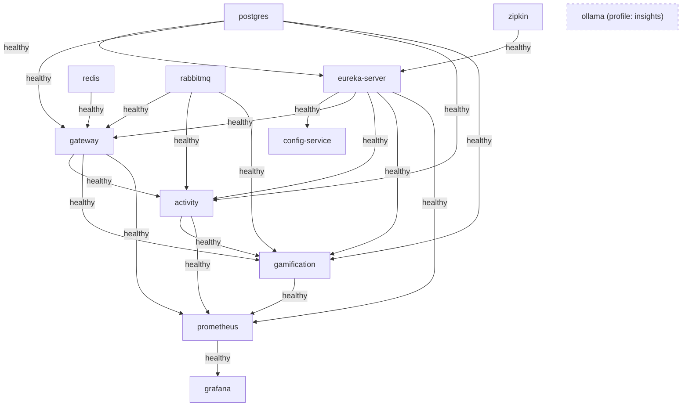
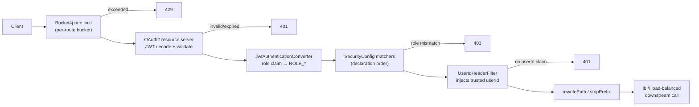
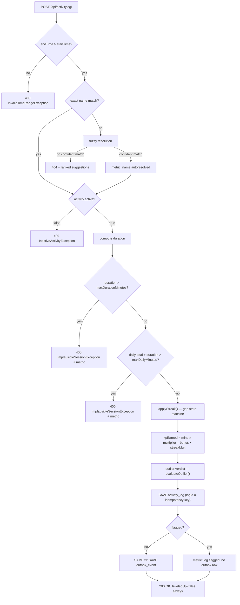
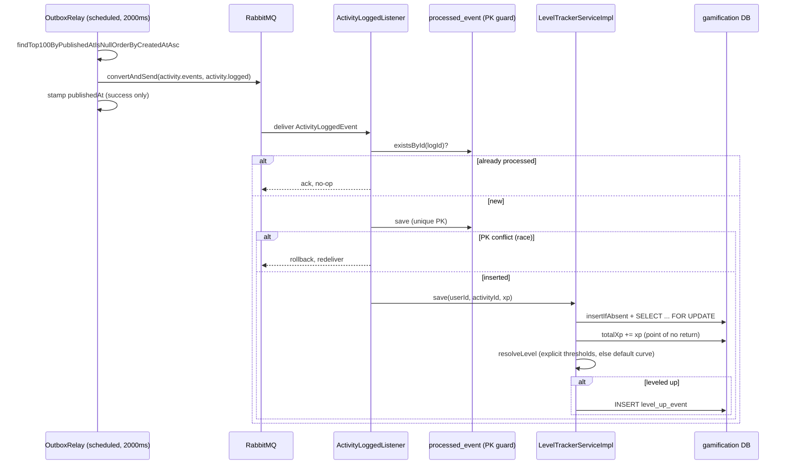
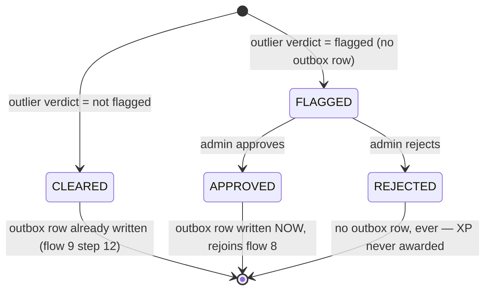
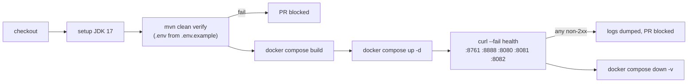

# System Flows — Gamified Tracker

`docs/features/` holds twenty standalone deep-dives — each one answers *what* a feature is and
*why* it's built the way it is. None of them answer *what happens, in order, when something actually
occurs* — a registration, a logged activity, a level-up — across the services that participate in
it. This document is that ordering map.

**How to read this:** each flow is a numbered step table read top-to-bottom. The **"Can stop
here?"** column is the point of the whole document — it's where a request can exit early (validation
failure, a guard, a degrade-and-continue), listed in the exact order the code checks them, which no
single feature doc can show because a real flow crosses several of them. Where a feature doc already
explains the *why* behind a step, this document links out to it (`→ …`) instead of repeating it.
Every step below was read directly off the source at the file:line cited, not off `CLAUDE.md` or the
feature docs — both are explicitly maps, not the territory, and drift as the code moves.

**Contents:** [I. Platform bring-up](#part-i--platform-bring-up) ·
[II. Identity & access](#part-ii--identity--access) ·
[III. The request pipeline](#part-iii--the-request-pipeline) ·
[IV. Activity catalog](#part-iv--activity-catalog) ·
[V. Logging an activity](#part-v--logging-an-activity-the-spine) ·
[VI. XP award & progression](#part-vi--xp-award--progression-async) ·
[VII. Review & integrity](#part-vii--review--integrity) ·
[VIII. Standings, reads & insight](#part-viii--standings-reads--insight) ·
[IX. Cross-cutting](#part-ix--cross-cutting) ·
[X. Build & delivery](#part-x--build--delivery)

---

## Part I — Platform bring-up

### 1. Container startup & dependency ordering

Nothing else in this document can happen until this flow completes. `docker-compose.yml` chains
every service on `depends_on: condition: service_healthy`, not just `depends_on` — a dependency
must pass its own healthcheck, not merely have started, before a dependent is allowed to start.

| # | Step | Source | Notes |
|---|---|---|---|
| 1 | `postgres`, `rabbitmq` start independently | `docker-compose.yml:2-33` | no dependencies |
| 2 | `eureka-server` waits on `postgres` + `zipkin` healthy | `docker-compose.yml:42-46` | Zipkin dependency is for tracing, not data |
| 3 | `config-service` waits on `eureka-server` healthy | `docker-compose.yml:63-65` | Phase 1 — nothing consumes it yet, see [Config Server](features/config-server.md) |
| 4 | `redis` starts independently | `docker-compose.yml:74-85` | gateway rate-limiting only |
| 5 | `gateway` waits on `postgres`, `eureka-server`, `redis`, `rabbitmq` all healthy | `docker-compose.yml:177-185` | |
| 6 | `activity` waits on `postgres`, `eureka-server`, `gateway`, `rabbitmq` all healthy | `docker-compose.yml:201-209` | |
| 7 | `gamification` waits on `postgres`, `eureka-server`, `activity`, `gateway`, `rabbitmq` all healthy | `docker-compose.yml:225-235` | last app service up |
| 8 | `prometheus` waits on `eureka-server` + all three app services healthy | `docker-compose.yml:131-139` | |
| 9 | `grafana` waits on `prometheus` healthy | `docker-compose.yml:160-162` | |
| — | `ollama` starts **only** under `--profile insights`, in **no** service's `depends_on` | `docker-compose.yml:92-108` | a plain `up -d` — and CI's `up -d` — never waits on it; see [AI Weekly Coaching Digest](features/ai-weekly-digest.md) |

**Can stop here?** Any healthcheck that never turns healthy within its `retries × interval` window
stops every service downstream of it from starting at all — this is the mechanism, not a side
effect: Compose won't start a service whose `depends_on` condition isn't met.

### 2. Schema migration

Each service owns one Postgres schema and applies its own Flyway migrations on boot, gated by
`ddl-auto: validate` (Hibernate never creates or alters schema itself).

| Service | Schema | Migrations |
|---|---|---|
| `activity-service` | `activity` | `V1` catalog + logs → `V2` indexes → `V3` streaks → `V4` review status |
| `gamification-service` | `gamification` | `V1` core tables → `V2` seed data → `V3` manual XP award audit |
| `api-gateway` | `gateway` | `V1` users → `V2` refresh tokens |

**Known drift, current as of this writing — verify before trusting this claim, per this doc's own
rule:**
- `gamification.processed_event` has a JPA entity (`ProcessedEvent.java:14`,
  `@Table(name = "processed_event")`) and `ddl-auto: validate` demands it exist, but **no migration
  ever creates it** — confirmed absent from `V1`–`V3`. Pre-existing, not something introduced by
  recent work.

(`gateway.user_entity` was previously drifted too — `User.java`'s `@Table` name and
`V1__create_user_schema.sql`'s `CREATE TABLE` name disagreed. That's since been fixed; both now say
`user_entity`, and `CLAUDE.md` has been corrected to match.)

**Can stop here?** `ddl-auto: validate` means a schema that doesn't match every entity fails the
service at startup, before it ever reaches Eureka registration — this is why `processed_event`'s
missing migration doesn't currently break anything: H2 test slices rebuild schema from entities
directly (see [Testing Strategy](features/testing-strategy.md)), and in Postgres the table exists
by other means in practice, so `validate` has nothing to disagree with. It is still real drift.

---

## Part II — Identity & access

Every flow after this one assumes a caller either has no identity yet (registration, login) or
already holds a JWT (everything else, via [Part III](#part-iii--the-request-pipeline)).

### 3. Registration

`POST /auth/register` · `AuthController.java:23` → `AuthService.register` (`AuthService.java:37-57`)

| # | Step | Source | Can stop here? |
|---|---|---|---|
| 1 | `AuthRateLimitFilter` IP-throttles `/auth/**` before anything else runs | `AuthRateLimitFilter.java:32-48` | bucket exhausted → `429` |
| 2 | `@Valid` on `RegisterRequest` | `AuthController.java:24` | validation failure → `400` |
| 3 | Password BCrypt-encoded | `AuthService.java:45` | |
| 4 | **Role forced to `Role.USER`, never read from the request** | `AuthService.java:47-50` | `RegisterRequest` has no `role` field at all — see [Authentication & Identity](features/authentication-and-identity.md) for why this matters |
| 5 | User saved, access + refresh token pair issued | `AuthService.java:51-56` | unique-email constraint violation → `500` (no dedicated handler) |

### 4. Login

`POST /auth/login` · `AuthService.login` (`AuthService.java:59-73`) — same rate limiter as
registration. Both "no such email" and "wrong password" throw the identical
`InvalidCredentialsException` (`AuthService.java:62,66`), so a `401` never discloses which one was
wrong — a deliberate no-user-enumeration design, detailed in
[Authentication & Identity](features/authentication-and-identity.md).

### 5. Token refresh & rotation

`POST /auth/refresh` · `AuthService.refresh` (`AuthService.java:75-88`) →
`RefreshTokenService.validateRefreshToken` (`RefreshTokenService.java:39-62`)

| # | Step | Source | Can stop here? |
|---|---|---|---|
| 1 | Token looked up by value | `RefreshTokenService.java:40-41` | not found → `InvalidCredentialsException` → `401` |
| 2 | Revoked check | `RefreshTokenService.java:43-45` | revoked → `401` |
| 3 | Expiry check | `RefreshTokenService.java:47-50` | expired → revoke it, then `401` |
| 4 | **Atomic used-check**: `markUsedIfTokenNotYetUsed` updates 0 or 1 rows | `RefreshTokenService.java:52-57` | 0 rows (already used = reuse of a stolen/replayed token) → **revoke every refresh token for that user**, then `401` |
| 5 | New access + refresh token pair issued | `AuthService.java:82-87` | old refresh token is now single-use-spent |

→ Deep dive: [Refresh Token Rotation](features/refresh-token.md) (reuse-detection rationale, token
lifecycle diagram).

### 6. Admin provisioning

`AdminBootstrap` (`AdminBootstrap.java`), an `ApplicationRunner` gated by
`app.admin.bootstrap.enabled` (off by default — `@ConditionalOnProperty`, line 20). On startup: if
`enabled=true` but email/password unset, **fails startup outright** (`AdminBootstrap.java:39-41`);
otherwise promotes an existing user by email to `ADMIN` or creates one. This is the **only** path to
an `ADMIN` account — registration can never produce one (flow 3, step 4).

**Can stop here?** This is the precondition every `hasRole("ADMIN")` gate in flow 7 depends on. If
this flow could be bypassed, every admin gate downstream would be decorative — see
[Authentication & Identity](features/authentication-and-identity.md).

---

## Part III — The request pipeline

Every authenticated `/api/**` call, regardless of destination, passes through this exact sequence
at the gateway before a downstream service ever sees it. Documented once here rather than repeated
in every flow below.

| # | Step | Source | Can stop here? |
|---|---|---|---|
| 1 | Redis-backed Bucket4j rate limit, one bucket per route (`activityRoute` / `gamificationRoute`), keyed `user:<id>` else `ip:<addr>` | `RouteConfiguration.java:31-36,46-51`, `RateLimitKeyResolver` | bucket exhausted → `429` |
| 2 | OAuth2 resource-server JWT decode (HS256, `jwt.secret`) | `SecurityConfig.java:78-86` | bad signature / expired → `401` |
| 3 | `JwtAuthenticationConverter` turns the `role` claim into `ROLE_USER`/`ROLE_ADMIN` | `SecurityConfig.java:88-97` | |
| 4 | `SecurityConfig` matchers evaluated **in declaration order**: `DispatcherType.ERROR/FORWARD` permitAll (must stay first — see flow 20) → `/auth/**` + docs + actuator permitAll → `POST /api/activity` ADMIN → `/api/activitylog/review/**` ADMIN → `POST /api/level` ADMIN → everything else just `authenticated()` | `SecurityConfig.java:43-68` | role doesn't match a `hasRole` matcher → `403`; no authentication at all on a non-permitAll path → `401` |
| 5 | `UserIdHeaderFilter` reads `userId` off the **JWT claim** (never trusts an inbound header) and wraps the request so `getHeader`/`getHeaders`/`getHeaderNames` for `userId` can only ever return the trusted value | `UserIdHeaderFilter.java:39-66` | claim missing → `401` (line 41) |
| 6 | `rewritePath`/`stripPrefix` + `lb://` to the target service via Eureka | `RouteConfiguration.java:28-29,44` | downstream unreachable → `503`/`502` from the load balancer |

→ Deep dives: [Authentication & Identity Propagation](features/authentication-and-identity.md),
[Rate Limiting](features/rate-limiting.md), [API Gateway Routing](features/api-gateway-routing.md).

**Note:** `activity`/`gamification` are also directly reachable on `:8081`/`:8082` in this dev
setup, entirely bypassing this whole flow — a documented, accepted gap (see `CLAUDE.md`), not
something any downstream flow below can defend against on its own.

---

## Part IV — Activity catalog

### 7. Admin creates an activity

`POST /api/activity` (ADMIN-gated at the gateway, flow 7 step 4) → `ActivityController.addActivity`
(`ActivityController.java:38-41`) → `ActivityServiceImpl`. `name` is unique (catalog lookup key for
flow 8's exact-match step); `active` is a soft-delete flag enforced only at log time (flow 8);
`xpMultiplier` of `0.0`/non-positive means "use the `Category` base rate," resolved by
`Activity.effectiveXpMultiplier()` — see [Leveling Engine](features/leveling-engine.md).

---

## Part V — Logging an activity (the spine)

This is the flow everything else in the system exists to serve. `POST /api/activitylog/` →
`ActivityLogController.addActivityLog` (`ActivityLogController.java:30-32`, `@RequestHeader("userId")`
— never a path variable, so the JWT-trusted value from flow 7 is what's used, not anything
client-supplied) → `ActivityLogServiceImpl.addActivityLogResponseResponseEntity`
(`ActivityLogServiceImpl.java:74-165`), one `@Transactional` method, read top-to-bottom below.

| # | Step | Source | Can stop here? |
|---|---|---|---|
| 1 | `endTime` must be after `startTime` | `ActivityLogServiceImpl.java:80-82` | `InvalidTimeRangeException` → `400` |
| 2 | **Exact name match first** — zero added cost on the happy path | `ActivityLogServiceImpl.java:171-173` | miss falls through to step 3 |
| 3 | **Fuzzy resolution only on a miss**: scores the live catalog, auto-substitutes above a high-confidence threshold (subject to an `activity-name-matching.auto-resolve-enabled` kill switch and an ambiguity guard), else returns ranked suggestions | `ActivityLogServiceImpl.java:177-191`, `ActivityNameResolutionService.java:29-72` | no confident match → `ActivityNameUnresolvedException` → `404` with `suggestions` extension member |
| 4 | Inactive-activity guard (soft-delete) | `ActivityLogServiceImpl.java:246-248` | `InactiveActivityException` → `409` — **only reachable via an exact hit**; the fuzzy matcher never resolves onto an inactive candidate |
| 5 | Duration computed | `ActivityLogServiceImpl.java:89-90` | |
| 6 | **Hard cap**: duration vs `session-integrity.max-duration-minutes` | `ActivityLogServiceImpl.java:97-102` | over cap → `ImplausibleSessionException` → `400`, tagged metric `activity.log.rejected.duration` |
| 7 | **Per-user-per-day aggregate cap**: existing same-day total (only `CLEARED`/`APPROVED` logs count) + this session vs `max-daily-minutes` | `ActivityLogServiceImpl.java:104-115` | over cap → `ImplausibleSessionException` → `400`, metric `activity.log.rejected.dailycap` |
| 8 | `applyStreak` — gap-day state machine: gap=0 same day (no bump shown here), gap=1 increments, gap>1 resets to 1 | `ActivityLogServiceImpl.java:281-306` | never blocks — always produces a streak |
| 9 | `xpEarned = durationMinutes × effectiveXpMultiplier() × bonus(20% chance, 1.1–1.5×) × streakMultiplier(caps at 1.5×)` | `ActivityLogServiceImpl.java:117-127` | |
| 10 | **Outlier verdict** — absolute-threshold check first (independent of the statistical baseline, catches a self-consistent-but-implausible history), else one-sided modified z-score against the user's own baseline (falling back to category-wide under `min-samples`) | `ActivityLogServiceImpl.java:203-210`, `DurationOutlierEvaluationService.java:34-52`, `DurationOutlierDetector.java:24-56` | flagged → log still saved (see step 11), but no outbox row |
| 11 | `activity_log` row saved **first** — its generated id is the idempotency key for everything downstream | `ActivityLogServiceImpl.java:134-137` | |
| 12 | **Same transaction**: `outbox_event` row saved — **only if not flagged** | `ActivityLogServiceImpl.java:139-159` | flagged → metric `activity.log.flagged` tagged with `basis`, XP silently withheld pending flow 16 |
| 13 | `200 OK` returned | `ActivityLogServiceImpl.java:163-164` | `leveledUp` is **always `false`** here — XP application is async (flow 10–13) |

→ Deep dives: [Fuzzy Activity-Name Matching](features/fuzzy-activity-matching.md),
[Session Integrity](features/session-integrity.md), [Streaks](features/streaks.md),
[Leveling Engine](features/leveling-engine.md) (multiplier resolution),
[Event-Driven Decoupling](features/event-driven-decoupling.md) (why the outbox write is atomic
with the log write).

---

## Part VI — XP award & progression (async)

Everything from here on is triggered by the outbox row flow 9 wrote (step 12), or by flow 16's
approval — never called synchronously from the request in Part V.

### 8. Outbox relay

`@Scheduled(fixedDelayString = "${outbox.relay.delay-ms:2000}")` (`OutboxRelay.java:37`) — batches
up to 100 unpublished rows oldest-first, publishes each, stamps `publishedAt` **only on success**
(`OutboxRelay.java:39-51`). A publish failure leaves the row `NULL` for the next tick — at-least-once
delivery, not exactly-once; exactly-once is enforced downstream at step 10.

### 9. Broker hop

Topic exchange `activity.events` / routing key `activity.logged` / queue
`gamification.activity-logged.q`, with a DLX (`activity.events.dlx`) + DLQ
(`gamification.activity-logged.dlq`) bound the same way (`RabbitConfig.java`, both services).
Listener retry: `max-attempts: 3`, `initial-interval: 1000ms`, `default-requeue-rejected: false`
(`gamification-service/application.yaml:16-20`) — after 3 failed attempts a message routes to the
DLQ instead of requeuing forever. `__TypeId__` carries the stable id `activity.logged`
(`ActivityLoggedEvent.TYPE_ID`), not a Java FQCN — the consumer's `TypePrecedence.INFERRED` +
`setTrustedPackages("*")` means it would still deserialize correctly even against a stale producer
using the old class-name header, a deliberate rolling-deploy safety net
(`gamification/config/RabbitConfig.java:58-71`).

### 10. Idempotent consumption

`ActivityLoggedListener.onActivityLogged`, `@Transactional`
(`ActivityLoggedListener.java:28-47`):

| # | Step | Can stop here? |
|---|---|---|
| 1 | `existsById(logId)` fast path | already processed → return, no-op (redelivery) |
| 2 | `processedEventRepository.save(new ProcessedEvent(logId, now))` — the **unique PK is what actually serializes a race**, not the check in step 1 | insert conflict (a racing duplicate delivery) → this save throws → **whole transaction rolls back, XP not applied** → message redelivered → step 1 now finds it → skipped |
| 3 | `levelTrackerService.save(userId, ...)` | — |

### 11. XP application & level resolution

`LevelTrackerServiceImpl.save` (`LevelTrackerServiceImpl.java:94-134`):

| # | Step | Source | Notes |
|---|---|---|---|
| 1 | `insertIfAbsent` then `findByUserIdAndActivityIdForUpdate` — pessimistic row lock | `LevelTrackerServiceImpl.java:96-100` | see [Concurrency-Safe XP](features/concurrency-safe-xp.md) |
| 2 | If not newly created, archive the pre-mutation row to `level_tracker_archive` | `LevelTrackerServiceImpl.java:102-104,154-165` | append-only; **nothing in production code reads it back** — a dormant audit trail |
| 3 | Capture level **before** mutation | `LevelTrackerServiceImpl.java:106-107` | this, not the `resolveLevel` outcome type, is what `leveledUp` actually compares against |
| 4 | **`totalXp += xp`** | `LevelTrackerServiceImpl.java:109` | **the point of no return** — no decrement/reversal/refund path exists anywhere in the codebase |
| 5 | `resolveLevel`: explicit `activity_level_threshold` rows win outright; the formula-driven default curve is consulted **only** when the activity has zero threshold rows at all | `LevelTrackerServiceImpl.java:184-210` | → [Leveling Engine](features/leveling-engine.md) |
| 6 | `leveledUp = newLevel > previousLevel` (captured in step 3) | `LevelTrackerServiceImpl.java:116` | |

### 12. Level-up → notification

If `leveledUp`, a `LevelUpEvent` row is appended (`LevelTrackerServiceImpl.java:120-131`) — feeds
`GET /notifications`, `/notifications/unread-count`, `POST /notifications/{id}/read`
(`NotificationServiceImpl.java`). → [Level-Up Notifications](features/level-up-notifications.md).

### 13. Manual XP award (admin, bypasses flows 8–10 entirely)

`POST /api/level` (ADMIN-gated at the gateway) → `LevelTrackerController.awardXpManually`
(`LevelTrackerController.java:49-53`) → `LevelTrackerServiceImpl.awardManually`
(`LevelTrackerServiceImpl.java:139-152`): writes a `manual_xp_award` audit row (actor, target,
activity, xp, timestamp) **first**, then delegates to the exact same `save()` as step 11. `xp` is
capped at `10000.0` (`@DecimalMax`). **This is by design a separate door** — it never touches the
outbox, RabbitMQ, or the `processed_event` idempotency guard, so anything in flow 9's session-
integrity layer (the hard cap, the daily cap, the outlier detector) never sees it.

---

## Part VII — Review & integrity

### 14. Flagged-log review

`GET /activitylog/review/flagged` / `POST /activitylog/review/{id}/approve` /
`POST /activitylog/review/{id}/reject` (all ADMIN-gated at the gateway) →
`ActivityLogReviewServiceImpl.java`.

| # | Step | Source | Can stop here? |
|---|---|---|---|
| 1 | `getFlaggedLogs` recomputes the verdict per item (for display, not to re-decide) | `ActivityLogReviewServiceImpl.java:44-60` | |
| 2 | `approve`: must currently be `FLAGGED` | `ActivityLogReviewServiceImpl.java:99-106` | non-`FLAGGED` target → `ReviewStateConflictException` → `409` |
| 3 | `approve`: sets `APPROVED`, **writes the outbox row that flow 9 step 12 withheld** — same shape, idempotent via the unique `idempotencyKey = logId` | `ActivityLogReviewServiceImpl.java:64-85` | rejoins flow 8 (outbox relay) from here |
| 4 | `reject`: sets `REJECTED` — "no compensation logic needed," per the code comment: rejection is simply *never* writing the outbox row | `ActivityLogReviewServiceImpl.java:87-97` | XP for this log is permanently never awarded |

→ Deep dive: [Session Integrity](features/session-integrity.md).

---

## Part VIII — Standings, reads & insight

### 15. Rank recompute

`@Scheduled(fixedDelayString = "${ranking.recompute-interval-ms:300000}")` (5 min default) or
on-demand `POST /ranks/recompute` (**no admin guard on this endpoint** — worth noting, not fixed
here) → `RankRecomputeServiceImpl.recompute` (`RankRecomputeServiceImpl.java:28-59`): reads all
`level_tracker` totals, dense-ranks ties (equal `totalXp` shares a position), computes
`topFraction = (position-1)/totalUsers`, maps to a `RankTier` (`RankTier.fromTopFraction`, 9 tiers
`SUMMIT`→`BASECAMP`), upserts `user_rank`. Fully derived from `level_tracker` — self-heals on the
next tick if the source data changes. → [Rank & Level System](features/rank-and-level-system.md).

### 16. Read flows

Kept deliberately shallow — controller → service → repository → DTO, no side effects:

| Flow | Endpoint | Key contrast |
|---|---|---|
| Level / progress | `GET /level/user/{userId}`, `/level/activity/{activityId}` | batched threshold lookup for list endpoints (`mapAll`, one query not N) vs single-row `progressFor` |
| **Leaderboard** | `GET /leaderboard`, `/leaderboard/activity/{id}`, `/leaderboard/me` | **computed live**: `SUM(level_tracker.total_xp) GROUP BY user_id` on every request (`LeaderboardServiceImpl.java:21-23`) |
| **Ranks** | `GET /ranks/me`, `/ranks/{tier}/leaderboard`, `/ranks` | **read from the materialized snapshot** written by flow 15 (`RankServiceImpl.java` — `userRankRepository` reads only) |
| Notifications | `GET /notifications`, `/unread-count`, `POST /{id}/read` | reads/marks `level_up_event` rows from flow 12 |
| Streaks | `GET /activitylog/streaks/user/{id}` | reads `activity_streak`, mutated only by flow 9 step 8 |
| Analytics | `GET /activitylog/analytics/user/{userId}/{category-summary,xp-over-time,weekly-report}` | in-memory stream aggregation over raw logs — → [Analytics](features/analytics.md) |

The leaderboard/ranks contrast above is deliberate and worth internalizing: **nothing reads
`activity_log` for ranking** — only `level_tracker` totals, either summed live or pre-aggregated.

### 17. AI weekly digest

`GET /insights/weekly` → `InsightsServiceImpl.getWeeklyInsights` (`InsightsServiceImpl.java:44-94`):

| # | Step | Source | Can stop here? |
|---|---|---|---|
| 1 | Headline totals **delegated** to `AnalyticsService.getWeeklyReport` — not recomputed, so this endpoint and `/weekly-report` can never disagree | `InsightsServiceImpl.java:50` | |
| 2 | Current week's logs fetched once; per-category aggregation and note collection both derive from the same list | `InsightsServiceImpl.java:52-56,98-129` | |
| 3 | `DigestFacts` built; notes ordered newest-first (decides which survive the prompt builder's cap) | `InsightsServiceImpl.java:58-69,123-128` | |
| 4 | `weeklyDigestNarrator.narrate(facts)` inside `try/catch(Exception)` | `InsightsServiceImpl.java:73-89` | narrator throws → caught, logged, **not rethrown** (`GlobalExceptionHandler` has no catch-all — this catch is load-bearing) → `narrativeStatus = UNAVAILABLE` |
| 5 | Empty `Optional` (flag off, or `spring.ai.model.chat=none`) | `InsightsConfig.java:30-46` | → `narrativeStatus = DISABLED` if `insights.enabled=false`, else `UNAVAILABLE` |
| 6 | Non-empty result → truncated to `maxNarrativeChars` **again**, independent of the narrator's own truncation (defense in depth against a future/stub narrator implementation) | `InsightsServiceImpl.java:79,135-140` | → `narrativeStatus = GENERATED` |
| 7 | `200 OK` always | `InsightsServiceImpl.java:92-93` | never a non-200 for any of the above — `narrativeStatus` is the only signal |

→ Deep dive: [AI Weekly Coaching Digest](features/ai-weekly-digest.md) (prompt-injection hardening,
Ollama vs Docker Model Runner backend selection).

---

## Part IX — Cross-cutting

### 18. Error flow

Every service's `@RestControllerAdvice` maps exceptions to RFC 7807 `ProblemDetail` — e.g.
`ActivityNameUnresolvedException` → `404` with `requestedName`/`suggestions` extension members
(`activity-service/exception/GlobalExceptionHandler.java:19-25`),
`InvalidCredentialsException` → `401` (`gateway/exception/GatewayExceptionHandler.java:11-14`).
**No service has a catch-all `Exception` handler** — confirmed by reading all three
`GlobalExceptionHandler`/`GatewayExceptionHandler` files; this is why flow 17 step 4's
`try/catch` is load-bearing rather than redundant, and why an unexpected exception anywhere
surfaces as a raw `500`.

The gateway passes a downstream `ProblemDetail` through **byte-for-byte**, which depends on flow 7
step 4's very first matcher: `.dispatcherTypeMatchers(DispatcherType.ERROR, DispatcherType.FORWARD)
.permitAll()` (`SecurityConfig.java:55`). Without it, the container's internal dispatch to Boot's
`/error` on an already-authenticated request would hit an **anonymous** security context (the
re-authenticating filters are skipped on that internal dispatch), match no `permitAll` rule, and
have Spring Security overwrite the real response with its own `401`/`403` — masking every proxied
error, a `404` and a `500` alike. → [Error Handling](features/error-handling.md).

### 19. Trace & metrics flow

One trace id follows a request across the RabbitMQ hop: gateway → activity-service →
(async) → gamification-service, via Micrometer Tracing + Zipkin auto-instrumentation, no manual
propagation code. Domain counters follow one rule throughout the codebase: **tag values are always
closed-set enums, never user-typed strings** — `activity.log.flagged{category,basis}`,
`activity.log.name.unresolved{reason}`, `activity.insights.narrative{outcome}`. Prometheus scrapes
`/actuator/prometheus` on all four services every 15s; Grafana queries Prometheus. →
[Distributed Tracing & Metrics](features/distributed-tracing.md).

---

## Part X — Build & delivery

### 20. Docker image build

Multi-stage (`activity-service/Dockerfile`, representative of all three app services):

| # | Step | Source |
|---|---|---|
| 1 | `mvn -N install` on the **parent** POM first | `Dockerfile:17` |
| 2 | `contracts` module installed to the local repo | `Dockerfile:22-23` |
| 3 | `mvn dependency:go-offline` for this module (cache layer) | `Dockerfile:25` |
| 4 | `mvn clean package -DskipTests` | `Dockerfile:28-29` |
| 5 | `java -Djarmode=layertools -jar ... extract` | `Dockerfile:31` |
| 6 | Fresh JRE-only stage, layers copied in (dependencies → loader → snapshot-deps → application), non-root `MyUser` | `Dockerfile:34-49` |

**Can stop here?** Skipping step 1, or invoking `-am` on a bare directory instead of a POM path,
silently no-ops the parent install and the `contracts` install then fails — `contracts` is a real
Maven dependency of the other two services, not a copy-paste template.

### 21. CI gate

`.github/workflows/pr-validation.yml`, triggered on PRs to `main`:

**No secrets are available in CI.** This is the constraint that shapes flow 1 (`ollama` must never
be in a plain `up -d`'s `depends_on`) and flow 17 (`insights.enabled` and every `spring.ai.model.*`
selector must default to fully off) — any feature that needs a key or heavy optional infra must
default disabled or the health-check gate in this flow goes red.

---

## Related

- [docs/features/](features/) — the 20 deep-dives this document links out to throughout
- [API.md](../API.md) — full request/response shapes for every endpoint named above
- [CLAUDE.md](../.claude/CLAUDE.md) — architectural knowledge base; treat this document's flow
  ordering as the more current source for step-by-step sequencing specifically, since inline flow
  descriptions there are the ones most likely to drift as a flow gains or loses a step
