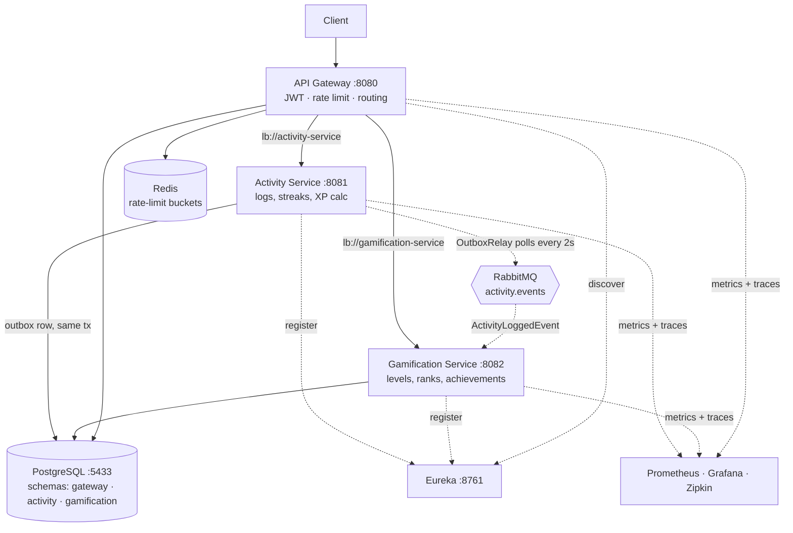

# Why my habit tracker gives you a 1.5× multiplier for showing up 11 days straight

Most habit trackers give you a checkbox and a streak counter. I wanted the thing that actually makes
games sticky: XP that compounds, levels that get meaningfully harder as you climb, and a percentile
rank that puts you against everyone else on the board. So logging a 45-minute study session in
[Gamified Tracker](https://github.com/prashant-singh-2001/gamified_tracker) doesn't just tick a box —
it computes `durationMinutes × activityMultiplier × bonusRoll × streakMultiplier`, banks XP against
that specific activity, maybe crosses a level threshold, and nudges your global rank from FOOTHILL
toward SUMMIT.

The formula isn't the hard part. The hard part is that **the XP award must never be able to break the
thing it's rewarding**. If the gamification layer falls over at 2am, your log still has to save. I
learned that the ugly way — my first version called the gamification service synchronously *before*
it saved the log, so a gamification outage didn't just skip your XP, it silently threw away the
activity you logged. That one bug is responsible for most of the architecture below.

## The system, in one picture



The dotted lines are the ones that matter. Everything solid is a request that can fail in front of a
user; everything dotted can be down for ten minutes and nobody notices except me.

## Stack

- **Java 17 + Spring Boot 3.5** — versatile, boring in the good way, and 20+ years of community
  answers for every stack trace I'd hit.
- **Spring Cloud Gateway (MVC)** — single front door: auth, rate limiting, routing.
- **Netflix Eureka** — service registry, so nothing hardcodes a host:port.
- **Spring Security OAuth2 Resource Server + JWT** — token issue at the gateway, validation at the gateway.
- **RabbitMQ (Spring AMQP)** — async XP awards, with a dead-letter queue.
- **PostgreSQL 15 + Flyway** — one instance, one schema per service, versioned migrations.
- **Docker Compose** — the whole thing, one command.
- **Prometheus · Grafana · Zipkin · Micrometer** — metrics, dashboards, distributed traces.

## Why microservices and not a monolith

I planned this for a wide audience — students through early-career professionals — and the split I
cared about was blast radius. In a monolith, the gamification layer chewing through a leaderboard
recompute degrades the endpoint that logs your activity, because they share a thread pool and a
heap. Splitting them means a gamification stall is a *delay in XP appearing*, not a *failure to
record what you did*.

The honest counterpoint: for my current traffic, a monolith would be entirely fine and about a
quarter of the operational work. I took the complexity deliberately, because the decoupling I wanted
between "record the fact" and "reward the fact" is the kind you can't fake with a well-named package.

## The pieces

### Service discovery — Eureka

`eureka-server` is a bare `@EnableEurekaServer` app, no custom code at all. The value is on the
client side: the gateway routes to `lb://activity-service`, a *name*, not `http://activity:8081`.
When I scale a service to two containers, the gateway load-balances across both without a config
change.

```yaml
eureka:
  client:
    service-url:
      defaultZone: http://eureka-server:8761/eureka
  instance:
    prefer-ip-address: true
    lease-renewal-interval-in-seconds: 10   # default is 30
    lease-expiration-duration-in-seconds: 30 # default is 90
```

I tightened the lease timings well below Eureka's defaults. Out of the box, a dead instance can stay
in the registry for 90 seconds, which in a demo environment means a minute and a half of requests
being load-balanced into a corpse.

### API Gateway — one place to say "no"

Routes are Java config rather than YAML, because each one composes a rewrite, a discovery-backed
load balancer, and a rate limiter:

```java
@Bean
public RouterFunction<ServerResponse> activityRoute(RateLimitProperties props) {
    var b = props.activity();
    return route("activity")
            .route(path("/api/activity/**").or(path("/api/activitylog/**")).or(path("/api/insights/**")), http())
            .before(rewritePath("^/api/(.*)$", "/$1"))
            .filter(lb("activity-service"))
            .filter(rateLimit(c -> c
                    .setCapacity(b.capacity())
                    .setPeriod(Duration.ofSeconds(b.periodSeconds()))
                    .setKeyResolver(RateLimitKeyResolver.byUserIdOrIp())))
            .build();
}
```

Centralizing here instead of per-service was the call I'd defend hardest. Both downstream services
run with **no Spring Security of their own**. Every `hasRole("ADMIN")` rule in the system lives in
one file:

```java
.requestMatchers(HttpMethod.POST, "/api/activity", "/api/activity/").hasRole("ADMIN")
.requestMatchers("/api/activitylog/review/**").hasRole("ADMIN")
.requestMatchers(HttpMethod.POST, "/api/level", "/api/level/").hasRole("ADMIN")
```

One file to audit beats three files to keep in sync. The cost is real, though: anything that reaches
a service without going through the gateway is completely unauthenticated. That's acceptable behind
a Docker network and unacceptable the moment those ports are public — which is a note-to-self, not a
recommendation.

### Auth — the half nobody blogs about

Issuing and validating a JWT is the easy half, and Spring Security does it for me. The gateway signs
HS256 tokens carrying `role` *and* the numeric `userId`, and `NimbusJwtDecoder` verifies them on the
way back in. Deleting my hand-rolled `JwtFilter` in favor of the OAuth2 resource server removed about
130 lines of token handling for identical guarantees.

The hard half is getting the *verified* identity to services that trust nothing. The gateway
overwrites a `userId` header from the token claim, so a downstream service can read it as gospel:

```java
Object rawUserId = jwtAuth.getToken().getClaim("userId");
if (rawUserId == null) { response.setStatus(SC_UNAUTHORIZED); return; }
final String trustedUserId = String.valueOf(rawUserId);

HttpServletRequestWrapper wrapper = new HttpServletRequestWrapper(request) {
    @Override public String getHeader(String name) {
        return USER_ID_HEADER.equalsIgnoreCase(name) ? trustedUserId : super.getHeader(name);
    }
    @Override public Enumeration<String> getHeaders(String name) { /* same override */ }
    @Override public Enumeration<String> getHeaderNames() {
        List<String> names = Collections.list(super.getHeaderNames());
        names.removeIf(n -> USER_ID_HEADER.equalsIgnoreCase(n));
        names.add(USER_ID_HEADER);
        return Collections.enumeration(names);
    }
};
```

Those last two overrides are the entire security fix, and I got them wrong first. Overriding only
`getHeader()` looks correct and tests green — but Spring Cloud Gateway builds the forwarded request
by iterating `getHeaderNames()` and calling `getHeaders(name)`. It never calls `getHeader()`. So a
client sending its own `userId: 1` header had that value forwarded verbatim, straight past a filter I
believed was sanitizing it. A textbook IDOR, hiding behind a method I hadn't overridden.

### Data — one Postgres, three schemas

Every service points at the same instance and the same `tracker_db`, but owns a distinct Postgres
schema with its own Flyway history:

```yaml
spring:
  jpa:
    hibernate:
      ddl-auto: validate     # Flyway owns the schema; Hibernate only checks it
    properties:
      hibernate:
        default_schema: gamification
  flyway:
    schemas: gamification
    default-schema: gamification
```

`ddl-auto: validate` is the part I'd push on anyone starting out. `update` feels great until
Hibernate quietly diverges from what your migrations claim, and then you have two sources of truth
and no way to tell which one production believes. Migrations own the schema; Hibernate is only
allowed to complain.

### Gamification — event-driven, and stubbornly so

Logging an activity writes two rows in **one transaction**: the log, and an outbox row describing
what happened.

```java
var saved = activityLogRepository.save(activityLog);           // 1. the log FIRST

var event = new ActivityLoggedEvent(saved.getId(), userId,
        saved.getActivity().getId(), saved.getXpEarned());

outboxEventRepository.save(OutboxEvent.builder()               // 2. the event, SAME tx
        .aggregateType("ActivityLog").aggregateId(saved.getId())
        .eventType("ActivityLogged").payload(toJson(event))
        .idempotencyKey(String.valueOf(saved.getId()))
        .createdAt(LocalDateTime.now()).publishedAt(null).build());
```

`@Transactional` is the whole trick: both rows commit or neither does. There is no window where a log
exists without its event, and no synchronous call to another service that can fail this request. A
scheduled relay ships whatever is unpublished, and only stamps `publishedAt` on success — a broker
outage just means the rows sit there until the next tick:

```java
@Scheduled(fixedDelayString = "${outbox.relay.delay-ms:2000}")
@Transactional
public void publishPending() {
    for (var row : repository.findTop100ByPublishedAtIsNullOrderByCreatedAtAsc()) {
        try {
            rabbitTemplate.convertAndSend(exchange, routingKey,
                    objectMapper.readValue(row.getPayload(), ActivityLoggedEvent.class));
            row.setPublishedAt(LocalDateTime.now());   // stamped only on success
        } catch (Exception e) {
            log.warn("Failed to publish outbox row {} (will retry)", row.getId(), e);
        }
    }
}
```

That's at-*least*-once delivery, which means the consumer has to be idempotent. It writes a guard row
keyed on the log id *before* applying XP:

```java
@RabbitListener(queues = "${messaging.queue}")
@Transactional
public void onActivityLogged(ActivityLoggedEvent event) {
    String key = String.valueOf(event.logId());
    if (processedEventRepository.existsById(key)) return;      // fast path

    // Guard FIRST: the unique PK serializes concurrent duplicates. If a racing delivery
    // already inserted this key, THIS save throws, the whole tx rolls back (XP not applied),
    // the message is redelivered, existsById is now true -> skipped. Exactly once.
    processedEventRepository.save(new ProcessedEvent(key, LocalDateTime.now()));

    levelTrackerService.save(event.userId(),
            new LevelTrackerRequestDTO(event.activityId(), event.xpEarned()));
}
```

The `existsById` check is only a fast path for sequential redelivery. The actual correctness comes
from the primary key constraint — two concurrent deliveries both pass the check, and the database
picks a winner.

Downstream, the XP lands on a per-activity tracker guarded by an atomic upsert plus a
`SELECT … FOR UPDATE`, and the level falls out of a configurable curve:

```java
/** xpRequiredFor(level) = baseXp * (level - 1) ^ exponent — base 100, exponent 1.5, cap 100. */
public int levelFor(double totalXp) {
    if (totalXp <= 0) return 1;
    int level = 1 + (int) Math.floor(Math.pow(totalXp / baseXp, 1.0 / exponent));
    level = Math.max(1, Math.min(level, maxLevel));
    // Math.pow/floor can land a hair off an exact boundary — nudge onto the correct side.
    while (level < maxLevel && xpRequiredFor(level + 1) <= totalXp) level++;
    while (level > 1 && xpRequiredFor(level) > totalXp) level--;
    return level;
}
```

The two `while` loops exist because floating-point `pow` will occasionally put you at level 6 with
exactly the XP that level 7 requires. Nothing is more annoying to a user than XP that visibly doesn't
add up.

## The decision I'd actually defend: shared instance, schema per service

Textbook microservices says database-per-service. I run one PostgreSQL container with three schemas —
`gateway`, `activity`, `gamification` — each with its own migration history.

**The case against me:** it's a shared failure domain. That one container dying takes down all three
services at once, so I've paid for microservices and kept a monolithic database. A long-running query
in gamification competes for the same connection slots and buffer cache as an activity write. And the
temptation to just `JOIN` across schemas — quietly welding two services together forever — is one
`grep` away. Nothing but discipline stops it.

**The case for me:** it isn't shared *ownership*. Each service has its own schema, its own Flyway
history, and `ddl-auto: validate` so nothing writes outside its lane. No service reads another's
tables — the only cross-service data flow in the entire system is the RabbitMQ event. So the
migration to true database-per-service is a connection-string change and a `pg_dump`, not a
refactor. Meanwhile I get one container instead of three, one backup, and a Compose file a
contributor can actually run on a laptop.

Physical separation buys fault isolation. Logical separation buys the freedom to *choose* physical
separation later. For a project whose contributors run everything on one machine, I'd rather have the
option than the overhead — and I'd rather be honest that this is a tradeoff than pretend the shared
container isn't a shared failure domain.

## What broke

**The bug that reshaped the project.** The original write path called gamification synchronously,
*before* saving the log. Gamification down meant the request threw, and the user's activity was never
recorded at all. The fix wasn't a retry or a circuit breaker — it was deleting the synchronous call.
Every pattern in the gamification section above exists to close that one hole.

**Async has a UX cost, and I ate it.** `POST /api/activitylog` used to return `leveledUp: true` in the
response. It now always returns `false`, because at the moment the response is written, nothing
downstream has run. Correctness went up; the "you leveled up!" moment moved to a separate read. I
haven't fully solved that — right now a client has to poll `/api/level`, and it should be a push.

**A type header nobody sees.** `ActivityLoggedEvent` was originally declared separately in each
service. Spring AMQP's Jackson converter stamps a `__TypeId__` header with the producer's fully
qualified class name, and the consumer couldn't resolve
`com.tracker.activity.messaging.ActivityLoggedEvent` because it had its own copy under a different
package. Two fixes: a shared `contracts` module for the wire type, and pinning type precedence to
`INFERRED` so the converter deserializes into the `@RabbitListener` parameter type and ignores the
header entirely — which also makes a rolling deploy safe in either order.

**Spring Security ate my error responses.** Every proxied downstream error — a 404, a 500, anything —
came back to clients as 401 or 403. Spring Security's filter chain also governs the container's
internal `ERROR` dispatch to Boot's `/error`, and on that dispatch the re-authenticating filters are
skipped, so the context is anonymous, `/error` matches no `permitAll` rule, and Security writes its
own response *over* the real one. One line, and it has to be first, because matchers evaluate in
declaration order:

```java
.dispatcherTypeMatchers(DispatcherType.ERROR, DispatcherType.FORWARD).permitAll()
```

**A JVM that didn't have my random generator.** `RandomGenerator.getDefault()` returns
`L32X64MixRandom`, which isn't present on every JVM/container image I ran on — so the log endpoint
500'd on some images and worked fine on others. `ThreadLocalRandom.current()` and it was gone. A good
reminder that "works on my machine" is a container image, not a machine.

**What I'd do differently:** I'd wire the Config Server *before* writing five copies of the same
`application.yaml`. The module is built and the shared config repo exists, but no service imports it
yet — so today it's a Phase 1 skeleton, and every service still carries its own duplicated Eureka and
Actuator block. Doing that first would have cost an afternoon; retrofitting it now means touching
every service.

## Run it

```bash
git clone https://github.com/prashant-singh-2001/gamified_tracker
cd gamified_tracker
cp .env.example .env          # defaults are fine for local dev
docker compose up --build
```

That brings up all four services plus Postgres, RabbitMQ, Redis, Eureka, Prometheus, Grafana and
Zipkin, chained on `depends_on: condition: service_healthy` so nothing starts before its dependencies
actually pass a healthcheck. Register a user at `POST localhost:8080/auth/register`, and the Eureka
dashboard at `localhost:8761` shows everything registered.

The repo is open to contributors and issues are labelled by type and priority — several pieces of
what's above, the Flyway migration setup among them, landed from outside contributors.
`docs/features/` has a deep-dive per feature, and `docs/FLOWS.md` maps what happens in what order
across services, which is the doc I wish every project had.

## What's next

Push notifications for level-ups, so the async tradeoff stops being a UX regression, and actually
finishing the Config Server migration. If you've got opinions on the shared-instance-with-schemas
call — especially if you think I'm wrong — I'd genuinely like to hear them.
