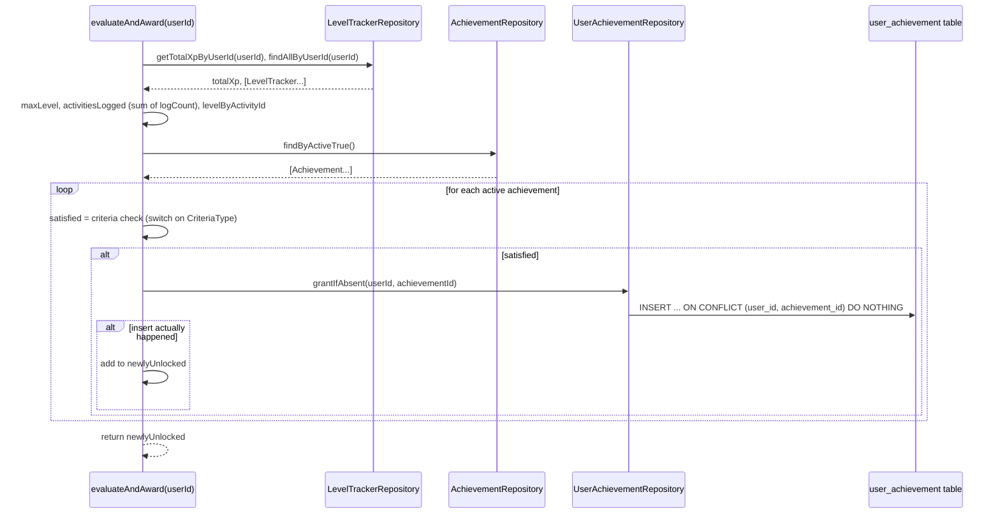

# Achievement Badges — Criteria-Driven, Idempotent Grants

**Service:** `gamification-service` · **Key classes:** `Achievement`, `UserAchievement`,
`CriteriaType`, `AchievementServiceImpl`, `UserAchievementRepository`

## What it is / why it's notable

A small rules engine that turns a user's existing gamification state — total XP, per-activity levels,
activity log counts — into unlockable badges, without a bespoke evaluator per badge type.
`evaluateAndAward(userId)` re-reads a user's current `LevelTracker` rows, checks every active
`Achievement` row against one of four generic criteria kinds, and grants whichever are newly satisfied.
Adding a new badge is a data change (`INSERT INTO achievement ...`), not a code change — no new `if`
branch, no new repository method.

**Honest gap, not a hidden one:** this is fully implemented and unit-tested
(`AchievementServiceImplTest`, `UserAchievementRepositoryTest`), but as of this writing
`evaluateAndAward` has **no caller in production code** — no controller exposes it, and nothing
invokes it after XP is applied. It's the backend half of the feature with the trigger not yet wired;
see [Wiring it up](#wiring-it-up-the-natural-next-step) below for where that plug fits.

## How it works



### 1. Four criteria kinds, one `switch` — no per-badge code

```java
boolean satisfied = switch (achievement.getCriteriaType()) {
    case TOTAL_XP -> totalXp >= achievement.getThreshold();
    case REACH_LEVEL_ANY -> maxLevel >= achievement.getThreshold();
    case ACTIVITIES_LOGGED -> activitiesLogged >= achievement.getThreshold();
    case ACTIVITY_LEVEL -> levelByActivityId.getOrDefault(achievement.getActivityId(), 0)
            >= achievement.getThreshold();
};
```
`CriteriaType` is a plain 4-value enum (`TOTAL_XP`, `REACH_LEVEL_ANY`, `ACTIVITIES_LOGGED`,
`ACTIVITY_LEVEL`); every badge is data — `(criteriaType, threshold, activityId)` — evaluated against the
same four small aggregates computed once per call:
```java
double totalXp = levelTrackerRepository.getTotalXpByUserId(userId);
List<LevelTracker> trackers = levelTrackerRepository.findAllByUserId(userId);
int maxLevel = trackers.stream().mapToInt(t -> t.getLevel() == null ? 0 : t.getLevel()).max().orElse(0);
long activitiesLogged = trackers.stream().mapToInt(LevelTracker::getLogCount).sum();
Map<Long, Integer> levelByActivityId = trackers.stream()
        .collect(Collectors.toMap(LevelTracker::getActivityId, t -> t.getLevel() == null ? 0 : t.getLevel()));
```
`activitiesLogged` is the reason `LevelTracker` carries a `logCount` field at all — `totalXp` alone can't
be reversed into "how many times did this user log something," so the count is tracked explicitly on
every `save()` (see [Concurrency-Safe XP Accumulation](concurrency-safe-xp.md)).

### 2. Idempotent grant — the same upsert idiom used across this codebase

```java
@Modifying(flushAutomatically = true)
@Query(value = """
        INSERT INTO user_achievement (user_id, achievement_id, unlocked_at)
        VALUES (:userId, :achievementId, now())
        ON CONFLICT (user_id, achievement_id) DO NOTHING
        """, nativeQuery = true)
int grantIfAbsent(@Param("userId") Long userId, @Param("achievementId") Long achievementId);
```
Returns `1` if the grant actually happened, `0` if the user already owned it — that return value is
exactly what `evaluateAndAward` checks before adding a badge to `newlyUnlocked`, so calling this method
repeatedly (once per activity log, say) never re-grants or re-reports an already-owned badge. The
`(user_id, achievement_id)` unique constraint (`uk_user_achievement`) is the backstop, same three-layer
shape as `LevelTracker.insertIfAbsent` and `UserRankRepository.upsert` — this codebase's one recurring
idempotent-write pattern, reused a third time.

### 3. Starter catalog — data, not code

```sql
-- V2__insert_data.sql — idempotent: ON CONFLICT (code) DO NOTHING
INSERT INTO achievement (code, name, description, criteria_type, threshold, activity_id, is_active)
VALUES ('FIRST_STEPS', 'First Steps', 'Log your first activity.', 'ACTIVITIES_LOGGED', 1, NULL, true)
ON CONFLICT (code) DO NOTHING;
-- XP_1000 (TOTAL_XP >= 1000), LEVEL_5 (REACH_LEVEL_ANY >= 5), DEDICATED (ACTIVITIES_LOGGED >= 50)
```
Four seeded badges, none scoped to a specific `activityId` (`ACTIVITY_LEVEL` badges — the one criteria
kind that *does* need one — aren't seeded yet, since they only make sense once specific activities
exist).

## Wiring it up (the natural next step)

The feature has no trigger today; the most natural place to add one mirrors how `LevelUpEvent` is
already emitted — inside `LevelTrackerServiceImpl.save`'s existing `@Transactional`, or from
`ActivityLoggedListener` right after it applies XP, both of which already have `userId` in scope:
```java
// ActivityLoggedListener.onActivityLogged — after the existing levelTrackerService.save(...) call
List<Achievement> unlocked = achievementService.evaluateAndAward(event.userId());
// unlocked -> could feed the same LevelUpEvent-style notification table, or its own.
```
A read endpoint (`GET /achievements/user/{id}`, backed by
`UserAchievementRepository.findByUserIdOrderByUnlockedAtDesc`, which already exists and is tested) is
the other missing half — this doc calls it out rather than leaving it implicit, matching this project's
own convention of documenting known gaps instead of hiding them (see the "leveled up fires on every
save" and "no small-population gate" notes in [Rank & Level System](rank-and-level-system.md)).

## Config

No config keys. Seed data lives in `V2__insert_data.sql` (idempotent — safe on every restart). No
gateway route exists for this feature yet, since there's no controller to route to.

## Try it

There's no HTTP surface to curl yet (see the gap above). The executable proof today is the test suite:
```bash
mvn -pl gamification-service -am test -Dtest=AchievementServiceImplTest,UserAchievementRepositoryTest -Dsurefire.failIfNoSpecifiedTests=false
```
`AchievementServiceImplTest` covers: granting `XP_1000` on threshold-crossing, granting `LEVEL_5` off
the max level across any single activity, `ACTIVITIES_LOGGED` correctly summing `logCount` across every
tracker (not just one), no grant below threshold, no re-grant once already owned, and `ACTIVITY_LEVEL`
correctly scoping to one specific tracked activity (defaulting to `0` for an activity the user has never
touched).

## Related
[Concurrency-Safe XP Accumulation](concurrency-safe-xp.md) (source of `logCount`, and the
`insertIfAbsent` upsert idiom this reuses) · [Rank & Level System](rank-and-level-system.md) (the other
feature built alongside this one, reusing the same idempotent-upsert pattern) ·
[Level-Up Notifications](level-up-notifications.md) (the existing notification shape a future
"achievement unlocked" feed would likely mirror) · issue #13
