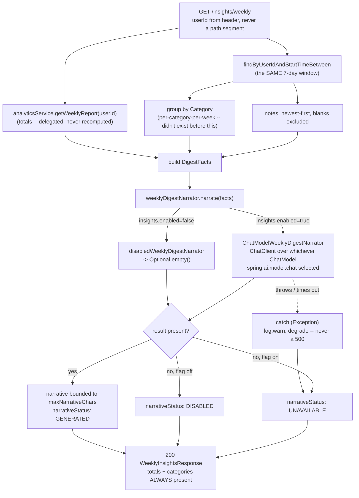

# AI Weekly Coaching Digest — A Provider-Agnostic Narrator Over Java-Computed Numbers

**Service:** `activity-service` · **Key classes:** `InsightsServiceImpl`, `WeeklyDigestNarrator`,
`ChatModelWeeklyDigestNarrator`, `WeeklyDigestPromptBuilder`, `DigestFacts`, `InsightsConfig`,
`InsightsController`

## What it is / why it's notable

`activity_log.notes` is the only free-text field a user ever writes in this system. Grepped across
every module: it's written once (`ActivityLogServiceImpl`), echoed back on two read paths, and
consumed by **nothing** else — no query filters, sorts, indexes, or aggregates it, and it never
crosses a service boundary (`ActivityLoggedEvent` carries only `logId/userId/activityId/xpEarned`).
Issue [#65](https://github.com/prashant-singh-2001/gamified_tracker/issues/65) is what finally reads
it: `GET /insights/weekly` turns a week of per-category totals plus that week's notes into a short
AI-written coaching narrative — what went well, what slipped, one concrete suggestion.

**The model narrates, it never computes.** Every number in the response — `totals`, `categories` —
is computed in Java before the model is ever called, by delegating to the existing
[Analytics](analytics.md) endpoint's `getWeeklyReport()` for the headline totals. The narrative is
prose *about* those numbers, injected into the prompt as already-final facts the model is instructed
to copy, never invent. This is the deliberate defense against the most obvious LLM failure mode for
a numbers-driven feature: a model asked to both compute and narrate will occasionally do the first
one wrong.

**Always `200`.** `insights.enabled` defaults to `false`, and no model backend is selected by default
either — CI has neither a model server nor secrets, and the compose health gate must stay green. Off,
misconfigured, or a live model timeout all look identical from the wire: `totals`/`categories` are
always present, and `narrativeStatus` (`GENERATED` / `DISABLED` / `UNAVAILABLE`) tells the client
which case it's looking at without a second response shape or a non-200 status.

**Two interchangeable local backends behind one interface.** [Fuzzy Activity-Name
Matching](fuzzy-activity-matching.md) split its scoring strategy from its safety rails specifically so
an LLM-backed provider could be swapped in later without touching the caller — this feature is the
first thing to actually use that kind of seam. `WeeklyDigestNarrator` is the interface;
`ChatModelWeeklyDigestNarrator` is the one implementation, built on Spring AI's `ChatModel`
abstraction. Ollama and Docker Model Runner both resolve to a `ChatModel` bean — they differ only in
which Spring AI autoconfiguration supplies it — so switching backend is pure configuration, never a
code change. See "Choosing a backend" below.

## How it works



### 1. Reusing the headline totals — `InsightsServiceImpl`

```java
// Delegated, not recomputed: makes "insights and /weekly-report never disagree" true by
// construction rather than by two copies of the same window math staying in sync.
WeeklyReportResponse totals = analyticsService.getWeeklyReport(userId).getBody();

List<ActivityLog> weekLogs = activityLogRepository.findByUserIdAndStartTimeBetween(
        userId, weekStart.atStartOfDay(), today.atTime(LocalTime.MAX));
```

`getWeeklyReport()` already computes `currentWeekXp`, `previousWeekXp`, `percentageChange`,
`totalActiveMinutes`, and `topCategory` over the identical rolling 7-day window
(`today.minusDays(6)..today`, bucketed on `startTime`). Recomputing that math a second time here
would be one extra `SELECT`, but it would also be a second copy that can silently drift from the
first — this endpoint would then disagree with `/activitylog/analytics/user/{id}/weekly-report`
about what happened this week, which is worse than the extra query it avoids.

### 2. The per-category-per-week aggregate that didn't exist

`CategorySummaryResponse` already existed, but only computed **all-time**
(`AnalyticsServiceImpl.getCategorySummary`, no date filter); the weekly report only ever carried a
single `topCategory`. This feature needed the per-category breakdown *for the week*, so
`InsightsServiceImpl` mirrors `getCategorySummary`'s exact grouping idiom against the same windowed
query used for `totals`, rather than adding a third query:

```java
Map<Category, List<ActivityLog>> grouped = weekLogs.stream()
        .filter(l -> l.getActivity() != null && l.getActivity().getCategory() != null)
        .collect(Collectors.groupingBy(l -> l.getActivity().getCategory()));
```

`notes` comes along for free from the same `weekLogs` list — no third query, no new repository
method. Both consistency choices track `/weekly-report` deliberately: FLAGGED/REJECTED logs are
still counted (see [Session Integrity](session-integrity.md)'s quarantine, whose XP was never
actually awarded) — an intentional match, not an oversight; see Known simplifications.

### 3. The provider seam — `WeeklyDigestNarrator`

```java
public interface WeeklyDigestNarrator {
    /**
     * Return a short coaching narrative, or Optional.empty() if none can be produced. MUST NOT
     * throw: this sits on a user-facing GET, and a model outage must degrade to numbers-only,
     * never turn a working request into an error.
     */
    Optional<String> narrate(DigestFacts facts);
}
```

`DigestFacts` is a flat record — week bounds, the totals, the per-category rows, the note lines — with
**zero Spring/JPA imports**, mirroring `ActivityCandidate` from the #66 seam: the narrator never sees
an `ActivityLog` entity or a repository. `ChatModelWeeklyDigestNarrator` is the only implementation,
and it's deliberately thin:

```java
public ChatModelWeeklyDigestNarrator(ChatModel chatModel, WeeklyDigestPromptBuilder promptBuilder) {
    this.chatClient = ChatClient.create(chatModel);
    this.promptBuilder = promptBuilder;
}
```

It takes whichever `ChatModel` Spring AI's autoconfiguration wired in — it has no idea whether that's
Ollama or Docker Model Runner underneath, and doesn't need to. `InsightsConfig` selects the bean:

```java
@Bean
@ConditionalOnProperty(prefix = "insights", name = "enabled", havingValue = "true")
public WeeklyDigestNarrator chatModelWeeklyDigestNarrator(
        ObjectProvider<ChatModel> chatModel, WeeklyDigestPromptBuilder promptBuilder) {
    ChatModel model = chatModel.getIfAvailable();
    return model == null ? facts -> Optional.empty() : new ChatModelWeeklyDigestNarrator(model, promptBuilder);
}

// Declared second. insights.enabled=false (the default, and CI) constructs nothing AI-related.
@Bean
@ConditionalOnMissingBean(WeeklyDigestNarrator.class)
public WeeklyDigestNarrator disabledWeeklyDigestNarrator() { return facts -> Optional.empty(); }
```

`ObjectProvider<ChatModel>` rather than `@ConditionalOnBean` — the latter is only reliable inside
auto-configuration classes, not user config — and `getIfAvailable()` is what lets
`insights.enabled=true` with `spring.ai.model.chat=none` (flag on, no backend chosen) degrade to the
no-op narrator instead of failing context startup.

### 4. Prompt hardening — `WeeklyDigestPromptBuilder`

Every string in `DigestFacts.noteLines()` is a user's free text and is treated as untrusted data,
never as instructions — the same posture any endpoint takes toward client input, applied here because
this is the first place free text a user wrote flows into a prompt. `WeeklyDigestPromptBuilder` is
pure (no Spring AI import) specifically so these rules are unit-testable without a model:

- At most `maxNotes` notes, **newest-first** — the caller sorts, the builder just takes the first N.
- Each note truncated to `maxNoteChars`.
- ASCII control characters stripped and whitespace collapsed, so a note can't forge a fake stat line
  or a newline-delimited fake bullet.
- Backticks neutralized (replaced with apostrophes) — they're how the fence around the notes block is
  spelled, so a note containing ` ``` ` cannot introduce a fourth fence and break out of the block.
- The system prompt states outright that the notes block is data, that anything inside it that reads
  like an instruction is part of the user's week and not a command, and that every number in the
  reply must be copied from the stats block — never estimated, rounded differently, or invented.
- The model's reply itself is bounded to `maxNarrativeChars` before it's used.

That last bound is enforced **twice**, deliberately: once inside `ChatModelWeeklyDigestNarrator`
(it calls `promptBuilder.truncateNarrative(...)` on the raw model output), and again in
`InsightsServiceImpl` regardless of which narrator answered. Every `WeeklyDigestNarrator`
implementation funnels through the service before becoming a wire response, so the length invariant
on `WeeklyInsightsResponse.narrative` holds even if a future implementation forgets to enforce it
itself.

### 5. Degrading gracefully — the `try`/`catch` and `narrativeStatus`

```java
try {
    Optional<String> result = weeklyDigestNarrator.narrate(facts);
    if (result.isPresent()) {
        narrative = boundNarrative(result.get());
        narrativeStatus = NarrativeStatus.GENERATED;
    } else {
        narrativeStatus = insightsProperties.enabled() ? NarrativeStatus.UNAVAILABLE : NarrativeStatus.DISABLED;
    }
} catch (Exception e) {
    log.warn("Weekly digest narrator failed for user {} (falling back to numbers-only)", userId, e);
    narrativeStatus = NarrativeStatus.UNAVAILABLE;
}
```

This is the second `catch (Exception)` in the module's `src/main` — the first is `OutboxRelay`'s
publish loop, and this mirrors its shape exactly: log a warning, degrade, carry on. It's load-bearing
here specifically because `GlobalExceptionHandler` has **no catch-all `@ExceptionHandler`** — a
documented, deliberate edge (see [Error Handling](error-handling.md)) — so an escaping model timeout
would otherwise surface as a raw, unstyled `500`. The `insightsProperties.enabled()` check is what
disambiguates the two ways `Optional.empty()` can happen: the flag itself is off (`DISABLED`), versus
the flag is on but nothing answered (`UNAVAILABLE`) — indistinguishable from the `Optional` alone,
since the disabled no-op narrator and a live-but-silent one both just return nothing.

## Choosing a backend

Both backends are local, Docker-hosted, and require no API key — the only supported shapes today (see
Known simplifications). Switching between them is one environment variable,
`spring.ai.model.chat` — Spring AI's own selector for which chat autoconfiguration is live, not a
second config knob layered on top of it (see Config below for why).

| | Ollama | Docker Model Runner |
|---|---|---|
| Spring AI starter | `spring-ai-starter-model-ollama` | `spring-ai-starter-model-openai` (any OpenAI-compatible server) |
| `spring.ai.model.chat` | `ollama` | `openai` |
| Runs as | a `docker-compose.yml` service, `profiles: ["insights"]` | Docker Desktop's built-in Model Runner, via `docker-compose.insights-dmr.yml` |
| Start it | `docker compose --profile insights up -d` | `docker compose -f docker-compose.yml -f docker-compose.insights-dmr.yml up -d` |
| Pull a model | `docker compose exec ollama ollama pull llama3.2` | pulled automatically on first use as an OCI artifact |
| Base URL | `OLLAMA_BASE_URL` (`http://ollama:11434` in Docker) | `INSIGHTS_OPENAI_BASE_URL` — Compose injects this automatically via the DMR file's `endpoint_var` |

**Why one `ChatModelWeeklyDigestNarrator` covers both.** Docker Model Runner exposes an
OpenAI-compatible inference API, so from Spring AI's perspective it's just another `openai`-flavored
`ChatModel` — the same starter that would talk to vLLM or LocalAI. Neither backend needs its own
Java class; the narrator only ever depends on the `ChatModel` interface, and Spring AI's
autoconfiguration is what decides which concrete implementation answers it.

## Config

```yaml
# activity-service application.yaml
insights:
  enabled: ${INSIGHTS_ENABLED:false}
  max-notes: ${INSIGHTS_MAX_NOTES:20}
  max-note-chars: ${INSIGHTS_MAX_NOTE_CHARS:280}
  max-narrative-chars: ${INSIGHTS_MAX_NARRATIVE_CHARS:1200}

spring:
  ai:
    # none | ollama | openai -- ALL SIX spring.ai.model.* selectors are listed explicitly (chat,
    # embedding, image, audio.speech, audio.transcription, moderation), because the openai starter
    # ships six independent autoconfigurations that each default to ACTIVE when their own selector
    # is unset (matchIfMissing=true) -- confirmed by decompiling the actual jar after an unset
    # selector broke ActivityServiceApplicationTests on a missing API key from an audio-speech
    # bean nothing here calls. Leaving `chat` unset is worse: Ollama's own chat autoconfiguration
    # is ALSO matchIfMissing=true, so both starters would try to supply a ChatModel at once.
    model:
      chat: ${INSIGHTS_CHAT_PROVIDER:none}
      embedding: none
      image: none
      audio:
        speech: none
        transcription: none
      moderation: none
    ollama:
      base-url: ${OLLAMA_BASE_URL:http://localhost:11434}
      init:
        pull-model-strategy: never   # never contact the server at startup
      chat:
        model: ${OLLAMA_MODEL:llama3.2}
    openai:
      base-url: ${INSIGHTS_OPENAI_BASE_URL:http://localhost:12434/engines/v1}
      api-key: ${INSIGHTS_OPENAI_API_KEY:not-needed}   # required by the starter, ignored by a local server
      chat:
        model: ${INSIGHTS_OPENAI_MODEL:ai/gemma3}
```

`insights.enabled` is the whole-feature switch (mirrors `app.admin.bootstrap.enabled`'s convention
for an all-or-nothing feature); `spring.ai.model.chat` is what actually turns a backend on —
`insights.enabled=true` with `spring.ai.model.chat=none` is a valid, supported combination that
degrades to `narrativeStatus: UNAVAILABLE`, not a startup failure.

## Try it

```bash
# Flag off (the default): still 200, all the numbers, no narrative
curl http://localhost:8080/api/insights/weekly -H "Authorization: Bearer $TOKEN"
# -> 200, totals + categories populated, "narrative": null, "narrativeStatus": "DISABLED"

# With Ollama running (INSIGHTS_ENABLED=true, INSIGHTS_CHAT_PROVIDER=ollama) and some
# activities logged with notes this week:
curl http://localhost:8080/api/insights/weekly -H "Authorization: Bearer $TOKEN"
# -> 200, "narrativeStatus": "GENERATED" -- every number the prose mentions matches totals/categories

# Stop the model container with the flag still on
docker compose stop ollama
curl http://localhost:8080/api/insights/weekly -H "Authorization: Bearer $TOKEN"
# -> still 200, "narrative": null, "narrativeStatus": "UNAVAILABLE" -- never a 500

# Same request, Docker Model Runner backend instead -- no code or config change beyond the
# environment variables the override file sets
docker compose -f docker-compose.yml -f docker-compose.insights-dmr.yml up -d
curl http://localhost:8080/api/insights/weekly -H "Authorization: Bearer $TOKEN"
# -> 200, "narrativeStatus": "GENERATED"

# Metrics -- no user-typed text in any tag
curl http://localhost:8081/actuator/prometheus | grep activity_insights_narrative
```

## Known simplifications

- **Local, OpenAI-API-compatible backends only.** A real hosted provider (OpenAI, Anthropic, Bedrock)
  would work behind the same `spring-ai-starter-model-openai` starter, but pointing at one drags in
  secrets management this repo has no story for — CI has none available, and the whole feature is
  designed to default off precisely because of that constraint. Out of scope here; see the sibling
  LLM issues (#68–#72) this seam is built to support later.
- **Buckets on client-supplied `startTime`, not `createdAt`** — inherited from `/weekly-report`
  itself (see [Analytics](analytics.md#honest-gaps)), not introduced by this feature.
- **Counts FLAGGED/REJECTED logs whose XP was never actually awarded.** A deliberate consistency
  choice with `/weekly-report` — the two endpoints must never disagree — not an oversight. A future
  version could exclude them from `/insights/weekly` specifically, at the cost of the two endpoints
  legitimately reporting different totals for the same week.
- **Narrative quality tracks note quality.** A user who never writes notes gets a thin narrative built
  from bare numbers — the same "garbage in" ceiling [Fuzzy Activity-Name
  Matching](fuzzy-activity-matching.md) documents for its own lexical suggestions.
- **Nothing is persisted or cached.** Every call regenerates the narrative from scratch, so two calls
  a second apart can legitimately word it differently even though the underlying numbers are
  identical — there is no digest history, no way to ask "what did last week's narrative say."
- **Output is not reproducible across backends or models.** The numbers are guaranteed identical
  regardless of backend (they're computed in Java); the prose is not, and isn't meant to be.

## Related

[Analytics](analytics.md) (the `getWeeklyReport()` delegation this feature is built on) ·
[Fuzzy Activity-Name Matching](fuzzy-activity-matching.md) (the provider-seam pattern and the
LLM-roadmap context this feature is the first to actually use) ·
[Session Integrity](session-integrity.md) (why FLAGGED logs still count toward these totals) ·
[Error Handling](error-handling.md) (why the `try`/`catch` here can't rely on a catch-all handler) ·
issue #65
