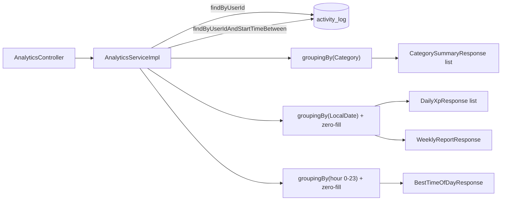

# Analytics — In-Memory Aggregation Over Activity Logs

**Service:** `activity-service` · **Key classes:** `AnalyticsController`, `AnalyticsServiceImpl`,
`CategorySummaryResponse`, `DailyXpResponse`, `WeeklyReportResponse`, `HourOfDayXpResponse`,
`BestTimeOfDayResponse`

## What it is / why it's notable

Four read-only endpoints that turn a user's raw `activity_log` rows into dashboard-shaped
summaries: totals per category, a daily XP timeline, a week-over-week report, and (issue #72) an
hour-of-day breakdown. None of them introduce a new table or a scheduled job — every number is
derived on request from `ActivityLogRepository`.

The notable design choice is *where* the aggregation happens: in the JVM, with Java streams, not in
SQL. `getCategorySummary` and `getBestTimeOfDay` pull every log a user has (`findByUserId`) and
group it with `Collectors.groupingBy`; the other two endpoints narrow first with
`findByUserIdAndStartTimeBetween` and then reduce in memory. This is a real trade-off, not an
oversight — see below.

## How it works



### 1. Why streams, not SQL — sidestepping the H2/Postgres trap

This codebase's biggest testing hazard is documented in the Testing Strategy doc: tests run against
H2, not Postgres, and Postgres-only SQL (`date_trunc`, native upserts) silently isn't exercised by
the `@DataJpaTest` slice. `AnalyticsServiceImpl` never risks that — there's no native query and no
`GROUP BY` in JPQL anywhere in it:

```java
Map<Category, List<ActivityLog>> grouped = logs.stream()
        .filter(log -> log.getActivity() != null && log.getActivity().getCategory() != null)
        .collect(Collectors.groupingBy(log -> log.getActivity().getCategory()));
```
The cost is real too, and worth naming plainly: every log a user has ever created is loaded into
the JVM for `getCategorySummary`, and every log within the query window for the other two. For a
demo app or a user with a few hundred logs this is free; it would not scale to a power user with
years of history without pagination or a real aggregate query.

### 2. Zero-fill — `getXpOverTime`

```java
for (LocalDate date = startDate; !date.isAfter(endDate); date = date.plusDays(1)) {
    List<ActivityLog> dayLogs = groupedByDate.getOrDefault(date, List.of());
    double dayXp = dayLogs.stream().mapToDouble(ActivityLog::getXpEarned).sum();
    long dayDuration = dayLogs.stream().mapToLong(l -> l.getDurationMinutes() != null ? l.getDurationMinutes() : 0L).sum();
    result.add(new DailyXpResponse(date, dayXp, dayDuration));
}
```
The loop walks every calendar day in the window, not just the days with logs, defaulting to an empty
list via `getOrDefault`. A day with zero activity still gets a `DailyXpResponse(date, 0.0, 0)` entry
— `GET .../xp-over-time?days=7` always returns exactly 7 entries, so a client can plot a continuous
line chart without patching gaps itself.

### 3. One query for two weeks — `getWeeklyReport`

```java
LocalDateTime prevStart = previousWeekStart.atStartOfDay();
LocalDateTime endNow = today.atTime(LocalTime.MAX);
List<ActivityLog> logs = activityLogRepository.findByUserIdAndStartTimeBetween(userId, prevStart, endNow);

List<ActivityLog> currentWeekLogs = logs.stream().filter(l -> !l.getStartTime().isBefore(currentStart)).toList();
List<ActivityLog> previousWeekLogs = logs.stream().filter(l -> l.getStartTime().isBefore(currentStart)).toList();
```
Both the current and previous 7-day windows are fetched in a single `BETWEEN` query spanning both,
then partitioned by comparing `startTime` against the boundary in memory — one round trip instead
of two, at the cost of pulling slightly more rows than either window needs alone.

`topCategory` is resolved with a `groupingBy(category, summingDouble(xpEarned))` followed by
`max(Map.Entry.comparingByValue())` over the **current week's** logs only — the category with the
most XP this week, not the most sessions.

### 4. "Analytics, not ML" — `getBestTimeOfDay` (issue #72)

Issue #72 asked for "you tend to log the most XP in category X around hour Y"-style insights, and
its own body makes the scoping call explicit: *"at the scale this app operates at, this is a
`GROUP BY hour_of_day` over `activity_log`, not a model."* The implementation is exactly that —
`Collectors.groupingBy(l -> l.getStartTime().getHour())` over the same `findByUserId` result
`getCategorySummary` already uses, all-time rather than a rolling window (a personal tendency like
"what hour do I usually log XP" is diluted by a short window, not clarified by one — the same
all-time scope as `getCategorySummary`, for the same reason):

```java
List<ActivityLog> timedLogs = logs.stream().filter(l -> l.getStartTime() != null).toList();
Map<Integer, List<ActivityLog>> groupedByHour = timedLogs.stream()
        .collect(Collectors.groupingBy(l -> l.getStartTime().getHour()));
```

`hourlyBreakdown` is zero-filled across all 24 hours, the same convention as `getXpOverTime`'s
zero-filled days — `for (int hour = 0; hour < 24; hour++)` rather than iterating only the hours
that appear in the grouped map, so a client can render a 24-bar chart without patching gaps. The
`startTime != null` filter is applied **once**, up front, and every downstream field — the hourly
buckets, `bestCategory`, `bestCategoryHour` — is derived from that same filtered list, so a
timestamp-less row can't contribute to one field while being invisible in another (an earlier
version of this endpoint let `bestCategory` skip the filter, so it could occasionally name a
category with zero visible presence in `hourlyBreakdown`). Three derived fields turn that raw
distribution into the issue's one-sentence insight, and they go null **as a set**, not
independently — see the next paragraph for why:

- **`bestHour`** — the hour with the most XP across all categories combined, or `null` if the user
  has no XP at all (not just no logs — a `0.0`-XP log at every hour would also leave this `null`,
  since the max is filtered against `> 0.0` rather than merely picking whichever bucket a
  24-way tie of zeros lands on).
- **`bestCategory`** — resolved with the exact same `groupingBy(category, summingDouble(xpEarned))`
  → `max(Map.Entry.comparingByValue())` idiom `getWeeklyReport.topCategory` uses, just over
  all-time logs instead of the current week. **Only computed when `bestHour` is non-null** — a
  user with zero XP everywhere has no best category either, not a best category paired with no
  best hour.
- **`bestCategoryHour`** — the peak hour **within** `bestCategory` only, read off the same
  `groupedByHour` buckets built above (filtered per hour to that category, not re-grouped from the
  raw list) — this is the "hour Y" half of "category X around hour Y," and it can differ from the
  overall `bestHour` if the user's biggest single category isn't also their single best hour. Also
  gated on `bestCategory` being non-null.

A concrete case worth internalizing, since a test in this PR is built exactly to catch a regression
here: a user who plays Gaming for 30 minutes at both 9pm and 10pm (60 XP each, 120 total) and
studies once for an hour at 9am (100 XP) has `bestHour = 9` (no single hour beats 100), but
`bestCategory = GAMING` (120 > 100) with `bestCategoryHour` scoped to *only* Gaming's own logs —
never derived from the overall per-hour winner, which could easily be a different category
entirely.

## Honest gaps

- **Buckets by `startTime`, not `createdAt`.** Every other analytics/ordering concern in this
  codebase treats the server-set `createdAt` as the correct axis specifically because `startTime` is
  client-supplied (see the data-model notes in the project's root `CLAUDE.md`). All four
  endpoints bucket by `startTime` instead, so a log backdated to last week (permitted, since
  `startTime` only needs to be `@PastOrPresent`, not "recent") lands in a past day/week/hour bucket
  rather than the one it was actually logged in. This is sharper for `getBestTimeOfDay` than for
  the other three: on the day/week endpoints a client can only shift *which* bucket a session
  lands in, but on the hour endpoint the client-chosen field **is the entire output** — the "hour Y"
  in "you log the most XP around hour Y" is fully user-forgeable, not just approximate.
- **`percentageChange` is `100.0`, not `Infinity` or `null`, when the previous week was zero and the
  current week is positive** — and `0.0` when both weeks are zero. A deliberate choice to keep the
  field always render-able, but a client can't distinguish "doubled from a small base" from
  "went from nothing to something."
- **`topCategory` is `null`** for a week with no logs at all (`Stream.max()` on an empty stream).
- **Ownership check added by #88, not present when the first three endpoints originally shipped.**
  These endpoints are path-scoped by `{userId}`, not header-scoped, so the fix is a comparison
  rather than a redesign: `AnalyticsServiceImpl.requireSelf` checks the trusted `userId` header
  against the path `{userId}` and throws before touching the repository on a mismatch, rendered as
  a `403` by `GlobalExceptionHandler`. Before #88 this was a real, unguarded IDOR on all three
  original endpoints — any authenticated caller could read any other user's
  category/XP-timeline/weekly-report analytics by changing the path segment.
  `getBestTimeOfDay` (#72) shipped after #88 and reuses the same guard from day one. See
  [Authentication & Identity Propagation](authentication-and-identity.md) for the fuller writeup (it
  also covers the sibling fixes on `GET /activitylog/{id}` and `GET /level/{id}`, which needed a
  404-vs-403 distinction this feature's path-scoped shape doesn't).
- **`bestCategory`'s tie-break is `HashMap` grouping order, not a documented rule** — same caveat
  as `getWeeklyReport.topCategory`'s `Map.Entry.comparingByValue()`, which this deliberately
  mirrors. `bestHour` and `bestCategoryHour` are **not** the same: both scan an explicit `hour = 0`
  to `23` array/list with a strict `>` comparison, so an exact tie always resolves to the earliest
  hour, deterministically. Fine in practice either way, since real XP totals rarely land on an
  exact double equality.
- **Withheld and denied XP still counts toward every number here, including this endpoint's
  max-based fields.** None of the four analytics endpoints — nor the AI weekly digest — filter on
  `ActivityLog.reviewStatus`. A session flagged by [Session Integrity](session-integrity.md) and
  later rejected by an admin (`ActivityLogReviewServiceImpl.reject`) keeps its `xpEarned` value on
  the row by design (rejection is simply never writing the outbox row, not clearing the field), so
  a single denied outlier still contributes here. This matters more for `getBestTimeOfDay` than for
  the other three: `getCategorySummary`/`getXpOverTime`/`getWeeklyReport` **sum** across many rows,
  so one bad row is diluted; `bestHour`/`bestCategory`/`bestCategoryHour` are **max**-based, so one
  sufficiently large denied session can single-handedly become "your best hour." The repository
  already has the right pattern to fix this — `findRecentDurationsForUserAndCategory` and
  `sumDurationForUserOnDay` both restrict to `{CLEARED, APPROVED}` — it just isn't applied to any
  analytics query yet. Tracked as [issue #105](https://github.com/prashant-singh-2001/gamified_tracker/issues/105)
  rather than fixed alongside #72, since the fix belongs to all four endpoints (plus the digest) at
  once, not just the newest one.
- **No user timezone exists anywhere in this system**, and `getBestTimeOfDay` is the one endpoint
  that's entirely made of that gap. Hour buckets come from whatever naive wall-clock `startTime` the
  client sent — a `POST /activitylog/` caller can send any zone's local time with nothing to
  normalize it, and the natural-language logging path (#70) resolves relative times against
  `Clock.systemDefaultZone()` (`NaturalLogConfig`), i.e. the **server's** zone, not the user's. Two
  ingestion paths for the same user can therefore place the same real-world session in different
  hour buckets. `User` has no timezone/locale column (root `CLAUDE.md`: "No timezone, no signup
  date, no locale"), so nothing in this system can correct for it today — the same constraint #70
  documented rather than solved. Fixing it means a schema change to `user_entity` and is its own
  issue, not a query-shape fix.

## Config

No config keys — nothing here is tunable beyond the `days` query parameter on `xp-over-time`
(defaults to 7, floored at 1 by `Math.max(days, 1)`; there is no upper bound). No dedicated
rate-limit bucket either: routed through the gateway's existing `/api/activitylog/**` match, these
endpoints share `activity-service`'s rate limit, not a bucket of their own.

## Try it

```bash
# Through the gateway — matches the existing /api/activitylog/** route
curl http://localhost:8080/api/activitylog/analytics/user/1/category-summary -H "Authorization: Bearer $TOKEN"
curl "http://localhost:8080/api/activitylog/analytics/user/1/xp-over-time?days=14" -H "Authorization: Bearer $TOKEN"
curl http://localhost:8080/api/activitylog/analytics/user/1/weekly-report -H "Authorization: Bearer $TOKEN"
curl http://localhost:8080/api/activitylog/analytics/user/1/best-time-of-day -H "Authorization: Bearer $TOKEN"
# -> {"hourlyBreakdown":[...24 entries...],"bestHour":9,"bestCategory":"STUDY","bestCategoryHour":9}

# Direct against activity-service (bypassing the gateway, as this dev setup allows) — the
# userId header stands in for the gateway-injected one, so it must be set explicitly
curl http://localhost:8081/activitylog/analytics/user/1/category-summary -H "userId: 1"
```

## Related
[Leveling Engine](leveling-engine.md) (the other place this codebase computes a derived summary over
raw logs) · [Testing Strategy](testing-strategy.md) (the H2/Postgres divergence trap this feature's
design sidesteps) · [Streaks](streaks.md) (another read derived from `activity_log`, computed
differently — incrementally, on write, rather than aggregated on read)
