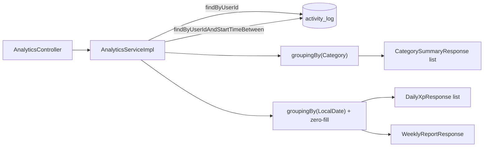

# Analytics — In-Memory Aggregation Over Activity Logs

**Service:** `activity-service` · **Key classes:** `AnalyticsController`, `AnalyticsServiceImpl`,
`CategorySummaryResponse`, `DailyXpResponse`, `WeeklyReportResponse`

## What it is / why it's notable

Three read-only endpoints that turn a user's raw `activity_log` rows into dashboard-shaped
summaries: totals per category, a daily XP timeline, and a week-over-week report. None of them
introduce a new table or a scheduled job — every number is derived on request from
`ActivityLogRepository`.

The notable design choice is *where* the aggregation happens: in the JVM, with Java streams, not in
SQL. `getCategorySummary` pulls every log a user has (`findByUserId`) and groups it with
`Collectors.groupingBy`; the other two endpoints narrow first with
`findByUserIdAndStartTimeBetween` and then reduce in memory. This is a real trade-off, not an
oversight — see below.

## How it works



### 1. Why streams, not SQL — sidestepping the H2/Postgres trap

This codebase's biggest testing hazard is documented in the Testing Strategy doc: tests run against
H2, not Postgres, and Postgres-only SQL (`date_trunc`, native upserts) silently isn't exercised by
the `@DataJpaTest` slice. `AnalyticsServiceImpl` never risks that — there's no native query and no
`GROUP BY` in JPQL anywhere in it:

```java
Map<Category, List<ActivityLog>> grouped = logs.stream()
        .filter(log -> log.getActivity() != null && log.getActivity().getCategory() != null)
        .collect(Collectors.groupingBy(log -> log.getActivity().getCategory()));
```
The cost is real too, and worth naming plainly: every log a user has ever created is loaded into
the JVM for `getCategorySummary`, and every log within the query window for the other two. For a
demo app or a user with a few hundred logs this is free; it would not scale to a power user with
years of history without pagination or a real aggregate query.

### 2. Zero-fill — `getXpOverTime`

```java
for (LocalDate date = startDate; !date.isAfter(endDate); date = date.plusDays(1)) {
    List<ActivityLog> dayLogs = groupedByDate.getOrDefault(date, List.of());
    double dayXp = dayLogs.stream().mapToDouble(ActivityLog::getXpEarned).sum();
    long dayDuration = dayLogs.stream().mapToLong(l -> l.getDurationMinutes() != null ? l.getDurationMinutes() : 0L).sum();
    result.add(new DailyXpResponse(date, dayXp, dayDuration));
}
```
The loop walks every calendar day in the window, not just the days with logs, defaulting to an empty
list via `getOrDefault`. A day with zero activity still gets a `DailyXpResponse(date, 0.0, 0)` entry
— `GET .../xp-over-time?days=7` always returns exactly 7 entries, so a client can plot a continuous
line chart without patching gaps itself.

### 3. One query for two weeks — `getWeeklyReport`

```java
LocalDateTime prevStart = previousWeekStart.atStartOfDay();
LocalDateTime endNow = today.atTime(LocalTime.MAX);
List<ActivityLog> logs = activityLogRepository.findByUserIdAndStartTimeBetween(userId, prevStart, endNow);

List<ActivityLog> currentWeekLogs = logs.stream().filter(l -> !l.getStartTime().isBefore(currentStart)).toList();
List<ActivityLog> previousWeekLogs = logs.stream().filter(l -> l.getStartTime().isBefore(currentStart)).toList();
```
Both the current and previous 7-day windows are fetched in a single `BETWEEN` query spanning both,
then partitioned by comparing `startTime` against the boundary in memory — one round trip instead
of two, at the cost of pulling slightly more rows than either window needs alone.

`topCategory` is resolved with a `groupingBy(category, summingDouble(xpEarned))` followed by
`max(Map.Entry.comparingByValue())` over the **current week's** logs only — the category with the
most XP this week, not the most sessions.

## Honest gaps

- **Buckets by `startTime`, not `createdAt`.** Every other analytics/ordering concern in this
  codebase treats the server-set `createdAt` as the correct axis specifically because `startTime` is
  client-supplied (see the data-model notes in the project's root `CLAUDE.md`). These three
  endpoints bucket by `startTime` instead, so a log backdated to last week (permitted, since
  `startTime` only needs to be `@PastOrPresent`, not "recent") lands in a past day/week bucket
  rather than the day it was actually logged.
- **`percentageChange` is `100.0`, not `Infinity` or `null`, when the previous week was zero and the
  current week is positive** — and `0.0` when both weeks are zero. A deliberate choice to keep the
  field always render-able, but a client can't distinguish "doubled from a small base" from
  "went from nothing to something."
- **`topCategory` is `null`** for a week with no logs at all (`Stream.max()` on an empty stream).
- **No ownership check beyond the gateway's trusted header pattern used elsewhere** — these
  endpoints are path-scoped by `{userId}`, not header-scoped, so any authenticated caller can read
  any other user's analytics by changing the path segment. Consistent with this codebase's other
  intentionally-open reads (`GET /api/level/user/{id}`, `GET /api/activitylog/user/{id}`), but worth
  naming since it wasn't an explicit design discussion for this specific feature.

## Config

No config keys — nothing here is tunable beyond the `days` query parameter on `xp-over-time`
(defaults to 7, floored at 1 by `Math.max(days, 1)`; there is no upper bound). No dedicated
rate-limit bucket either: routed through the gateway's existing `/api/activitylog/**` match, these
endpoints share `activity-service`'s rate limit, not a bucket of their own.

## Try it

```bash
# Through the gateway — matches the existing /api/activitylog/** route
curl http://localhost:8080/api/activitylog/analytics/user/1/category-summary -H "Authorization: Bearer $TOKEN"
curl "http://localhost:8080/api/activitylog/analytics/user/1/xp-over-time?days=14" -H "Authorization: Bearer $TOKEN"
curl http://localhost:8080/api/activitylog/analytics/user/1/weekly-report -H "Authorization: Bearer $TOKEN"

# Direct against activity-service (bypassing the gateway, as this dev setup allows)
curl http://localhost:8081/activitylog/analytics/user/1/category-summary
```

## Related
[Leveling Engine](leveling-engine.md) (the other place this codebase computes a derived summary over
raw logs) · [Testing Strategy](testing-strategy.md) (the H2/Postgres divergence trap this feature's
design sidesteps) · [Streaks](streaks.md) (another read derived from `activity_log`, computed
differently — incrementally, on write, rather than aggregated on read)
