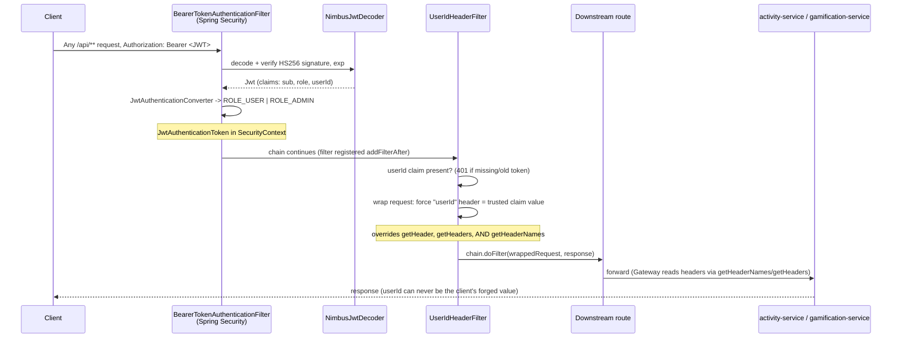
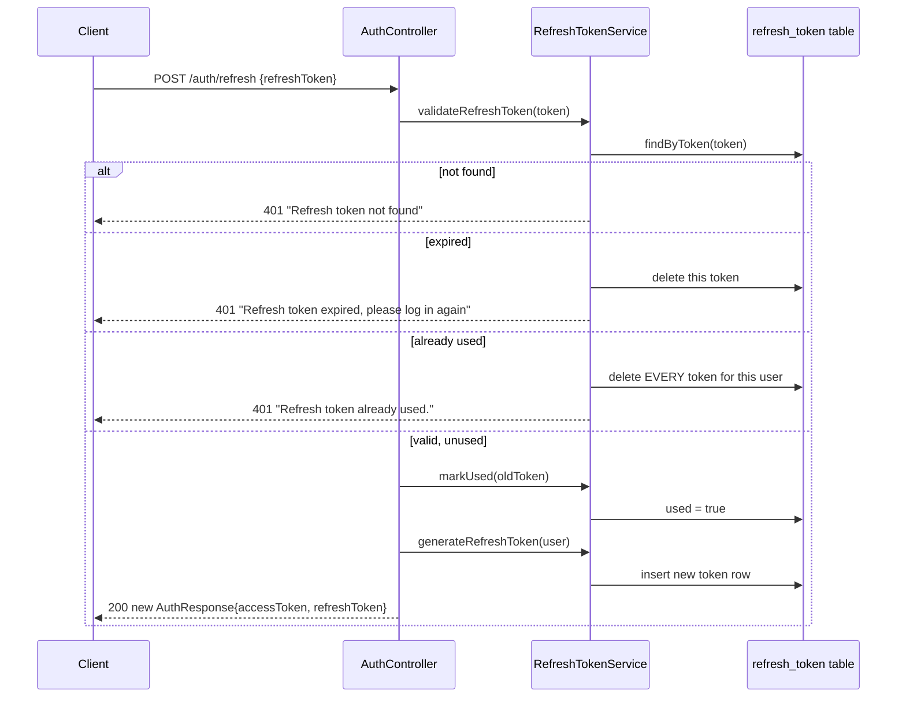

# Authentication & Trusted-Identity Propagation

**Service:** `api-gateway` · **Key classes:** `JwtUtil`, `AuthService`, `SecurityConfig`,
`UserIdHeaderFilter`, `RefreshTokenService`, `RefreshToken`, `AdminBootstrap`

## What it is / why it's notable

Most tutorials stop at "validate the JWT." This system does the harder, less-blogged-about half:
once the gateway knows *who* the caller is, it has to get that identity to two downstream services
that have **no security of their own** — safely, in a way a malicious client can't spoof. That's
the actual IDOR (Insecure Direct Object Reference) fix at the heart of this feature: not just "add
a JWT filter," but closing the specific hole where overriding only `getHeader()` on a request
wrapper still let a forged `userId` header sail through, because Spring Cloud Gateway's request
forwarding reads headers via `getHeaderNames()`/`getHeaders()`, never `getHeader()` alone.

The second thing worth reading is *how the validation half got deleted*. The gateway originally
hand-rolled a `JwtFilter` that parsed the token, checked the signature, built an `Authentication`,
and injected the header — all in one class. It now delegates every one of those steps except the
last to Spring Security's **OAuth2 resource server**, leaving behind a filter that does only the
part no framework can do for you. Same security guarantees, ~130 lines of hand-written token
handling gone.

## How it works



### 1. Issuing the token — `JwtUtil` + `AuthService`

`JwtUtil.generateToken` signs an HS256 token whose claims carry both the caller's `role` **and**
their numeric `userId` (the `User.id` primary key) — not just the email subject most tutorials stop
at:

```java
public String generateToken(String email, Role role, Long userId) {
    return Jwts.builder()
            .setSubject(email)
            .claim("role", role.name())
            .claim("userId", userId)
            .setIssuedAt(new Date())
            .setExpiration(new Date(System.currentTimeMillis() + expiration))
            .signWith(getSigningKey(), SignatureAlgorithm.HS256)
            .compact();
}
```

The signing key is derived once, from the secret's **raw UTF-8 bytes**:
```java
private SecretKey getSigningKey() {
    return Keys.hmacShaKeyFor(SECRET.getBytes(StandardCharsets.UTF_8));
}
```
This is not cosmetic. The old `signWith(SignatureAlgorithm.HS256, SECRET)` overload treated the
secret as **base64** and decoded it, while `NimbusJwtDecoder.withSecretKey(...)` on the verifying
side takes a `SecretKey` built from raw bytes. Issuer and verifier have to derive the *same* key or
every token fails signature validation — so JJWT's key derivation had to be moved to
`Keys.hmacShaKeyFor` to match what `SecurityConfig` hands the decoder.

`AuthService.register`/`login` (`api-gateway/src/main/java/com/tracker/gateway/auth/AuthService.java`)
BCrypt-hashes passwords (`passwordEncoder.encode`) and, on login, compares with
`passwordEncoder.matches` — a failed lookup and a wrong password both throw the same
`InvalidCredentialsException`, so the API never reveals whether an email exists (no user
enumeration).

On successful authentication, the gateway issues **both**:
- a short-lived JWT access token, and
- a long-lived refresh token persisted in the database.

Refresh tokens are rotated after every successful refresh request and can be revoked server-side,
allowing replay detection and immediate session invalidation.

### 2. Validating — `SecurityConfig` as an OAuth2 resource server

There is no hand-written parsing, no `try { Jwts.parser()... } catch`, no manual
`SecurityContextHolder.setAuthentication`. Two beans configure the framework to do it:

```java
@Bean
public JwtDecoder jwtDecoder(@Value("${jwt.secret}") String secret) {
    SecretKey key = Keys.hmacShaKeyFor(secret.getBytes(StandardCharsets.UTF_8));
    return NimbusJwtDecoder.withSecretKey(key)
            .macAlgorithm(MacAlgorithm.HS256)
            .build();
}

@Bean
public JwtAuthenticationConverter jwtAuthenticationConverter() {
    JwtAuthenticationConverter converter = new JwtAuthenticationConverter();
    converter.setJwtGrantedAuthoritiesConverter(jwt -> {
        String roleClaim = jwt.getClaimAsString("role");
        Role role = roleClaim != null ? Role.valueOf(roleClaim) : Role.USER;
        return List.of(new SimpleGrantedAuthority(role.authority()));
    });
    return converter;
}
```

What this buys over the old filter, for free: signature *and* `exp`/`nbf` validation, correct
`401` vs `403` semantics via `BearerTokenAuthenticationEntryPoint` (including the
`WWW-Authenticate` header, with the failure reason for malformed or expired tokens), and a
`JwtAuthenticationToken` whose `getToken()` exposes every claim to anything downstream in the
chain. The one project-specific bit — mapping the custom `role` claim onto Spring's
`ROLE_`-prefixed authority — is the converter above, and it defaults to `USER` rather than failing
when the claim is absent.

### 3. Authorization — the filter chain

```java
http.csrf(csrf -> csrf.disable())
        .authorizeHttpRequests(auth -> auth
                .requestMatchers("/auth/**", "/swagger-ui.html", "/swagger-ui/**",
                        "/v3/api-docs", "/v3/api-docs/**", "/swagger-resources/**", "/actuator/**")
                .permitAll()
                .requestMatchers(HttpMethod.POST, "/api/activity", "/api/activity/").hasRole("ADMIN")
                .requestMatchers("/api/activitylog/review/**").hasRole("ADMIN")
                .requestMatchers(HttpMethod.POST, "/api/level", "/api/level/").hasRole("ADMIN")
                .anyRequest().authenticated())
        .oauth2ResourceServer(oauth2 -> oauth2
                .jwt(jwt -> jwt
                        .decoder(jwtDecoder)
                        .jwtAuthenticationConverter(jwtAuthenticationConverter)))
        .addFilterAfter(userIdHeaderFilter, BearerTokenAuthenticationFilter.class);
```
Role gating happens at the **URL level**, not `@PreAuthorize` — because routing is declarative
(see [API Gateway Routing](api-gateway-routing.md)), there's no controller method left to annotate.
The `POST /api/level` matcher is the newest of the three (issue #74): that endpoint used to be a
public, unbounded XP mint (see [Concurrency-Safe XP Accumulation](concurrency-safe-xp.md)) — any
authenticated user could award themselves arbitrary XP for arbitrary activities. All three ADMIN
matchers share the same limitation: they're enforced **only** at the gateway, because
activity-service and gamification-service have no Spring Security of their own and are directly
reachable in the dev compose setup (`:8081`, `:8082`) — bypassing the gateway also bypasses every
role check on it.

**Admin provisioning.** Since `register` can no longer take a role from the client (see above), the
only way to create an ADMIN account is `AdminBootstrap`, an `ApplicationRunner` gated by
`app.admin.bootstrap.enabled` (off by default, see Config below). When enabled, it creates the
configured email as `Role.ADMIN` if absent, or promotes it to `ADMIN` if it already exists as a
`USER` — idempotent either way, safe to leave enabled across restarts.

Note the ordering: `addFilterAfter(..., BearerTokenAuthenticationFilter.class)`. The identity
filter now runs *after* the framework has authenticated the token, not before — it can therefore
assume a populated `SecurityContext` instead of re-parsing the token itself. (The old `JwtFilter`
was registered `addFilterBefore(..., UsernamePasswordAuthenticationFilter.class)`, because it *was*
the authentication step.)

### 4. Propagating — `UserIdHeaderFilter` (the core fix)

What's left is the part Spring Security has no opinion about: turning the authenticated identity
into a header two downstream services will trust. The filter skips itself entirely on
`permitAll` paths, where there is nothing to propagate:

```java
@Override
protected boolean shouldNotFilter(HttpServletRequest request) {
    return SecurityContextHolder.getContext().getAuthentication() == null;
}
```

**A missing `userId` claim is rejected outright**, not silently ignored — this protects against a
token minted before the claim existed from slipping through with no trusted identity:
```java
Object rawUserId = jwtAuth.getToken().getClaim("userId");
if (rawUserId == null) {
    response.setStatus(HttpServletResponse.SC_UNAUTHORIZED);
    return;
}
final String trustedUserId = String.valueOf(rawUserId);
```
The claim is read off the already-verified `JwtAuthenticationToken`, so the token is parsed exactly
once per request. `String.valueOf` rather than a `Long` cast is deliberate: a JSON number arrives
from Nimbus as whatever numeric type fits, and the header is a string either way.

**The triple header override** — the actual IDOR fix, unchanged by the migration because it was
never the framework's job:
```java
HttpServletRequestWrapper wrapper = new HttpServletRequestWrapper(request) {
    @Override
    public String getHeader(String name) {
        return USER_ID_HEADER.equalsIgnoreCase(name) ? trustedUserId : super.getHeader(name);
    }
    @Override
    public Enumeration<String> getHeaders(String name) {
        return USER_ID_HEADER.equalsIgnoreCase(name)
                ? Collections.enumeration(List.of(trustedUserId))
                : super.getHeaders(name);
    }
    @Override
    public Enumeration<String> getHeaderNames() {
        List<String> names = Collections.list(super.getHeaderNames());
        names.removeIf(n -> USER_ID_HEADER.equalsIgnoreCase(n));
        names.add(USER_ID_HEADER);
        return Collections.enumeration(names);
    }
};
```
An earlier version overrode only `getHeader(String)`. The Gateway's request forwarding enumerates
headers via `getHeaderNames()`/`getHeaders(String)` to build the downstream request and never
consults `getHeader()` there — so a client-forged `userId` header passed straight through
unmodified, and a request with no `userId` header at all never got one added. Overriding all three
closes both holes: it removes any client-sent variant by name (case-insensitively) before
re-adding the trusted one, so every enumeration path a caller might use sees the same value.

### 5. Refresh tokens — rotation with reuse detection

Access tokens now expire after 15 minutes (see Config below), which would otherwise mean re-logging
in every 15 minutes. `POST /auth/refresh` trades a refresh token for a new `AuthResponse` without
touching the password again:

```java
public AuthResponse refresh(String refreshToken) {
    RefreshToken oldToken = refreshTokenService.validateRefreshToken(refreshToken);
    User user = oldToken.getUser();

    refreshTokenService.markUsed(oldToken);
    RefreshToken newRefreshToken = refreshTokenService.generateRefreshToken(user);
    String newAccessToken = jwtUtil.generateToken(user.getEmail(), user.getRole(), user.getId());

    return new AuthResponse(newAccessToken, newRefreshToken.getToken());
}
```



Unlike the stateless access token, a refresh token is **tracked server-side** — `RefreshToken` is a
real row (`refresh_token` table: `token` UUID string, `user_id` FK, `expiresAt`, a `used` flag), not
just a signed claim. That's what makes revocation possible at all; a stateless JWT can't be
individually invalidated before it expires, but a DB row can be deleted.

**Every refresh token is single-use, and every successful refresh rotates it** — `markUsed` flips the
row's `used` flag and a brand-new token is issued alongside the new access token; the presented token
is never handed back. This is what makes the next part meaningful:

```java
if (refreshToken.isUsed()) {
    revokeAllForUser(refreshToken.getUser().getId());
    throw new InvalidCredentialsException("Refresh token already used.");
}
```
Presenting an *expired* token is treated as benign — the one token is deleted and the client is told
to log in again. Presenting an **already-used** token is treated differently: since rotation means
a legitimate client would never do this (it always gets a fresh token back and discards the old
one), a used-token replay is a signal that the token was copied or stolen, and *every* refresh token
belonging to that user is revoked — not just the one presented. This is the standard refresh-token
rotation + reuse-detection pattern: it doesn't stop a single theft, but it forces both the attacker's
and the legitimate user's sessions to re-authenticate the moment the theft is exploited, bounding the
damage instead of leaving a stolen long-lived token valid for its full 7-day life.

`InvalidCredentialsException` gained a message-carrying constructor to support this
(`GatewayExceptionHandler` maps it to `401` `ProblemDetail` either way) — note this is a deliberate
departure from the login path's no-enumeration principle above: refresh failures *do* say exactly
why ("not found" vs "expired" vs "already used"), because a refresh token isn't a guessable secret
like a password, so distinguishing failure reasons here doesn't leak anything an attacker couldn't
already infer from possessing the token.

**A narrow TOCTOU window worth knowing about:** `validateRefreshToken` (the check) and `markUsed`
(the write) are two separate `@Transactional` calls with no row lock or optimistic-version field
between them. Two concurrent `/auth/refresh` calls presenting the same still-valid token can both
pass validation before either marks it used, both minting a new token pair from the same old one.
Low blast radius in practice (both requests came from someone holding the same valid token), but it
means reuse detection is not airtight against a client that retries/duplicates the exact same
request in flight.

**No logout endpoint calls `revoke`/`revokeAllForUser` directly today** — both methods exist and are
exercised (`RefreshTokenServiceTest`), but the only caller in production code is
`validateRefreshToken`'s own error paths above. A `POST /auth/logout` that revokes the caller's
refresh token(s) on demand is the natural next piece, not yet built.

## Downstream trust model

`activity-service` and `gamification-service` have zero security dependencies. Their controllers
read `@RequestHeader("userId") Long userId` and trust it completely — because by the time a request
reaches them, `UserIdHeaderFilter` has already guaranteed that header can only carry the
authenticated caller's real id. Hitting those services directly (bypassing the gateway) is the one
way to defeat this — a documented, known caveat, not a gap in the fix itself.

## Config

`api-gateway/src/main/resources/application.yaml`:
```yaml
jwt:
  secret: ${JWT_SECRET}                              # HS256 signing key — no default, startup fails without it
  expiration: ${JWT_EXPIRATION:900000}                # 15 min in ms — access token lifetime
  refresh-expiration: ${REFRESH_EXPIRATION:604800000} # 7 days in ms — refresh token lifetime
```
`jwt.secret` deliberately has **no fallback value**: a checked-in default is a signing key everyone
who has ever read the repo already knows. The gateway refuses to start rather than come up with a
public key. Set it in `.env` (see `.env.example`); it must be at least 32 bytes for HS256.
`REFRESH_EXPIRATION` is the one env var of the three **not yet listed in `.env.example`** — it falls
back to its 7-day default until that's added.

```yaml
app:
  admin:
    bootstrap:
      enabled: ${ADMIN_BOOTSTRAP_ENABLED:false}   # off by default — CI's `cp .env.example .env` needs no secrets
      email: ${ADMIN_EMAIL:}
      password: ${ADMIN_PASSWORD:}
```
`AdminBootstrap` throws `IllegalStateException` at startup if `enabled=true` with a blank email or
password, rather than silently no-op-ing on a half-configured bootstrap.

## Tests

`SecurityConfigTest` covers the two beans directly — that `jwtDecoder` is built from the configured
secret, and that the converter maps an `ADMIN` role claim to `ROLE_ADMIN` while a missing claim
falls back to `ROLE_USER`. It mocks `HttpSecurity` and never invokes `filterChain(...)`, so it does
**not** exercise any `hasRole("ADMIN")` matcher — `SecurityRulesTest` closes that gap: a
`@SpringBootTest` + `@AutoConfigureMockMvc` test that mints real USER/ADMIN tokens with `JwtUtil` and
asserts `POST /api/level` and `POST /api/activity` return `403` for a USER token and let an ADMIN
token past authorization (verified by asserting the response isn't `403`, since what happens next —
routing to a live service instance — is out of scope for a gateway-only test). `UserIdHeaderFilterTest`
covers the filter's four behaviours: skipped with no authentication, `401` on a missing `userId`
claim, header injected on the happy path, and pass-through when the authentication isn't a
`JwtAuthenticationToken`. `RefreshTokenServiceTest` covers `generateRefreshToken`, the three
`validateRefreshToken` outcomes (not-found, expired + single revoke, already-used + revoke-all),
`markUsed`, and both revoke methods directly. `AuthServiceTest.shouldRefreshTokensSuccessfully`
covers the full rotation through `AuthService`: old token marked used, new access + refresh tokens
both returned; `shouldAlwaysAssignUserRoleRegardlessOfCaller` pins that `register` can no longer
produce anything but a `USER` account. `AdminBootstrapTest` covers all four `run()` branches: create,
promote, no-op when already ADMIN, and the blank-email/password guard.

## Try it

```bash
# Register — returns both an access token and a refresh token
curl -X POST http://localhost:8080/auth/register \
# Register — now returns {"accessToken": "...", "refreshToken": "..."}, not a raw JWT
RESPONSE=$(curl -s -X POST http://localhost:8080/auth/register \
  -H "Content-Type: application/json" \
  -d '{"firstName":"Ada","lastName":"L","email":"ada@example.com","password":"secret"}'
TOKEN=$(echo "$RESPONSE" | jq -r .accessToken)
REFRESH=$(echo "$RESPONSE" | jq -r .refreshToken)

# Spoofed-header test: authenticated as Ada, but forge a userId header for another user.
# (POST /api/level is admin-only as of #74 — /api/activitylog is the everyday endpoint that
# still demonstrates the same header-trust point, since it also reads userId off the header.)
curl -X POST http://localhost:8080/api/activitylog -H "Authorization: Bearer $TOKEN" \
  -H "userId: 999" -H "Content-Type: application/json" \
  -d '{"activityName":"Study","startTime":"2026-07-16T09:00:00","endTime":"2026-07-16T09:30:00"}'
# -> the log (and its eventual XP) still lands on Ada's real id, never 999

# 15 minutes later, the access token is dead — trade the refresh token for a new pair
# instead of logging in again. The old $REFRESH is now burned; only the new one works.
curl -X POST http://localhost:8080/auth/refresh -H "Content-Type: application/json" \
  -d "{\"refreshToken\":\"$REFRESH\"}"

# Reuse detection: presenting that same (now-used) $REFRESH again revokes every refresh
# token this user has, not just this one
curl -i -X POST http://localhost:8080/auth/refresh -H "Content-Type: application/json" \
  -d "{\"refreshToken\":\"$REFRESH\"}"
# -> 401 "Refresh token already used."
```
The Postman collection's **Security – IDOR Verification** folder automates the spoofed-header test.
Access tokens expire after 15 minutes, so a saved token from an earlier session will come back `401`
with `WWW-Authenticate: Bearer error="invalid_token"` — either re-run `/auth/login`, or `/auth/refresh`
if the refresh token from that session is still unused and unexpired.

## Related
[Rate Limiting](rate-limiting.md) (keys on this same trusted `userId` header) ·
[API Gateway Routing](api-gateway-routing.md) ·
[Error Handling](error-handling.md)
