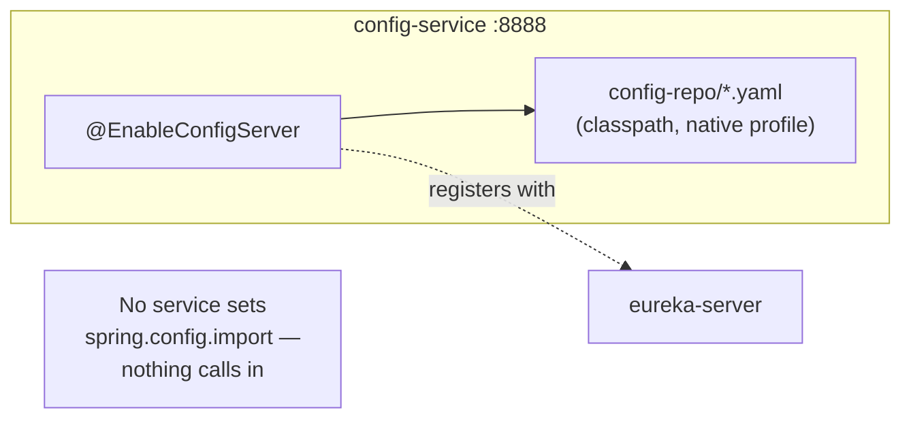

# Config Server — Phase 1, Not Yet Wired Up

**Service:** `config-service` · **Key classes:** `ConfigServiceApplication` ·
**Port:** `8888`

## What it is / why it's notable

A standalone Spring Cloud Config Server, running as its own module and its own container, serving
configuration out of a filesystem-backed repository baked into its own jar. It boots, registers with
Eureka, and answers config requests correctly — but as of this writing, **no other service in this
project actually imports it.** This doc exists specifically to say that plainly, rather than let a
reader assume centralized config is live because the module exists and runs.

That framing matters because the honest state is easy to get backwards from the file layout alone:
`config-service/src/main/resources/config-repo/` already contains a shared `application.yaml` plus
one override file per service (`activity-service.yaml`, `api-gateway.yaml`,
`gamification-service.yaml`, `eureka-server.yaml`) — a complete-looking config repo. Reading only
that directory, you'd reasonably conclude every service pulls from it. None do yet.

## How it's built



### 1. The server itself — three lines of application code

```java
@EnableConfigServer
@SpringBootApplication
public class ConfigServiceApplication {
    public static void main(String[] args) {
        SpringApplication.run(ConfigServiceApplication.class, args);
    }
}
```
`@EnableConfigServer` is the entire integration surface — everything else is configuration, not code.

### 2. Native profile — a filesystem backend, not Git

Spring Cloud Config's default backend is a Git repository; this project deliberately swaps that for
the `native` profile, serving files straight off the server's own classpath instead:

```yaml
spring:
  profiles:
    active: native
  cloud:
    config:
      server:
        native:
          search-locations: classpath:/config-repo
```
No Git remote, no credentials, no clone-on-startup latency — appropriate for a project where the
config repo is small and versioned alongside the code that would consume it, in the same monorepo.
The trade-off: no per-environment branch/label switching the way a Git backend gives you for free;
every profile has to be a different file or profile-scoped section within a file.

### 3. Shared + per-service split

`config-repo/application.yaml` (served to every client regardless of application name) carries
settings genuinely common across all four runtime services — actuator exposure, Eureka client
tuning, tracing sampling, log pattern — with a header comment stating the Phase 1 status directly in
the file:
```yaml
# Notice: Phase 1 Config Server repository. Not yet active on microservices (no service imports this yet; see Phase 2).
```
Each `<service-name>.yaml` (matched by Spring Cloud Config's convention of filename = `spring.application.name`)
carries just that service's `server.port` and `spring.application.name` today — a minimal starting
point, not a full migration of each service's existing `application.yaml`.

## Why nothing consumes it yet

Wiring a client in requires two things, and this project has added neither:

1. A `spring-cloud-config-client` (or `spring-cloud-starter-config`) dependency on the consuming
   service's classpath.
2. `spring.config.import: configserver:http://config-service:8888` (or equivalent) in that service's
   own `application.yaml`, telling Boot to fetch remote config at startup.

Grep for either across `activity-service`, `gamification-service`, `api-gateway`, and
`eureka-server` and you'll find nothing — every one of them still reads its configuration entirely
from its own local `application.yaml`, exactly as before this module existed.

## Config

```yaml
server:
  port: 8888
spring:
  application:
    name: config-service
  profiles:
    active: native
  cloud:
    config:
      server:
        native:
          search-locations: classpath:/config-repo
eureka:
  client:
    service-url:
      defaultZone: ${EUREKA_SERVER_URL:http://eureka-server:8761/eureka}
```
`docker-compose.yml` builds and runs it (`config-service/Dockerfile`, multi-stage + layertools,
matching the other services' Dockerfile pattern), exposes `8888:8888`, and gates its startup on
`eureka-server` being healthy — but nothing else in `docker-compose.yml` depends on
`config-service` being healthy in turn, which is the compose-level tell that nothing downstream
actually needs it yet.

## What Phase 2 would need

To make this load-bearing rather than dormant: add the client dependency + `spring.config.import`
to each of the four services, decide which settings actually move out of each service's own
`application.yaml` into `config-repo/` (today's per-service files only carry `server.port` and
`spring.application.name` — far short of a real migration), and add a `depends_on:
condition: service_healthy` on `config-service` for every service that now needs it at startup.
None of that is started yet.

## Try it

```bash
docker-compose up --build config-service eureka-server
# Config Server's own resolution for a given service/profile:
curl http://localhost:8888/activity-service/default
curl http://localhost:8888/application/default   # the shared file every client would get
```
The response is real, correctly-merged configuration — the server itself works. What you won't see
is any of the four services picking any of it up on their own startup logs; each still logs its
usual local `application.yaml` values.

## Related
[Service Discovery, Health Orchestration & Containerization](observability-and-discovery.md) (the
Eureka registration and Docker Compose health-gating pattern this module follows) · issue #55
