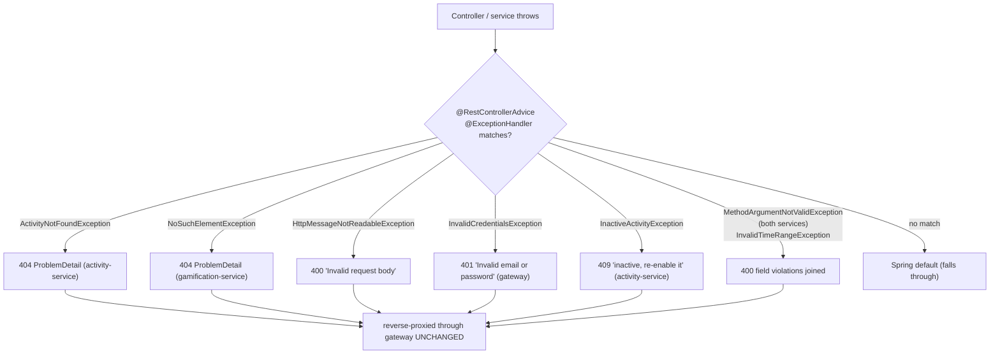

# Error Handling — RFC 7807 ProblemDetail, Consistently

**Services:** all three web services · **Key classes:** `GatewayExceptionHandler`,
`GlobalExceptionHandler` (activity + gamification), `InvalidCredentialsException`,
`ActivityNotFoundException`, `InactiveActivityException`, `InvalidTimeRangeException`

## What it is / why it's notable

Every service returns errors in one machine-readable, standardized shape — Spring's `ProblemDetail`
(the RFC 7807 `application/problem+json` model) — instead of Spring's default whitelabel error page
or ad-hoc JSON that drifts per endpoint. That consistency is the point: a client parses one error
format everywhere. Two design touches raise it above "we added an exception handler": the login
error is deliberately identical for unknown-email and wrong-password (no user enumeration), and
because the gateway is a real reverse proxy, a downstream service's `ProblemDetail` reaches the
client **byte-for-byte unchanged** — the gateway doesn't re-wrap or flatten it, so the error a
client sees is the error the owning service actually produced.

## How it works



### Each service advises on the exceptions it actually throws

**Gateway — one handler, and a security-conscious message:**
```java
@RestControllerAdvice
public class GatewayExceptionHandler {
    @ExceptionHandler(InvalidCredentialsException.class)
    public ProblemDetail handleInvalidCredentials(InvalidCredentialsException ex) {
        return ProblemDetail.forStatusAndDetail(HttpStatus.UNAUTHORIZED, ex.getMessage());
    }
}
```
The exception itself hardcodes one message for both failure modes:
```java
public class InvalidCredentialsException extends RuntimeException {
    public InvalidCredentialsException() { super("Invalid email or password"); }
}
```
`AuthService.login` throws it whether the email doesn't exist *or* the password is wrong (see
[Authentication & Identity Propagation](authentication-and-identity.md)) — so the response never
reveals which accounts exist. This is a small thing that's easy to get wrong by returning "user not
found" vs "bad password."

**activity-service — four handlers, three status codes:**
```java
@RestControllerAdvice
public class GlobalExceptionHandler {
    @ExceptionHandler(ActivityNotFoundException.class)
    public ProblemDetail handleNotFound(ActivityNotFoundException ex) {
        return ProblemDetail.forStatusAndDetail(HttpStatus.NOT_FOUND, ex.getMessage());
    }
    @ExceptionHandler(InactiveActivityException.class)
    public ProblemDetail handleInactiveActivity(InactiveActivityException ex) {
        return ProblemDetail.forStatusAndDetail(HttpStatus.CONFLICT, ex.getMessage());
    }
    @ExceptionHandler(InvalidTimeRangeException.class)
    public ProblemDetail handleTimeout(InvalidTimeRangeException ex) {
        return ProblemDetail.forStatusAndDetail(HttpStatus.BAD_REQUEST, ex.getMessage());
    }
    @ExceptionHandler(MethodArgumentNotValidException.class)
    public ProblemDetail handleValidation(MethodArgumentNotValidException ex) { ... }
}
```
`ActivityNotFoundException` carries a specific message (`"Activity not found: {name}"` /
`"Activity log not found: {id}"`) thrown from every lookup path.

The status-code choices are the interesting part. A **soft-deleted activity is a `409 Conflict`,
not a `404`** — the activity genuinely exists, the client just can't log against it, and conflating
the two would tell a client "create this activity" when the right move is "re-enable it." The
exception message says exactly that:
```java
super("Activity '" + activityName + "' is inactive and cannot accept new log entries. "
        + "Re-enable the activity before logging time against it.");
```
It's thrown in `mapToActivityLog`, **before** any XP, bonus roll, streak update, or outbox row is
produced (issue #7) — so a rejected log leaves no partial side effects behind.

**Declarative validation.** `MethodArgumentNotValidException` is what `@Valid @RequestBody` throws,
and the handler flattens every field violation into one detail string rather than returning only the
first:
```java
String detail = ex.getBindingResult().getFieldErrors().stream()
        .map(FieldError::getDefaultMessage)
        .collect(Collectors.joining("; "));
```
The constraints live on the request records — e.g. `ActivityLogRequest` requires a non-blank
`activityName`, a non-null `startTime`/`endTime`, and `@PastOrPresent` on `startTime`. That last
one previously read `@FutureOrPresent`, which had the rule exactly backwards: you log time you have
already spent, so a start time in the future is the invalid case.

**gamification-service — 404, invalid-body, and (as of issue #74) a validation 400:**
```java
@RestControllerAdvice
public class GlobalExceptionHandler {
    @ExceptionHandler(NoSuchElementException.class)
    public ProblemDetail handleNotFound(NoSuchElementException ex) {
        return ProblemDetail.forStatusAndDetail(HttpStatus.NOT_FOUND, ex.getMessage());
    }
    @ExceptionHandler(HttpMessageNotReadableException.class)
    public ProblemDetail handleInvalidRequestBody(HttpMessageNotReadableException ex) {
        return ProblemDetail.forStatusAndDetail(HttpStatus.BAD_REQUEST, "Invalid request body");
    }
    @ExceptionHandler(MethodArgumentNotValidException.class)
    public ProblemDetail handleValidation(MethodArgumentNotValidException ex) {
        String detail = ex.getBindingResult().getFieldErrors().stream()
                .map(FieldError::getDefaultMessage)
                .collect(Collectors.joining("; "));
        return ProblemDetail.forStatusAndDetail(HttpStatus.BAD_REQUEST, detail);
    }
}
```
This third handler is new: until issue #74's fix, gamification-service had no
`@ExceptionHandler(MethodArgumentNotValidException.class)` at all, so a `@Valid` failure (e.g.
`LevelTrackerRequestDTO`'s `xp` going negative) fell straight through to Spring's own default error
handling instead of this service's `ProblemDetail` shape — unlike activity-service, which already
had the equivalent handler (see above). It was added specifically because `POST /level`'s new
[per-award XP cap](concurrency-safe-xp.md) needed to reject an oversized request with a message an
admin could actually read, rather than an opaque `400` with no body. The pattern is copied verbatim
from activity-service's handler above. `LevelTrackerRequestDTO`'s leading comment block preserves an
older, now-dead approach — a compact constructor that threw `IllegalArgumentException` on `xp < 0`
during deserialization — commented out in favor of the declarative constraint; don't mistake the
comment for live behavior.

### The errors Spring Security writes itself

The `401` for a missing/expired/malformed bearer token and the `403` for a caller without the
required role never reach a `@RestControllerAdvice` — they are written by the filter chain, before
any controller exists. This resource server has not customized either: Spring's defaults
(`BearerTokenAuthenticationEntryPoint` / the default `AccessDeniedHandler`) apply, which send an
**empty body** and put the failure reason in a `WWW-Authenticate` header rather than a
`ProblemDetail`. That's valid OAuth 2.0 behavior, but it means these two status codes are the one
place a client parses a different error shape than everywhere else in this API — a gap worth
closing by registering a custom `AuthenticationEntryPoint`/`AccessDeniedHandler` on
`oauth2ResourceServer(...)`, not yet done.

### The response shape

```json
{
  "type": "about:blank",
  "status": 404,
  "detail": "Activity not found: Study",
  "instance": "/activity/Study"
}
```

### Pass-through through the gateway

Because routing is a genuine reverse proxy (see [API Gateway Routing](api-gateway-routing.md)), the
`instance` field of a downstream error still shows the *downstream* service's own path (e.g.
`/level/999999`), not the gateway's `/api/level/999999` — proof the gateway forwards the response
untouched rather than re-serializing it. `GET /api/activity/does-not-exist` and
`GET /api/level/999999` each return the exact body their owning service produces directly.

**This guarantee was silently broken for a while (issue #95).** `SecurityConfig`'s
`.anyRequest().authenticated()` also governs the servlet container's *internal* `ERROR` dispatch to
Boot's `/error` (Spring Boot's `spring.security.filter.dispatcher-types` includes `ERROR` by
default). With no matcher permitting that dispatch, the security context on it is anonymous, and
Spring Security's own entry point wrote a `401`/`403` **over** the real downstream status and body —
so every proxied error, not just auth failures, came back looking like an auth failure. Fixed by
adding `.dispatcherTypeMatchers(DispatcherType.ERROR, DispatcherType.FORWARD).permitAll()` as the
**first** matcher (order matters — it must precede `.anyRequest().authenticated()`). The pass-through
claim above is a property of that matcher now, not just of routing being a real reverse proxy.

## Known edges (honest inventory)

- Only the exceptions above are advised; anything else falls through to Spring's defaults — there's
  no catch-all `@ExceptionHandler(Exception.class)`.
- Bean Validation is now wired in **both** activity-service and gamification-service (issue #74
  added the latter's `MethodArgumentNotValidException` handler, shown above) — but still not in
  api-gateway. `LoginRequest`/`RegisterRequest` carry constraints (`@Email`, `@NotBlank`), and
  `AuthController.register` **does** have `@Valid` on the body, yet the service has no validation
  starter (`spring-boot-starter-validation`) on its classpath at all, so those annotations never
  actually run — a blank `firstName` or malformed email is accepted rather than rejected with a 400.
  This is unrelated to `RegisterRequest.role`, which no longer exists: issue #74 removed the field
  entirely rather than fixing its validation, since a client-supplied role was the actual
  vulnerability (any caller could `POST /auth/register {"role":"ADMIN"}` and self-promote) — see
  [Authentication & Identity Propagation](authentication-and-identity.md).
- `ConstraintViolationException` (thrown by `@Validated` + `@Positive` on a `@RequestHeader` or
  `@PathVariable` value that's *present but invalid* — as opposed to `@Valid` on a `@RequestBody`,
  or a header that's missing entirely, which Spring already maps to a clean `400`) has no handler in
  either service — e.g. `POST /api/level` with `userId: -5`, or `GET /level/-1`, falls through to
  Spring's default `500` rather than a `400` `ProblemDetail`. Not fixed alongside #74 because it's a
  pre-existing gap `@DecimalMax` on `ManualXpAwardRequest.xp` doesn't touch — that constraint lives
  on the `@Valid`-checked body, not a header or path variable, so it correctly produces the new
  handler's `400` rather than this gap's `500`.

## Try it

```bash
curl -i http://localhost:8080/api/activity/DoesNotExist -H "Authorization: Bearer $TOKEN"   # 404 ProblemDetail
curl -i -X POST http://localhost:8080/auth/login -H "Content-Type: application/json" \
  -d '{"email":"nobody@example.com","password":"x"}'                                         # 401 "Invalid email or password"
# POST /api/level is admin-only as of #74 — $ADMIN_TOKEN needs Role.ADMIN (see AdminBootstrap in
# Authentication & Identity Propagation). This now DOES get gamification-service's own ProblemDetail
# shape, unlike before #74 — the new MethodArgumentNotValidException handler applies:
curl -i -X POST http://localhost:8080/api/level -H "Authorization: Bearer $ADMIN_TOKEN" \
  -H "Content-Type: application/json" -d '{"activityId":1,"xp":-5}'
# -> 400 "xp cannot be negative"
curl -i -X POST http://localhost:8080/api/level -H "Authorization: Bearer $ADMIN_TOKEN" \
  -H "Content-Type: application/json" -d '{"activityId":1,"xp":50000}'
# -> 400 "xp exceeds the per-award cap of 10000"

# Soft-delete an activity, then try to log against it -> 409, no XP or streak side effects
curl -i -X POST http://localhost:8080/api/activitylog -H "Authorization: Bearer $TOKEN" \
  -H "Content-Type: application/json" \
  -d '{"activityName":"Retired","startTime":"2026-07-29T09:00:00","endTime":"2026-07-29T09:30:00"}'

# Field violations are joined into one detail string
curl -i -X POST http://localhost:8080/api/activitylog -H "Authorization: Bearer $TOKEN" \
  -H "Content-Type: application/json" -d '{"activityName":"","startTime":null,"endTime":null}'
# -> 400 "Activity name is required; Start time is required; End time is required"
```

## Related
[Authentication & Identity Propagation](authentication-and-identity.md) (the no-enumeration login) ·
[API Gateway Routing](api-gateway-routing.md) (byte-for-byte pass-through)
