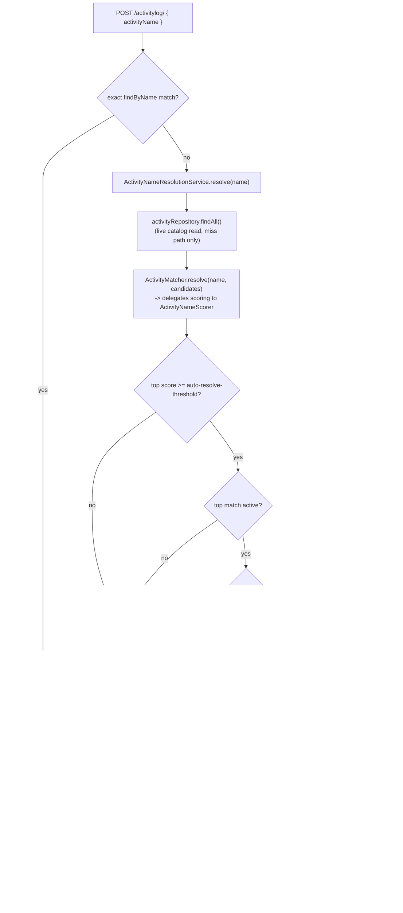

# Fuzzy Activity-Name Matching — Ranked Suggestions & Guarded Auto-Resolve

**Service:** `activity-service` · **Key classes:** `ActivityMatcher`, `ActivityNameScorer`,
`LexicalActivityNameScorer`, `ActivityNameResolutionService`, `ActivityLogServiceImpl`,
`GlobalExceptionHandler`

## What it is / why it's notable

`POST /activitylog/` used to resolve `activityName` by **exact string match only**
(`activityRepository.findByName(...).orElseThrow(...)`). Type `"morning jog"` when the catalog says
`"Running"` and the log was rejected outright with a bare 404 and no hint — a confirmed UX defect
(issue [#66](https://github.com/prashant-singh-2001/gamified_tracker/issues/66)), not a speculative
feature.

The fix has two parts: a miss now returns **ranked suggestions**, and a confident, unambiguous match
against an **active** catalog entry is **substituted automatically** — visibly, never silently, since
the XP it awards is irreversible (see [Concurrency-Safe XP Accumulation](concurrency-safe-xp.md)).

**Why a hand-written matcher instead of a dependency or an embedding model.** The repo's entire
third-party footprint is a dozen small libraries; nothing here pulls in a stats or NLP library, the
same way [`DurationOutlierDetector`](session-integrity.md) hand-rolled Iglewicz-Hoaglin outlier
detection rather than adding one. The scoring algorithm is Jaro-Winkler, written from scratch in
`LexicalActivityNameScorer`. It is **lexical, not semantic** — see Known simplifications below for
what that costs.

**The scoring strategy and the safety rails are two different classes on purpose.** An LLM/embedding
service is on this project's roadmap (issues #65, #68–#72). `ActivityMatcher` never touches
Jaro-Winkler math directly — it delegates to an `ActivityNameScorer` interface and owns only the
ranking and the three safety rails. See "Swapping the scorer" below.

## How it works



### 1. The scorer — `LexicalActivityNameScorer`

Normalize (lowercase, every non-alphanumeric run collapsed to one space) → tokenize → hand-written
Jaro-Winkler:

```java
private static double jaro(String a, String b) {
    // matching-character window = floor(max(len)/2) - 1, then a transposition count
    // over the matched characters taken in order from each string
}
private static double jaroWinkler(String a, String b) {
    double jaro = jaro(a, b);
    if (jaro < WINKLER_BOOST_THRESHOLD) return jaro;           // 0.7
    int prefix = /* shared prefix, capped at 4 chars */;
    return jaro + prefix * PREFIX_SCALE * (1.0 - jaro);         // PREFIX_SCALE = 0.1
}
```

Each field's score is `max(whole-string Jaro-Winkler, 0.7 × best-token-score + 0.3 × mean-token-score)`
— the whole-string pass catches typos that span the entire value (`"runnning"` → `"running"`) and
multi-word queries against a single-word name (`"study session"` → `"Study"`); the token blend catches
the reverse. Every pairwise score below **0.82** gates to exactly `0.0` first: Jaro-Winkler's noise
floor for two unrelated English words is high enough (`"morning"`/`"running"` scores `0.743` with
nothing in common) that an ungated blend would rank pure noise above a real partial match.

### 2. Combining fields — weighted MAX, not weighted sum

```java
private static final double NAME_WEIGHT = 1.0;
private static final double DESCRIPTION_WEIGHT = 0.8;
private static final double CATEGORY_WEIGHT = 0.5;
```

A candidate's score is the highest of `NAME_WEIGHT × nameFieldScore`, `DESCRIPTION_WEIGHT ×
descriptionFieldScore`, `CATEGORY_WEIGHT × categoryFieldScore` — a strong hit on one field is
evidence; averaging it against two empty fields would bury it. The weights double as each field's
*confidence ceiling as an identifier*: a description or category can suggest an activity, never
uniquely identify one, so their weights sit below `auto-resolve-threshold` (default `0.86`) —
**a description-only hit can structurally never auto-resolve**, only a name hit can. That guarantee
is a property of these specific weights, not of `ActivityMatcher` itself — see "Swapping the scorer".

### 3. The safety rails — `ActivityMatcher`

Three independent conditions, checked in order, before any auto-resolve happens:

```java
if (top.score() < autoResolveThreshold) {
    return new Resolution(null, suggestions, /* NO_MATCH or BELOW_THRESHOLD */);
}
// Rail 1: never auto-resolve onto a soft-deleted activity (#7) -- that would substitute a
// name the user never typed and then 409 on it. The suggestion still shows, active=false.
if (!top.candidate().active()) {
    return new Resolution(null, suggestions, Reason.INACTIVE_TOP_MATCH);
}
// Rail 2: ambiguity guard. A coin-flip pick is a bug, not a feature -- XP is irreversible.
if (scored.size() > 1 && top.score() - scored.get(1).score() < ambiguityMargin) {
    return new Resolution(null, suggestions, Reason.AMBIGUOUS);
}
return new Resolution(top, suggestions, Reason.AUTO_RESOLVED);
```

Ranking is deterministic — score descending, ties broken by name ascending — so the ambiguity guard
never depends on catalog iteration order. `ActivityNameResolutionService` applies one more gate on top
(the `auto-resolve-enabled` kill switch), withholding only the substitution while suggestions still
ride the response — the exact pattern `session-integrity.outlier-detection-enabled` uses for its
statistical layer.

### 4. The worked example — issue #66's own case

`"morning jog"` against `Running` (category `HEALTH`, description `"Jogging, cardio, running
outdoors"`):

| Field | Raw Jaro-Winkler | Weight | Weighted |
|---|---|---|---|
| name (`"running"`) | `0` (every pairwise score gates below 0.82) | 1.0 | `0.000` |
| description (`"jog"` ↔ `"jogging"` = 0.867, `"morning"` gates to 0) | token blend `0.7·0.867 + 0.3·0 ≈ 0.737` | 0.8 | **`0.589`** |
| category (`"health"`) | `0` | 0.5 | `0.000` |

Final score `0.589`, `matchedOn: DESCRIPTION`. Below `auto-resolve-threshold` (`0.86`) but above
`suggestion-threshold` (`0.45`) — it ranks as a **suggestion**, never an automatic substitution. This
is the intended split: the description is what makes the suggestion possible at all, but only a name
match is trusted enough to spend XP on.

Other measured values (all from the actual implementation, not hand-derived):

| Query | Target | Score | Outcome |
|---|---|---|---|
| `"Runnning"` | `Running` (name) | `0.946` | `AUTO_RESOLVED` |
| `"Studying"` | `Study` (name) | `0.925` | `AUTO_RESOLVED` |
| `"study session"` | `Study` (name, whole-string pass) | `0.877` | `AUTO_RESOLVED` |
| `"quantum physics homework"` | `Running` | `0.000` | no suggestion at all |
| `"Studyng"` | `Study` / `Studying` | `0.943` / `0.975` (gap `0.032`) | `AMBIGUOUS` — both suggested, no XP |

That last row is the concrete justification for `ambiguity-margin: 0.05`: two catalog names one edit
apart land close enough together that picking the top one would be a coin flip.

### 5. Response shape — `ProblemDetail` extension members, not a new error shape

A miss is still a `404` with the exact-match era's message, so nothing that already parses `detail`
breaks. Ranked alternatives ride as RFC 7807 extension properties:

```json
{
  "type": "about:blank", "title": "Not Found", "status": 404,
  "detail": "Activity not found: morning jog",
  "instance": "/activitylog/",
  "requestedName": "morning jog",
  "suggestions": [
    { "name": "Running", "category": "HEALTH", "active": true, "score": 0.589, "matchedOn": "DESCRIPTION" }
  ]
}
```

`suggestions` is always present (`[]` when nothing cleared the floor), so a client never needs a null
branch. An auto-resolved log instead returns its normal `200`, with a populated `nameResolution` on
the `ActivityLogResponse`:

```json
{ "activityName_typed": "Runnning", "nameResolution": { "requestedName": "Runnning", "resolvedName": "Running", "score": 0.946 }, "...": "rest of the usual ActivityLogResponse" }
```

## Config

```yaml
# activity-service application.yaml
activity-name-matching:
  auto-resolve-enabled: ${ACTIVITY_NAME_AUTO_RESOLVE_ENABLED:true}      # kill switch for substitution ONLY
  auto-resolve-threshold: ${ACTIVITY_NAME_AUTO_RESOLVE_THRESHOLD:0.86}  # just above DESCRIPTION_WEIGHT (0.8)
  ambiguity-margin: ${ACTIVITY_NAME_AMBIGUITY_MARGIN:0.05}              # catches "Study" vs "Studying" (gap 0.032)
  suggestion-threshold: ${ACTIVITY_NAME_SUGGESTION_THRESHOLD:0.45}
  max-suggestions: ${ACTIVITY_NAME_MAX_SUGGESTIONS:3}
```

`auto-resolve-enabled` mirrors `session-integrity.outlier-detection-enabled` — a kill switch for the
automatic substitution only; ranked suggestions have no XP side effect, so they're always returned
regardless of this flag. The field weights (`NAME_WEIGHT`/`DESCRIPTION_WEIGHT`/`CATEGORY_WEIGHT`) and
the Jaro-Winkler constants are `private static final` in `LexicalActivityNameScorer`, not config —
only the four policy knobs above are tunable at runtime.

## Try it

```bash
# Exact match -- unchanged, zero added cost
curl -X POST http://localhost:8080/api/activitylog -H "Authorization: Bearer $TOKEN" \
  -H "Content-Type: application/json" \
  -d '{"activityName":"Running","startTime":"2026-07-16T09:00:00","endTime":"2026-07-16T09:30:00"}'
# -> 200, nameResolution: null

# A typo -- confident, unambiguous, active -> auto-resolved
curl -X POST http://localhost:8080/api/activitylog -H "Authorization: Bearer $TOKEN" \
  -H "Content-Type: application/json" \
  -d '{"activityName":"Runnning","startTime":"2026-07-16T09:00:00","endTime":"2026-07-16T09:30:00"}'
# -> 200, nameResolution.resolvedName: "Running", score ~0.946

# The issue's own example -- matched through the description, not the name -> suggestion only
curl -X POST http://localhost:8080/api/activitylog -H "Authorization: Bearer $TOKEN" \
  -H "Content-Type: application/json" \
  -d '{"activityName":"morning jog","startTime":"2026-07-16T09:00:00","endTime":"2026-07-16T09:30:00"}'
# -> 404, suggestions[0]: { "name": "Running", "matchedOn": "DESCRIPTION", "score": 0.589 }

# Two catalog names too close together -- refuses to guess
curl -X POST http://localhost:8080/api/activitylog -H "Authorization: Bearer $TOKEN" \
  -H "Content-Type: application/json" \
  -d '{"activityName":"Studyng","startTime":"2026-07-16T09:00:00","endTime":"2026-07-16T09:30:00"}'
# -> 404, suggestions lists both "Study" and "Studying" -- no XP either way

# Kill switch off -- suggestions still ride the 404, substitution withheld
ACTIVITY_NAME_AUTO_RESOLVE_ENABLED=false docker compose up activity-service
```

## Swapping the scorer

`ActivityNameScorer` is the seam a future embedding- or LLM-backed provider implements:

```java
public interface ActivityNameScorer {
    List<ActivityMatch> scoreAll(String query, List<ActivityCandidate> candidates);
}
```

Two things to preserve when adding a second implementation:

- **Batch-shaped on purpose.** `scoreAll` takes the *whole* candidate list in one call so a
  network-backed provider issues one request per miss, not one per catalog row. A per-candidate
  signature would lock in N round trips and can't be fixed later without breaking every implementer.
- **The "description can never auto-resolve" guarantee is lexical-weighting-derived, not structural
  to `ActivityMatcher`.** It falls out of `DESCRIPTION_WEIGHT (0.8) < auto-resolve-threshold (0.86)`
  in the *lexical* scorer specifically. A calibrated semantic score has no such per-field ceiling, so
  a new provider must re-establish the guarantee itself if it still wants it — e.g. by having
  `ActivityMatcher` refuse to auto-resolve whenever `matchedOn != MatchField.NAME`.

Not yet decided (deliberately, tracked against issues #65/#68–#72, not this one): whether a semantic
provider lands as its own `ai-service` microservice or a shared `ai-client` library module, and
whether it's synchronous on this path at all — anything on `POST /activitylog` must stay fast and
**fail open** to the lexical scorer on a timeout, never turn a working log into an error.

## Known simplifications

- **Lexical, not semantic.** `"gym"` → `"Weightlifting"` scores `0` unless an admin's catalog
  description happens to mention "gym" — suggestion quality tracks catalog-metadata quality, not
  real-world synonym knowledge.
- **No phonetic pass.** Soundex/Metaphone-style sound-alike matching (`"fone"` → `"phone"`) isn't
  attempted; Jaro-Winkler is purely character-edit-distance-shaped.
- **An auto-resolved log advances the *resolved* activity's streak**, and `ActivityStreak` is mutated
  in place with no history (see [Streaks](streaks.md)) — a wrong resolution's streak side effect isn't
  reconstructible, the same accepted risk [Session Integrity](session-integrity.md) documents for a
  rejected log keeping its streak.
- **Auto-resolved logs are not routed into the #67 review queue.** A sixth safety rail, if ever
  wanted, would be flagging every auto-resolved log for admin review rather than trusting the
  threshold alone — deliberately out of scope here.
- **`findAll()` per miss** is O(catalog size) and fine at this scale (an admin-curated table, tens of
  rows) — the first thing to change if the catalog ever grows past a few hundred.

## Related
[Session Integrity](session-integrity.md) (the `outlier-detection-enabled` kill-switch convention this
copies) · [Concurrency-Safe XP Accumulation](concurrency-safe-xp.md) (why there's no XP decrement path,
and thus why auto-resolve needs guarding this carefully) · [Streaks](streaks.md) (why a wrong
resolution's streak side effect can't be undone) · [Error Handling](error-handling.md) (the
`ProblemDetail` extension-member contract) · issue #66
