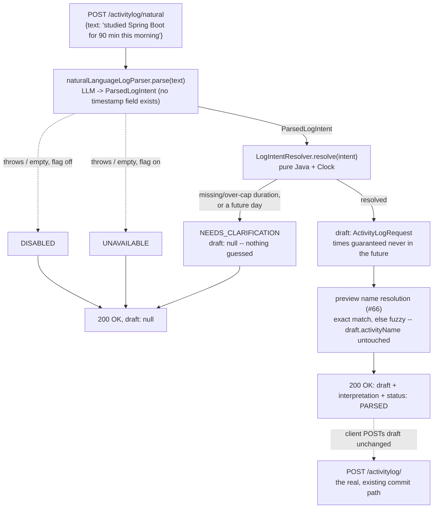

# Natural-Language Activity Logging — An LLM Classifier Over a Deterministic Java Clock

**Service:** `activity-service` · **Key classes:** `NaturalLogServiceImpl`,
`NaturalLanguageLogParser`, `ChatModelNaturalLanguageLogParser`, `NaturalLogPromptBuilder`,
`ParsedLogIntent`, `LogIntentResolver`, `NaturalLogConfig`, endpoint on `ActivityLogController`

## What it is / why it's notable

Let a user type "studied Spring Boot for 90 minutes this morning" and get back a validated,
committable `ActivityLogRequest` instead of filling in a form. Issue
[#70](https://github.com/prashant-singh-2001/gamified_tracker/issues/70) was filed as the
highest-UX-ceiling item in the same systematic ML/LLM scan that produced #65's weekly digest and
the sibling issues #68–#72, and it composes directly with [#66's fuzzy activity-name
resolution](fuzzy-activity-matching.md) for the name step.

**The issue's stated blocker turned out not to exist by the time this was built.** #70 was filed
against `ActivityLogRequest.startTime`/`.endTime` as `@FutureOrPresent`/`@Future` — under that
validation, "this morning" was genuinely unloggable. Both fields had already flipped to
`@PastOrPresent` in commit `99c6df9`, issue #67's own work closing the unbounded-XP exploit (see
[Session Integrity](session-integrity.md)) — a side effect of that fix, not something #70 needed to
do itself. No validation change is part of this feature;
`ActivityLogRequestValidationTest` now pins `startTime`'s `@PastOrPresent` explicitly, closing the
one gap in that file's coverage (only `endTime` had a regression guard before).

**The model classifies, it never computes.** Same principle #65 uses for its narrative: an LLM is
unreliable at date/calendar arithmetic, so it's never asked to do any. `ParsedLogIntent` —
everything the model may return — has **no timestamp field of any kind**; it can only emit a day
offset, an optional clock time or a coarse time-of-day bucket, and a stated duration.
`LogIntentResolver` is a pure, `Clock`-driven Java class that turns those into concrete times, with
one invariant enforced regardless of input: a resolved draft's times can never land in the future.

**Draft, don't commit.** `POST /activitylog/natural` writes nothing. It returns a preview — the
exact `ActivityLogRequest` the client would `POST` to the real `/activitylog/` endpoint to actually
log it — plus a human-readable interpretation and a preview of how the activity name would resolve.
XP in this system is irreversible; putting a commit step between the model and an XP-awarding write
is the containment strategy, not just a UX choice. Unlike #65's notes — background context the
model narrates *about* — the text here **is** the instruction being interpreted, so prompt injection
can't be prevented, only bounded: by `ParsedLogIntent`'s rigid schema, by `LogIntentResolver`
re-validating and clamping every field in Java, and by the fact that this endpoint never writes.

## How it works



### 1. The model's output contract — `ParsedLogIntent`

```java
public record ParsedLogIntent(
        String activityName,
        int dayOffset,            // 0 = today, negative = that many days ago
        Integer startHour,
        Integer startMinute,
        TimeOfDay timeOfDay,      // MORNING | AFTERNOON | EVENING | NIGHT
        Integer durationMinutes,  // null is NEVER defaulted -- a guessed duration is guessed XP
        String notes) {
}
```

No field can hold a `LocalDateTime`, a `LocalDate`, or an epoch value — the type itself makes
emitting a timestamp impossible, not just a prompt instruction the model could ignore.

### 2. Turning intent into time — `LogIntentResolver`

Pure, no Spring, `Clock`-driven — fully unit-tested with a fixed clock and no model
(`LogIntentResolverTest`, 15 cases):

```java
if (intent.dayOffset() > 0) {
    return new Resolution(null, Reason.FUTURE_DAY);
}
Integer duration = intent.durationMinutes();
if (duration == null || duration <= 0) {
    return new Resolution(null, Reason.MISSING_DURATION);
}
if (duration > maxDurationMinutes) {
    return new Resolution(null, Reason.DURATION_TOO_LONG);
}
```

Every rejection is refused outright, never silently repaired: a missing duration doesn't get a
default, an over-cap duration doesn't get clamped down to the cap, a future day doesn't get
reinterpreted as today. `maxDurationMinutes` is [Session Integrity](session-integrity.md)'s existing
`session-integrity.max-duration-minutes` (#67) — the same ceiling `POST /activitylog/` itself
enforces on commit, not a second cap that could quietly disagree with it.

Two "no time given" cases split deliberately:

```java
if (intent.dayOffset() == 0 && intent.startHour() == null && intent.timeOfDay() == null) {
    // "studied for 30 minutes" -- the only honest anchor is "just finished."
    endTime = now;
    startTime = endTime.minusMinutes(duration);
} else {
    ...
    // A past day with no time at all has no "just finished" anchor -- falls back to a fixed
    // noon default instead.
}
```

And a stated time that would still land in the future ("this evening" while it's still morning)
shifts the whole window back rather than being rejected — the duration the user actually stated
survives the shift:

```java
if (endTime.isAfter(now)) {
    endTime = now;
    startTime = endTime.minusMinutes(duration);
}
```

### 3. The provider seam — `NaturalLanguageLogParser`

Same shape as `WeeklyDigestNarrator` (#65) and `ActivityNameScorer` (#66): an interface, one
`ChatModel`-backed implementation, the backend a runtime concern.

```java
public interface NaturalLanguageLogParser {
    Optional<ParsedLogIntent> parse(String text);
}
```

`ChatModelNaturalLanguageLogParser` goes through Spring AI's `call().entity(ParsedLogIntent.class)`
— confirmed by decompiling `spring-ai-client-chat-1.1.8.jar`'s `ChatModelCallAdvisor`, rather than
assumed, that this automatically builds a `BeanOutputConverter` for the target type and appends its
JSON-format instructions to the outgoing prompt on its own. No manual `{format}` placeholder is
needed in `NaturalLogPromptBuilder`. `NaturalLogConfig` wires the bean with the same
`ObjectProvider<ChatModel>` fail-open pattern `InsightsConfig` uses:

```java
@Bean
@ConditionalOnProperty(prefix = "natural-log", name = "enabled", havingValue = "true")
public NaturalLanguageLogParser chatModelNaturalLanguageLogParser(
        ObjectProvider<ChatModel> chatModel, NaturalLogPromptBuilder promptBuilder, Clock clock) {
    ChatModel model = chatModel.getIfAvailable();
    return model == null ? text -> Optional.empty() : new ChatModelNaturalLanguageLogParser(model, promptBuilder, clock);
}
```

### 4. Prompt hardening — `NaturalLogPromptBuilder`

Same discipline as `WeeklyDigestPromptBuilder` (#65) — control characters stripped, whitespace
collapsed, backticks neutralized so the input can't forge its way out of the fenced block it's
rendered inside, capped at `natural-log.max-input-chars`. The system prompt is explicit that the
sentence is data to extract from, never instructions to follow, and that every field must come from
what was actually said, never invented.

One thing this prompt deliberately withholds: **the actual date.** Only today's weekday name is
given ("today is Friday"), enough to resolve a phrase like "last Tuesday" into a day count without
asking the model to do any real calendar arithmetic — `NaturalLogPromptBuilderTest` pins that no
plausible year ever appears in the system prompt.

### 5. Name resolution is a preview, never a rewrite

`draft.activityName` stays exactly the raw text the model produced. `NaturalLogServiceImpl`
separately previews what `POST /activitylog/`'s own exact-then-fuzzy resolution (#66) would do with
it — populating `nameResolution`/`suggestions` for display — without ever touching the draft itself:

```java
private NamePreview previewNameResolution(String activityName) {
    if (activityRepository.findByName(activityName).isPresent()) {
        return new NamePreview(null, List.of());
    }
    var resolution = activityNameResolutionService.resolve(activityName);
    ...
}
```

This deliberately replays the same exact-match-first order `ActivityLogServiceImpl.resolveActivity`
uses, since `ActivityNameResolutionService` is documented to only be called on a miss. The draft the
client actually commits gets its **real** resolution for free, the moment it's `POST`ed to
`/activitylog/` — this preview exists purely so the client can show "this will log as Study" before
that happens.

### 6. Degrading gracefully

```java
try {
    parsed = naturalLanguageLogParser.parse(text);
} catch (Exception e) {
    log.warn("Natural-language log parser failed for user {} (falling back to UNAVAILABLE)", userId, e);
    parsed = Optional.empty();
}
```

Same shape as `InsightsServiceImpl`'s narrator `try`/`catch` (#65) and `OutboxRelay`'s publish loop
before it — load-bearing here for the same reason: `GlobalExceptionHandler` has no catch-all
handler, so an escaping model timeout or malformed JSON reply would otherwise surface as a raw `500`
on a `POST`. `naturalLogProperties.enabled()` disambiguates `DISABLED` from `UNAVAILABLE` on an
empty result, identical to how `insightsProperties.enabled()` disambiguates `NarrativeStatus`.

## Config

```yaml
# activity-service application.yaml
natural-log:
  enabled: ${NATURAL_LOG_ENABLED:false}
  max-input-chars: ${NATURAL_LOG_MAX_INPUT_CHARS:500}
```

No separate backend selector — `spring.ai.model.chat` (shared with #65, see [AI Weekly Coaching
Digest](ai-weekly-digest.md#config)) decides whether Ollama or Docker Model Runner answers.
`natural-log.enabled=true` with `spring.ai.model.chat=none` is a valid, supported combination that
degrades to `UNAVAILABLE`, not a startup failure.

## Try it

```bash
# Flag off (the default): still 200, nothing written
curl -X POST http://localhost:8080/api/activitylog/natural -H "Authorization: Bearer $TOKEN" \
  -H "Content-Type: application/json" -d '{"text":"studied Spring Boot for 90 minutes this morning"}'
# -> 200, "draft": null, "status": "DISABLED"

# With a backend running (NATURAL_LOG_ENABLED=true, spring.ai.model.chat=ollama|openai):
curl -X POST http://localhost:8080/api/activitylog/natural -H "Authorization: Bearer $TOKEN" \
  -H "Content-Type: application/json" -d '{"text":"studied Spring Boot for 90 minutes this morning"}'
# -> 200, "status": "PARSED", the draft's window is exactly 90 minutes, both times in the past,
#    "nameResolution" shows what the name would resolve to on commit

# Commit it -- the draft is valid input by construction
curl -X POST http://localhost:8080/api/activitylog/ -H "Authorization: Bearer $TOKEN" \
  -H "Content-Type: application/json" -d '<the returned draft, unchanged>'

# Ambiguous input: no guessed duration
curl -X POST http://localhost:8080/api/activitylog/natural -H "Authorization: Bearer $TOKEN" \
  -H "Content-Type: application/json" -d '{"text":"did some stuff"}'
# -> 200, "status": "NEEDS_CLARIFICATION", "draft": null

# Metrics -- no user-typed text in any tag
curl http://localhost:8081/actuator/prometheus | grep activity_log_natural_parse
```

## Known simplifications

- **No user timezone.** `User` has no timezone/locale field anywhere in this system, so "this
  morning" resolves against server time. Genuinely wrong for a caller in a different timezone from
  the server; stated plainly rather than glossed over. Fixing it means a schema change to
  `user_entity` and is its own issue.
- **Weak on named weekdays with a small local model.** The system prompt gives the model today's
  weekday name so "last Tuesday" can resolve to a day count, but this still asks a small model to do
  real reasoning ("today is Friday, so Tuesday was 3 days ago") that a 3B-class model may get wrong.
  `LogIntentResolver`'s `FUTURE_DAY` rejection catches the case where it reasons the wrong direction
  entirely; it can't catch an off-by-one.
- **Single intent per sentence.** "ran, then studied" is not decomposed into two logs —
  `ParsedLogIntent` models exactly one activity.
- **The draft is advisory, not a security boundary.** A client can edit the returned draft before
  committing it; that's fine by design, since `POST /activitylog/` re-validates and re-resolves
  everything from scratch regardless of what this endpoint said.
- **Small local models are weak at structured output in general.** `.entity(Class)` is
  prompt-plus-parse, not constrained decoding — a malformed reply is handled (caught, degrades to
  `UNAVAILABLE`), but the practical success rate depends on which model is actually running.

## Related

[AI Weekly Coaching Digest](ai-weekly-digest.md) (the shared Spring AI foundation, backend selector,
and the model-classifies-Java-computes principle this feature reuses) ·
[Fuzzy Activity-Name Matching](fuzzy-activity-matching.md) (the exact-then-fuzzy resolution this
feature previews but never replaces) ·
[Session Integrity](session-integrity.md) (the duration cap this feature reuses, and the validation
history that closed #70's stated blocker before this feature needed to touch it) ·
[Error Handling](error-handling.md) (why the `try`/`catch` here can't rely on a catch-all handler) ·
[docs/FLOWS.md, Part V](../FLOWS.md#part-v--logging-an-activity-the-spine) ·
issue #70
