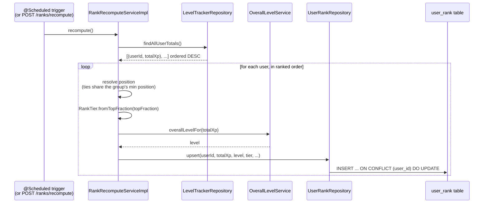
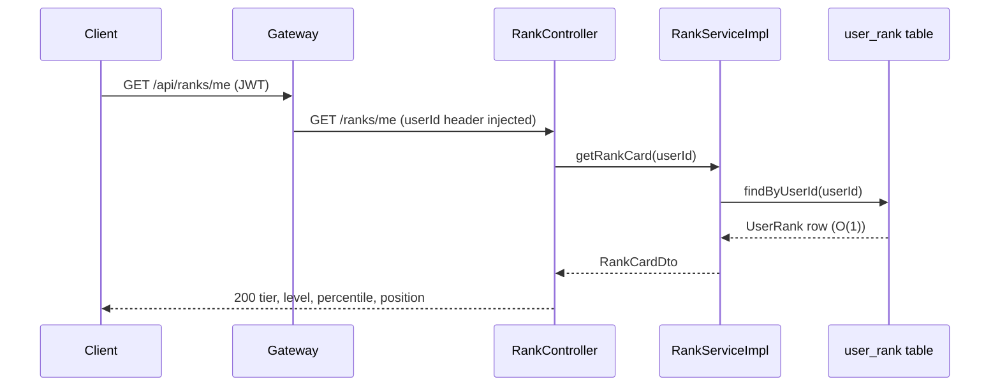

# Overall Level, Percentile Ranks & Within-Tier Leaderboards

> **A note on this doc's context:** the `docs/features/` folder that previously held this project's
> other showcase docs (authentication, rate limiting, event-driven decoupling, and eight others) is no
> longer present in the working tree — it appears to have been lost in a branch/merge operation
> somewhere between sessions, not something this doc can recover. This file starts a fresh
> `docs/features/` folder with the newest feature; the others would need to be regenerated separately
> if wanted.

## What it is / why it's notable

Every user has an **overall level** (absolute, derived from lifetime XP against a seeded threshold
curve) and a **rank** (relative, their percentile standing among *all* tracked users, expressed as one
of nine Summit-themed tiers). The two are deliberately different kinds of progression: level only ever
goes up; rank is a live standing that can **promote or demote** a user as other people earn XP — the
same dynamic that makes Clash-of-Clans-style leagues compelling. Sitting on top of both is a
**within-tier leaderboard**, so every tier has its own race instead of everyone chasing one unreachable
global #1.

The interesting engineering is in how cheaply this stays correct at read time: ranking is an O(N log N)
sweep over every user, which is too expensive to do per request. Instead a scheduled batch
(`RankRecomputeServiceImpl`) sorts everyone once, resolves each person's tier from a single
authoritative percentile→tier table (`RankTier`), and writes the result into a **materialized snapshot**
(`UserRank`) that every read endpoint serves directly — O(1) for a personal card, O(page) for a
leaderboard.

## How it works





Every read (`/me`, `/{tier}/leaderboard`, `/me/leaderboard`, the distribution) hits the snapshot table
only — no cross-user aggregation happens on the request path. The batch is the only place that does the
expensive O(N) work.

## Key classes & code

**`RankTier`** — [gamification-service/.../dao/RankTier.java](../../gamification-service/src/main/java/com/tracker/gamification/dao/RankTier.java)
is the single authoritative percentile→tier mapping. Each of the 9 tiers carries its `[lo, hi)` band;
`fromTopFraction` scans from the top tier down and returns the first one whose `lo` the fraction clears —
so every tier's upper edge is implicit (the next tier's `lo`), and there's no separate boundary to keep
in sync:

```java
public static RankTier fromTopFraction(double topFraction) {
    RankTier[] tiers = values();
    for (int i = tiers.length - 1; i >= 0; i--) {
        if (topFraction >= tiers[i].lo) {
            return tiers[i];
        }
    }
    return SUMMIT;
}
```

| Bracket | topFraction | Tier |
|---|---|---|
| top 5% | `[0.00, 0.05)` | SUMMIT |
| 5–15% | `[0.05, 0.15)` | PEAK |
| 15–25% | `[0.15, 0.25)` | RIDGE |
| 25–50% | `[0.25, 0.50)` | ALPINE |
| 50–60% | `[0.50, 0.60)` | ASCENT |
| 60–75% | `[0.60, 0.75)` | HIGHLAND |
| 75–85% | `[0.75, 0.85)` | FOOTHILL |
| 85–95% | `[0.85, 0.95)` | TRAILHEAD |
| 95–100% | `[0.95, 1.00]` | BASECAMP |

**`RankRecomputeServiceImpl.recompute()`** — the batch. `LevelTrackerRepository.findAllUserTotals()`
returns every user's cross-activity XP total, already ordered descending; the method walks that list
once, assigning a 1-based position and computing `topFraction = (position-1)/totalUsers`. **Tied users
share the tie group's minimum position** — two people tied at the top both land on position 1, and the
next distinct value picks up from the raw sequential count rather than the tie-inflated one — so equal
XP never splits arbitrarily across a tier boundary. `OverallLevelService.overallLevelFor` resolves the
absolute level the same way `ActivityLevelThresholdRepository` already resolves per-activity levels:
highest seeded threshold cleared, ordered `DESC`, capped to one row via `Pageable`.

**`UserRankRepository.upsert`** — a native `INSERT ... ON CONFLICT (user_id) DO UPDATE SET ...`, the
same idempotent-upsert idiom as `LevelTracker.insertIfAbsent` and
`UserAchievementRepository.grantIfAbsent`, except it *updates* on conflict rather than no-op'ing — a
recompute should overwrite a stale snapshot, not skip it.

**`UserRank implements Persistable<Long>`** — worth calling out as a real gotcha this feature ran into.
`userId` is an application-assigned natural key (the actual platform user id), not a database-generated
surrogate. Spring Data's default "is this entity new?" check treats *any* non-null `@Id` as "already
exists" and issues an `UPDATE` — which matches zero rows and throws
`ObjectOptimisticLockingFailureException` the first time a genuinely new user is saved via the plain
JPA path. Implementing `Persistable<Long>` with an explicit `isNew` flag (true until `@PostPersist`/
`@PostLoad` flips it) fixes `.save()`-based code paths; the native `upsert()` query bypasses the issue
entirely since it never goes through JPA's persistence-context logic.

**`RankController`** — `@RequestMapping("/ranks")`, every user-scoped read (`/me`, `/me/leaderboard`)
takes the caller's identity from the trusted, gateway-injected `userId` header, never a path or body
value — the same IDOR-safe pattern used throughout this service. `/{tier}/leaderboard` binds the path
segment straight to the `RankTier` enum via Spring's built-in enum converter. `/recompute` is the
on-demand equivalent of the scheduled job, useful for demos and tests without waiting out the interval.

## Config

```yaml
# gamification-service/src/main/resources/application.yaml
ranking:
  recompute-interval-ms: 300000   # 5 minutes; externalized so cadence can be tuned per environment
```

`GamificationServiceApplication` carries `@EnableScheduling` — without it, `@Scheduled` methods are
silently never invoked. The overall-level curve (`overall_level_threshold`) and the gateway route
(`/api/ranks/**` added to `RouteConfiguration.gamificationRoute`) are the other two pieces:

```sql
-- gamification-service/src/main/resources/data.sql
INSERT INTO overall_level_threshold (level, threshold) VALUES (1, 0)    ON CONFLICT (level) DO NOTHING;
INSERT INTO overall_level_threshold (level, threshold) VALUES (2, 100)  ON CONFLICT (level) DO NOTHING;
INSERT INTO overall_level_threshold (level, threshold) VALUES (3, 250)  ON CONFLICT (level) DO NOTHING;
-- ... widening thereafter (500, 1000, 2000, 4000, 8000, 16000, 32000) so early
-- levels come quick and later ones stay meaningful, without a redeploy to retune.
```

## Try it

Via the Postman collection's **Ranks** folder (`postman/gamified-tracker.postman_collection.json`,
positioned right after **Level Tracker** since it needs XP on record first): confirms `GET /ranks/me` is
`404` before any recompute, triggers one via `POST /ranks/recompute`, then walks `/ranks/me`,
`/ranks/me/leaderboard`, `/ranks/{tier}/leaderboard`, and `/ranks` (the distribution).

Or by hand, once a JWT is in hand:

```bash
curl -X POST http://localhost:8080/api/ranks/recompute -H "Authorization: Bearer $TOKEN"
curl http://localhost:8080/api/ranks/me -H "Authorization: Bearer $TOKEN"
curl "http://localhost:8080/api/ranks/SUMMIT/leaderboard?page=0&size=20" -H "Authorization: Bearer $TOKEN"
curl http://localhost:8080/api/ranks -H "Authorization: Bearer $TOKEN"
```

## Related

- [API.md](../../API.md), [gamification-service/README.md](../../gamification-service/README.md)
- Reuses the concurrency-safe idempotent-upsert pattern from `LevelTracker.insertIfAbsent` and
  `UserAchievementRepository.grantIfAbsent` (the achievements feature, built alongside this one).
- `RANK_AND_LEVEL_SYSTEM_TODO.md` at the repo root is the implementation plan this feature was built
  from, including the sections intentionally left undone: live overall-level feedback inside the XP
  write path, and a small-population gate below which ranks are suppressed.

---
_Verified against the working tree on 2026-07-22; snippets are illustrative — confirm against source
before relying on line-level detail._
