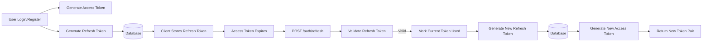
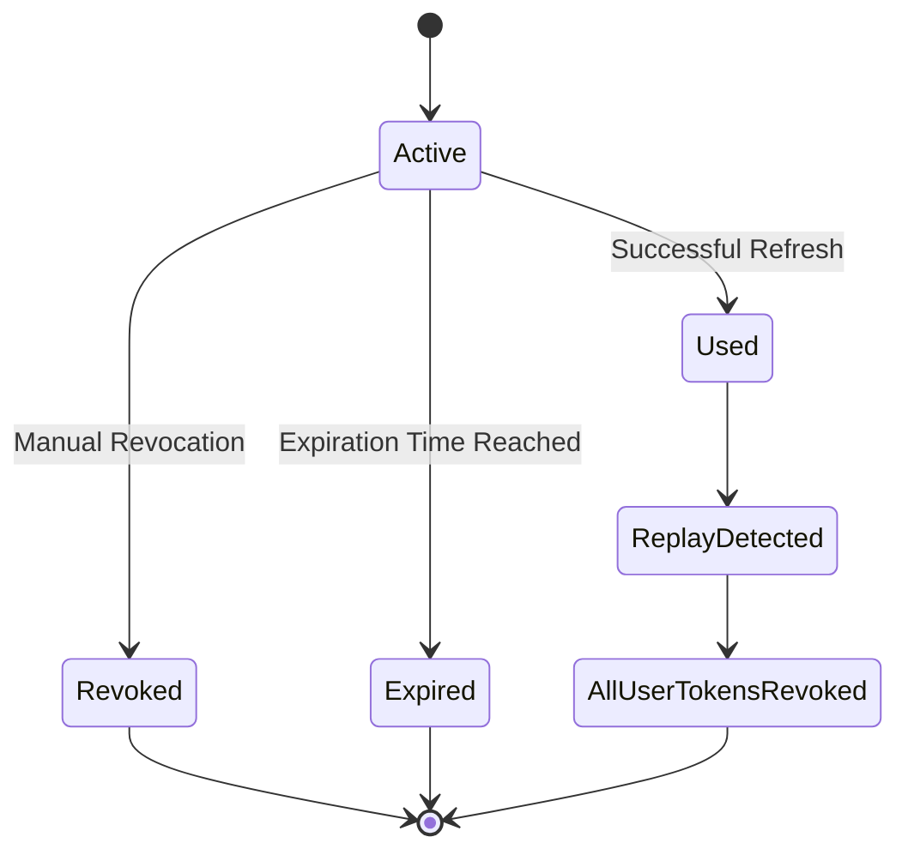
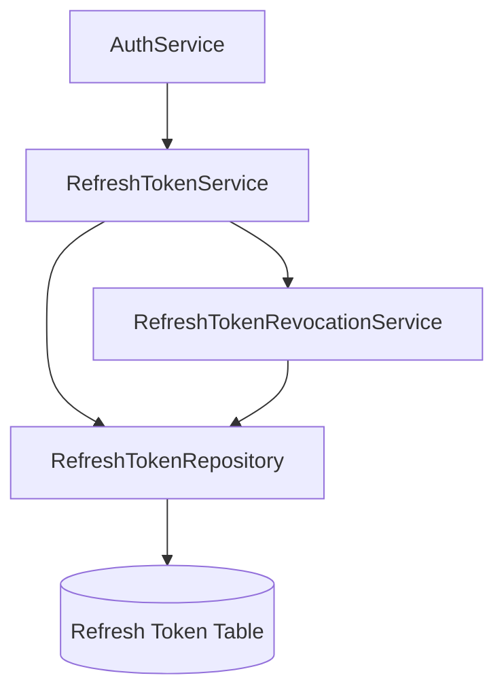

# Refresh Token Rotation & Revocation

**Service:** `api-gateway` · **Key classes:** `RefreshTokenService`, `RefreshTokenRevocationService`, `RefreshToken`

---

## What it is / Why it's notable

A **stateful refresh token implementation** that provides **refresh token rotation**, **token reuse detection**, and **server-side token revocation**.

Unlike purely stateless JWT authentication, access tokens remain stateless while refresh tokens are persisted in the database. 
This allows the gateway to invalidate compromised refresh tokens, detect replay attacks, and immediately terminate all active sessions for a user when token reuse is detected.

To ensure significant security, the implementation follows the **one-time-use refresh token** pattern:

- Every login or registration issues a brand-new refresh token.
- Every successful refresh consumes (invalidates) the current refresh token.
- A completely new refresh token replaces it.
- Reusing an already consumed refresh token is treated as suspicious activity and revokes every refresh token owned by that user.
- **Soft delete logic** is implemented to improve auditability.

---

# Objective

The refresh token subsystem has four primary goals:

- Provide long-lived authentication without requiring users to log in repeatedly.
- Ensure refresh tokens can only be used once (Refresh Token Rotation).
- Detect replay attacks by identifying reused refresh tokens.
- Allow immediate server-side invalidation of refresh tokens.

---

# High-Level Flow



Only refresh tokens are stored in the database.
Access tokens remain completely stateless JWTs.

---

# Refresh Token Lifecycle


A refresh token may only transition through these states once.
Once a token becomes **Used** or **Revoked**, it can never be used again.

---

# Architecture



Responsibilities are intentionally separated:
- **AuthService** orchestrates authentication workflows.
- **RefreshTokenService** manages refresh token creation and validation.
- **RefreshTokenRevocationService** handles revocation logic.
- **Repository** performs persistence.

---

# Refresh Token Entity

Each refresh token stores authentication state independently. The fields include:

```java
id
token
user (user_id)
expiresAt
usedAt
revokedAt        
isUsed
isRevoked
```

Unlike access tokens, refresh tokens are fully persistent. This enables:
- Server-side logout
- Session invalidation
- Replay detection
- Multi-device support

---

# RefreshTokenService
This service owns the lifecycle of refresh tokens.

## 1. Generate Refresh Token

```java
generateRefreshToken(User user)
```

Creates a brand-new refresh token whenever a user:
- registers
- logs in
- refreshes an expired access token

Every generated token is:
- unique (UUID)
- unused
- not revoked
- assigned an expiration timestamp

```
Client Login

↓

Generate UUID

↓

Persist Refresh Token

↓

Return Token
```

---

## 2. Validate Refresh Token and Consume It

```java
validateRefreshToken(String token)
```

Validation performs several security checks and atomically marks the token as used if all checks pass. The validation order is:

```text
Find Token
    ↓
Exists?
    ↓
Revoked?
    ↓
Expired?
    ↓
Already Used? (CAS Update)
    ↓
Valid (marked used)
```

Each validation failure has a different outcome.

---

### Token Not Found

```text
Client
   │
   ▼
Lookup
   │
Not Found
   │
Throw InvalidCredentialsException
```

---

### Token Revoked

Revoked tokens are permanently unusable.

```text
Lookup
↓
Revoked
↓
Reject Request
```

---

### Token Expired

Expired refresh tokens are revoked immediately.

```text
Lookup
↓
Expired
↓
Revoke Token
↓
Throw Exception
```

This ensures expired tokens cannot later be reused.

---

### Token Already Used (Replay Detection)

The most important security feature. The detection is performed atomically using a database **Compare‑And‑Set (CAS) update**:

```postgresql
UPDATE RefreshToken 
SET isUsed = true 
WHERE token = :token AND isUsed = false
```

If the update returns 0 (no rows updated), the token was already consumed. 
This triggers revocation of all tokens for that user.

```text
Refresh Request
↓
CAS Update Fails (0 rows) 
↓
Possible Replay Attack
↓
Revoke Every Refresh Token
↓
Force User Login
```

If someone attempts to reuse an already consumed refresh token, the system assumes the token may have been stolen.
Rather than issuing another refresh token, every refresh token belonging to that user is revoked.
This immediately terminates all active sessions.

---

## 3. Mark Refresh Token Used (Atomic)

The token is marked as used **inside** validateRefreshToken:

- The repository’s markUsedIfTokenNotYetUsed executes the atomic update.
- If successful, the entity’s isUsed flag is set to true (in memory) and the token is considered consumed.
- This happens in the same transaction as the refresh operation.

```text
Successful Validation
  ↓
Atomic Update (isUsed = true)
  ↓
Token Consumed
  ↓
Return Valid Token
```

The consumed token can never be used again.

---

# RefreshTokenRevocationService

This service centralizes revocation operations.
Separating revocation logic keeps validation focused while allowing revocation behavior to evolve independently.
Both revocation methods execute in their own transaction (`REQUIRES_NEW`), ensuring revocation is committed even if the surrounding authentication flow later fails.
---

## Revoke Single Token

```java
revoke(RefreshToken token)
```

Flow:

```text
Token
↓
Already Revoked?
↓
No
↓
Mark Revoked
↓
Save
```

Used for:
- expired refresh tokens
- manual logout (future enhancement)
- administrator session invalidation (future enhancement)

---

## Revoke All Tokens For A User

```java
revokeAllForUser(Long userId)
```

Flow:

```text
Find User Tokens
↓
Iterate Tokens
↓
Mark Every Active Token Revoked For That UserID
↓
Save All
```

This is primarily triggered after refresh token reuse is detected.

---

# Refresh Token Rotation

The gateway implements **Refresh Token Rotation**.
Instead of repeatedly using one refresh token until it expires:

```text
Login
↓
Refresh Token A
↓
Refresh
↓
Token A → Used
↓
Issue Token B
↓
Refresh
↓
Token B → Used
↓
Issue Token C
```

Each refresh token is valid exactly once.
This significantly limits the usefulness of stolen refresh tokens.

---

# Transaction Design

Authentication orchestration occurs inside a single transaction.

```text
BEGIN

Validate Refresh Token
  ↓ (within same transaction)
Atomic CAS Update (mark used)
  ↓
Generate New Refresh Token
  ↓
Generate Access Token

COMMIT
```

If any step fails: ```ROLLBACK```

The previous refresh token remains usable.
Revocation operations intentionally execute in independent transactions so security-critical revocations are never rolled back.

---

# Security Benefits

This implementation provides several security improvements over traditional refresh token handling:
- One-time-use refresh tokens.
- Replay attack detection (atomic CAS).
- Server-side logout capability.
- Immediate token revocation.
- Session invalidation across all devices.
- Persistent refresh token management.
- Stateless access token validation.

---
