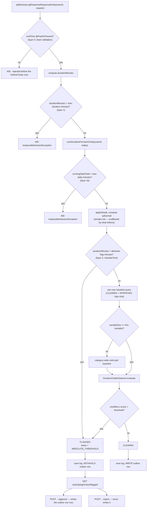

# Session Integrity — Duration Validation & Statistical Quarantine

**Service:** `activity-service` · **Key classes:** `ActivityLogServiceImpl`, `DurationOutlierDetector`,
`DurationOutlierEvaluationService`, `ActivityLogReviewServiceImpl`, `ReviewStatus`

## What it is / why it's notable

`xpEarned` is linear in `durationMinutes`, and until issue [#67](https://github.com/prashant-singh-2001/gamified_tracker/issues/67), nothing bounded either one. `ActivityLogRequest.endTime` carried only `@NotNull` — no upper bound — so `startTime = now, endTime = now + 10 years` was accepted outright and awarded millions of minutes of XP from a single call, silently poisoning the global leaderboard (`SUM(level_tracker.total_xp) GROUP BY user_id`).

The fix is four layers deep, and the last one doesn't just reject implausible input — it **quarantines** it:

```
layer 0   endTime @PastOrPresent           reject (400)
layer 1   per-session hard cap             reject (400)
layer 1b  per-user-per-day aggregate cap   reject (400)
layer 2   statistical + absolute outlier   FLAG — save the log, withhold the XP
```

Layers 0–1b reject impossible input the same way `endTime.isAfter(startTime)` always has — a 30-hour
session is not ambiguous, it's wrong. Layer 2 is different on purpose: a genuinely unusual (but real)
9-hour study session shouldn't cost a user their XP outright on a false positive, so it's saved,
visible, and pending a maintainer's review instead — a `409`-style hard rejection was rejected as too
punishing for a statistical judgment call. This mirrors how `LevelTrackerServiceImpl.save()` treats
`level_tracker.total_xp` — a running total mutated in place with no decrement path anywhere in the
codebase (see [Concurrency-Safe XP Accumulation](concurrency-safe-xp.md)) — so the **only** cheap point
to stop bad XP is *before* the [outbox](event-driven-decoupling.md) row is ever written. Everything in
this feature is built around protecting that one seam.

## How it works



### 1. The four-layer wiring — `ActivityLogServiceImpl`

```java
long maxDurationMinutes = sessionIntegrityProperties.maxDurationMinutes();
if (activityLog.getDurationMinutes() > maxDurationMinutes) {
    throw new ImplausibleSessionException(activityLog.getDurationMinutes(), maxDurationMinutes);
}

long maxDailyMinutes = sessionIntegrityProperties.maxDailyMinutes();
Long existingDailyTotal = activityLogRepository.sumDurationForUserOnDay(
        userId, activityDate.atStartOfDay(), activityDate.atTime(LocalTime.MAX), COUNTED_TOWARD_DAILY_CAP);
long runningDailyTotal = (existingDailyTotal != null ? existingDailyTotal : 0L) + activityLog.getDurationMinutes();
if (runningDailyTotal > maxDailyMinutes) {
    throw new ImplausibleSessionException(activityLog.getDurationMinutes(), runningDailyTotal, maxDailyMinutes);
}
// ... applyStreak, compute xpEarned (streaks.md) ...

DurationOutlierDetector.Verdict verdict = evaluateOutlier(activityLog);
activityLog.setReviewStatus(verdict.flagged() ? ReviewStatus.FLAGGED : ReviewStatus.CLEARED);

var saved = activityLogRepository.save(activityLog);          // 1. log FIRST, either way

if (!verdict.flagged()) {
    outboxEventRepository.save(/* ... */);                    // 2. SAME tx — the point of no return
}
```
Both caps reject before `applyStreak` runs, so a rejected request never has a side effect a rollback
would need to undo. `existingDailyTotal` is a boxed `Long` — `SUM(...)` is SQL `NULL` for a user with
no logs that day, and a primitive would throw on unboxing; the `null`-coalesce is deliberate, not a
defensive afterthought. `COUNTED_TOWARD_DAILY_CAP` is `{CLEARED, APPROVED}` — the same exclusion set the
baseline query below uses, and for the same reason (§3).

### 2. The detector — one-sided modified z-score with three fallbacks

`DurationOutlierDetector` is pure domain logic — no Spring, no JPA — which is what makes it
exhaustively unit-testable:

```java
double median = median(priorDurations);
if (candidateDuration <= median) {
    return new Verdict(false, 0.0, median, sampleSize, Basis.MODIFIED_Z_SCORE);   // one-sided
}
double mad = medianAbsoluteDeviation(priorDurations, median);
if (mad > 0) {
    double z = 0.6745 * (candidateDuration - median) / mad;                       // Iglewicz-Hoaglin
    return new Verdict(z > modifiedZThreshold, z, median, sampleSize, Basis.MODIFIED_Z_SCORE);
}
double meanAd = meanAbsoluteDeviation(priorDurations, median);
if (meanAd > 0) {
    double z = (candidateDuration - median) / (1.253314 * meanAd);                // MAD == 0 fallback
    return new Verdict(z > modifiedZThreshold, z, median, sampleSize, Basis.MEAN_AD_FALLBACK);
}
boolean flagged = median > 0 && candidateDuration > median * relativeFactor;      // zero-dispersion fallback
```
Three details that matter more than the formula:
- **One-sided.** A short session is never a threat, and ignoring the low tail roughly halves the
  false-positive rate — a user who logs 5 minutes one day isn't gaming anything.
- **`MAD == 0` is common, not exotic.** A user who logs exactly 60 minutes every time has zero
  dispersion by that measure — falling back to mean absolute deviation (as the original
  Iglewicz-Hoaglin paper prescribes) is the normal path for a consistent user, not an edge case.
- **All-identical priors** (`meanAd == 0` too) fall back further, to a flat multiple of the median —
  the only way a wild outlier can still be caught when every prior sample was literally the same
  number.

### 3. The self-consistency gap — and why layer 2 alone wasn't enough

The detector above only ever measures a user **against their own history**, and that turns out to be
gameable two ways that don't require beating the math at all:

- **Cold-start seeding.** Below `min-samples` (10) priors the detector abstains rather than flagging on
  thin evidence — correct, since a brand-new user shouldn't be flagged on one data point. But that means
  the first 10 sessions logged at 1440 minutes each are all `CLEARED`, award full XP, and **become the
  baseline**: median = 1440, and every later 1440-minute session reads as `candidateDuration <= median`
  — never even reaches the z-score branch.
- **Ratcheting.** `baseline-window: 100` ages old (small) values out of the query, so a user who grows
  their session length in small steps — each one comfortably inside `modifiedZThreshold` of their own
  *already-inflated* recent distribution — never trips 3.5σ, even on a mature account.

Neither path is a statistics problem; both just avoid ever being an outlier *relative to themselves*.
The fix is two bounds that don't care what "normal" looks like for a given user:

```java
// DurationOutlierEvaluationService.evaluate — checked BEFORE either baseline query,
// so a session over this line never touches the database at all
if (durationMinutes > sessionIntegrityProperties.absoluteFlagMinutes()) {
    return new Verdict(true, 0.0, 0.0, 0, Basis.ABSOLUTE_THRESHOLD);
}
```
`absolute-flag-minutes` (default 600) flags regardless of the user's own baseline, closing cold-start
seeding and ratcheting in one line. The per-user-per-day cap in §1 closes the same hole for **many
small** sessions instead of one big one — a day physically contains 1440 minutes, so a legitimate
running total can never exceed that, independent of any per-session number.

Verified live against real Postgres: a first-ever 1440-minute session now comes back `FLAGGED` instead
of `CLEARED`; a 1440-minute session against a self-consistent 590-minute baseline is still `FLAGGED`,
even though `590 × 3 = 1770 > 1440` would have passed the relative-fallback check in §2 alone.

### 4. Quarantine and the admin review API — `ActivityLogReviewServiceImpl`

```java
@Transactional
public ResponseEntity<ActivityLogResponse> approve(Long logId) {
    var log = findFlaggedOrThrow(logId);              // 409 if not currently FLAGGED
    log.setReviewStatus(ReviewStatus.APPROVED);
    var saved = activityLogRepository.save(log);

    var event = new ActivityLoggedEvent(saved.getId(), saved.getUserId(),
            saved.getActivity().getId(), saved.getXpEarned());     // the ORIGINAL, frozen xpEarned
    outboxEventRepository.save(/* idempotencyKey = logId, same as the producer path */);

    return ResponseEntity.ok(mapToActivityLogResponse(saved));
}
```
Approval writes the outbox row that creation withheld — the existing 2-second `OutboxRelay` picks it up
and applies XP exactly as if the log had never been flagged, because `xpEarned` was already computed
and frozen on the row at creation time (§1). It's idempotent for free: the outbox table's
`idempotency_key` unique constraint is the log id, so a second approve attempt on an already-`APPROVED`
log can't double-write. Rejection just never writes the row — no compensation logic exists or is needed,
since nothing was ever committed for a rejected log. Both transitions require the log to currently be
`FLAGGED` (`409` otherwise), so an already-decided log can't be flipped a second time.

A flagged log **still advances the streak** — the session probably happened; only its magnitude is in
doubt, and punishing the streak on a false positive would double-punish the user. See the ordering note
in [Streaks](streaks.md).

Both endpoints are gated `hasRole("ADMIN")` at the Gateway (`/api/activitylog/review/**`), the same
mechanism as `POST /api/activity` — this service has no Spring Security of its own, so, like every
other admin-gated endpoint in this codebase, calling `:8081` directly bypasses the check.

## Config

```yaml
# activity-service application.yaml
session-integrity:
  outlier-detection-enabled: ${SESSION_INTEGRITY_OUTLIER_ENABLED:true}    # kill switch for layer 2 ONLY
  max-duration-minutes: ${SESSION_INTEGRITY_MAX_DURATION:1440}            # layer 1
  max-daily-minutes: ${SESSION_INTEGRITY_MAX_DAILY_MINUTES:1440}          # layer 1b
  absolute-flag-minutes: ${SESSION_INTEGRITY_ABSOLUTE_FLAG_MINUTES:600}   # layer 2, self-consistency bound
  modified-z-threshold: ${SESSION_INTEGRITY_Z_THRESHOLD:3.5}
  min-samples: ${SESSION_INTEGRITY_MIN_SAMPLES:10}
  baseline-window: ${SESSION_INTEGRITY_BASELINE_WINDOW:100}
  relative-factor: ${SESSION_INTEGRITY_RELATIVE_FACTOR:3.0}
```
`outlier-detection-enabled` mirrors gamification-service's `leveling.default-curve.enabled` convention
— a kill switch for the *statistical* layer only. Layers 0, 1, and 1b always apply regardless; they
reject the impossible, not the merely unusual, so there's no reason to ever want them off.

## Try it

```bash
# A 700-minute session: under the 1440 hard cap, over the 600 absolute-flag threshold -> FLAGGED
# on the very first request, no baseline seeding needed.
curl -X POST http://localhost:8080/api/activitylog -H "Authorization: Bearer $TOKEN" \
  -H "Content-Type: application/json" \
  -d '{"activityName":"Study","startTime":"2026-07-16T09:00:00","endTime":"2026-07-16T20:40:00"}'
# -> 200, reviewStatus: "FLAGGED" — no outbox row was written

curl http://localhost:8080/api/activitylog/review/flagged -H "Authorization: Bearer $ADMIN_TOKEN"
# -> the log above, plus its verdict (median, modifiedZScore, sampleSize, basis: "ABSOLUTE_THRESHOLD")

curl -X POST http://localhost:8080/api/activitylog/review/{id}/approve -H "Authorization: Bearer $ADMIN_TOKEN"
sleep 3   # outbox relay + consumer catch up, per Event-Driven Decoupling
curl http://localhost:8080/api/level/user/{userId} -H "Authorization: Bearer $TOKEN"
# -> XP now applied, exactly the amount computed at creation time
```

## Known simplifications

- **The cold-start global baseline is itself poisonable in aggregate** if many users farm the same
  category at once — the median they all shift together still looks self-consistent. Accepted at this
  scale; a trimmed mean or an admin-curated per-category baseline is the fix (`ActivityLogRepository`'s
  Javadoc on `findRecentDurationsForCategory` flags this explicitly).
- **No historical backfill.** This only evaluates new writes; logs that predate #67 are all `CLEARED`
  by migration default and were never scored.
- **A rejected log keeps its streak.** `applyStreak()` commits before the flag/reject decision, and
  rejection never rolls it back — `ActivityStreak` is mutated in place with no history, so a correct
  rollback isn't reconstructible. Deliberate, not an oversight.
- **Migration correctness isn't covered by CI.** `@DataJpaTest` builds its schema from entities, not
  Flyway (see [Testing Strategy](testing-strategy.md)), so a green repository test proves the JPQL
  translates on H2 — it doesn't prove the `V4` migration and the entity actually agree under
  `ddl-auto: validate`. That was verified manually, by booting against real Postgres.

## Related
[Event-Driven Decoupling](event-driven-decoupling.md) (the outbox seam this feature withholds a write
from) · [Concurrency-Safe XP Accumulation](concurrency-safe-xp.md) (why there's no XP decrement path,
and thus no cheaper place to intervene) · [Streaks](streaks.md) (why a flagged log still advances it) ·
[Error Handling](error-handling.md) (the `ProblemDetail` contract behind every 400/409 here) · issue #67
