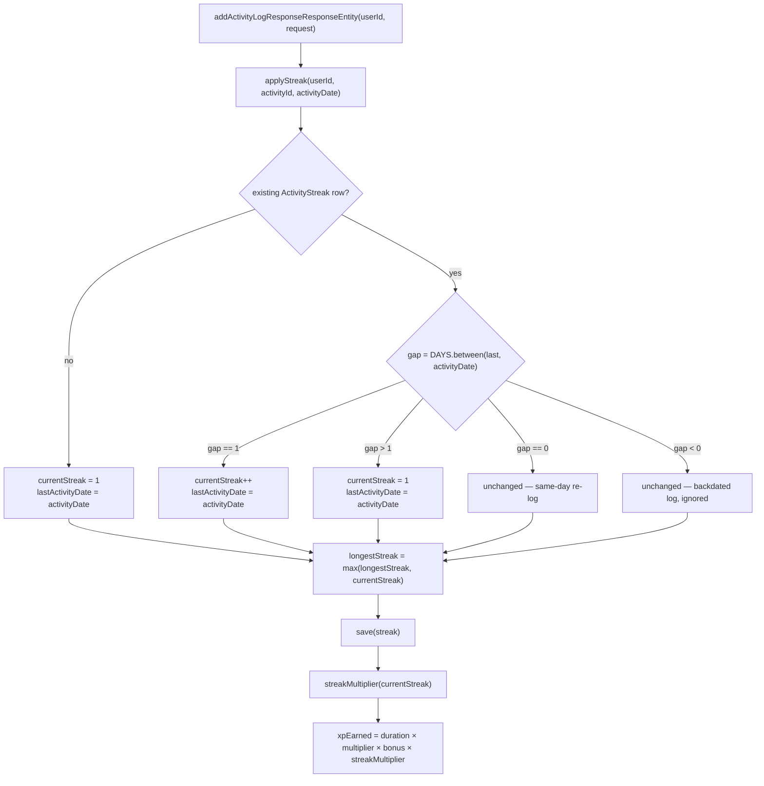

# Streaks — Consecutive-Day Retention Multiplier

**Service:** `activity-service` · **Key classes:** `ActivityStreak`, `ActivityStreakRepository`,
`ActivityLogServiceImpl.applyStreak`

## What it is / why it's notable

A per-`(user, activity)` consecutive-day counter that stacks as a fourth multiplicand onto XP, right
next to the existing random bonus roll. Log the same activity on consecutive calendar days and the
streak climbs; skip a day and it resets to 1. It's the same daily-habit mechanic that makes streak-based
apps sticky — and closes issue [#12](https://github.com/prashant-singh-2001/gamified_tracker/issues/12),
which asked for exactly this: `lastActivityDate` tracking plus consecutive-day logic, paired with the
existing bonus multiplier.

The interesting part isn't the counter itself — it's that the whole feature lives **entirely inside
activity-service**, in the same transaction that already computes `xpEarned`. The streak-boosted total
then travels to gamification-service through the **unchanged** `ActivityLoggedEvent` (see
[Event-Driven Decoupling](event-driven-decoupling.md)), so a feature that touches leveling and ranks
needed zero changes on the consumer side.

```
xpEarned = durationMinutes × effectiveXpMultiplier × bonus × streakMultiplier
                             \_______ existing _______/       \___ NEW ___/
```

## How it works



### 1. The gap-day state machine — `applyStreak`

```java
private ActivityStreak applyStreak(Long userId, Long activityId, LocalDate activityDate) {
    ActivityStreak streak = activityStreakRepository.findByUserIdAndActivityId(userId, activityId)
            .orElseGet(() -> ActivityStreak.builder()
                    .userId(userId).activityId(activityId)
                    .currentStreak(0).longestStreak(0).lastActivityDate(null)
                    .build());

    LocalDate last = streak.getLastActivityDate();
    if (last == null) {
        streak.setCurrentStreak(1);
        streak.setLastActivityDate(activityDate);
    } else {
        long gap = ChronoUnit.DAYS.between(last, activityDate);
        if (gap == 1) {                 // consecutive day -> extend
            streak.setCurrentStreak(streak.getCurrentStreak() + 1);
            streak.setLastActivityDate(activityDate);
        } else if (gap > 1) {           // missed at least one day -> restart at 1
            streak.setCurrentStreak(1);
            streak.setLastActivityDate(activityDate);
        }
        // gap == 0 (same-day re-log) or gap < 0 (backdated): left untouched on purpose
    }
    streak.setLongestStreak(Math.max(streak.getLongestStreak(), streak.getCurrentStreak()));
    return activityStreakRepository.save(streak);
}
```
Four branches, one `ChronoUnit.DAYS.between` call — no manual date arithmetic. The two "leave it alone"
branches are deliberate, not omissions: a second log the same day shouldn't double-count toward the
streak, and a backdated log older than the recorded `lastActivityDate` shouldn't retroactively rewrite
state that later, newer logs already built on.

### 2. The multiplier — capped linear growth

```java
private double streakMultiplier(int currentStreak) {
    return 1.0 + Math.min(Math.max(currentStreak - 1, 0), 10) * 0.05;
}
```
Day 1 is `1.00×` (no bonus for a single log), then `+0.05` per consecutive day, capped at day 11+
(`1.50×`). One line, tuned by two constants — deliberately simple rather than exponential, so a broken
streak doesn't erase an outsized chunk of a user's earning rate.

### 3. Folded into the existing XP line — `addActivityLogResponseResponseEntity`

```java
LocalDate activityDate = activityLog.getStartTime().toLocalDate();
ActivityStreak streak = applyStreak(userId, activityLog.getActivity().getId(), activityDate);
double streakMult = streakMultiplier(streak.getCurrentStreak());

double multiplier = activityLog.getActivity().effectiveXpMultiplier();   // see Leveling Engine
double bonus = random.nextDouble() < 0.2 ? random.nextDouble(1.1, 1.5) : 1.0;
activityLog.setXpEarned(activityLog.getDurationMinutes() * multiplier * bonus * streakMult);
```
`streakMult` is just a fourth number multiplied into the same line that already combines the category
multiplier and the random bonus — no branching, no separate code path for "streak days" vs. "non-streak
days."

Ordering note: the request is resolved and validated by `mapToActivityLog` *before* this runs, so a
log against a soft-deleted activity throws `InactiveActivityException` (`409`) without ever reaching
`applyStreak` — a rejected log can neither extend a streak nor break one. See
[Error Handling](error-handling.md).

### 4. Reading it back — `GET /activitylog/streaks/user/{id}`

```java
@Override
public ResponseEntity<List<StreakResponse>> getStreaksForUser(Long userId) {
    var streaks = activityStreakRepository.findByUserId(userId).stream()
            .map(s -> new StreakResponse(s.getActivityId(), s.getCurrentStreak(),
                    s.getLongestStreak(), s.getLastActivityDate()))
            .toList();
    return ResponseEntity.ok(streaks);
}
```
The `POST` response also carries the live snapshot — `ActivityLogResponse.currentStreak` /
`streakMultiplier` — so a client gets immediate "🔥 5-day streak" feedback without a second round-trip;
the two historical-read paths (`GET /activitylog/{id}`, `GET /activitylog/user/{id}`) don't have a live
streak in scope for that request, so they report neutral defaults (`0` / `1.0`), the same pattern
already used there for `bonusApplied`/`bonusMultiplier`.

### 5. Storage — a new table, added as a new migration rather than an edited one

```sql
-- V3__create_activity_streak.sql
CREATE TABLE activity_streak
(
    id BIGSERIAL PRIMARY KEY,
    user_id BIGINT NOT NULL,
    activity_id BIGINT NOT NULL,
    current_streak INTEGER NOT NULL,
    longest_streak INTEGER NOT NULL,
    last_activity_date DATE,

    CONSTRAINT uk_activity_streak_user_activity
        UNIQUE (user_id, activity_id),
    CONSTRAINT fk_activity_streak_activity
        FOREIGN KEY (activity_id) REFERENCES activity(id)
);
```
Worth calling out as a small Flyway discipline point: the table was first drafted as an edit to the
already-applied `V1__create_activity_schema.sql`, then deliberately moved into a new `V3` migration
instead. Flyway checksums every applied migration on startup — editing one that a running database has
already recorded would break that checksum for anyone with an existing schema. A new, additively-numbered
file is always the safe move once a migration has shipped. The unique constraint mirrors
`LevelTracker`'s `uk_level_tracker_user_activity` shape — one row per `(user, activity)`, upsert-by-find
rather than a native `ON CONFLICT` (H2, the test database, can't parse `ON CONFLICT` — a limitation this
codebase already hit and documented on the achievements/rank features).

## Config

No config keys. The read endpoint needed no gateway change — `RouteConfiguration.activityRoute` already
matches `/api/activitylog/**`, so `/api/activitylog/streaks/user/{id}` was reachable the moment the
controller method existed.

## Try it

```bash
# Day 1 — starts the streak at 1 (1.00x)
curl -X POST http://localhost:8080/api/activitylog -H "Authorization: Bearer $TOKEN" \
  -H "Content-Type: application/json" \
  -d '{"activityName":"Reading","startTime":"2026-07-24T08:00:00","endTime":"2026-07-24T08:30:00"}'

# Day 2 — consecutive -> streak 2 (1.05x)
curl -X POST http://localhost:8080/api/activitylog -H "Authorization: Bearer $TOKEN" \
  -H "Content-Type: application/json" \
  -d '{"activityName":"Reading","startTime":"2026-07-25T08:00:00","endTime":"2026-07-25T08:30:00"}'

# See both rows and the current multiplier
curl http://localhost:8080/api/activitylog/streaks/user/{userId} -H "Authorization: Bearer $TOKEN"
```

## Known simplifications

- **Timezone:** `lastActivityDate` is a naive `LocalDate` off a zoneless `LocalDateTime` — "consecutive
  day" is measured in the activity's local date, not a per-user timezone.
- **Concurrency:** two racing logs for the same `(user, activity)` could both find-empty and insert; the
  second commit trips the unique constraint and that transaction rolls back. The escalation path already
  exists in this codebase if it ever matters — `LevelTracker`'s `insertIfAbsent` +
  `@Lock(PESSIMISTIC_WRITE)` pattern (see [Concurrency-Safe XP Accumulation](concurrency-safe-xp.md)).
- **No grace day / streak-freeze** yet — letting a user miss one day without losing the streak is the
  natural next retention feature.

## Related
[Leveling Engine](leveling-engine.md) (the multiplier line this stacks onto) ·
[Event-Driven Decoupling](event-driven-decoupling.md) (how the streak-boosted XP reaches
gamification-service unchanged) · [Concurrency-Safe XP Accumulation](concurrency-safe-xp.md) (the
upsert pattern this mirrors) · issue #12
